# 🚀 Curso: Frontend Esencial para Desarrolladores Backend

## 📋 Información del Curso

**Duración Total:** 21 semanas  
**Modalidad:** Intensivo con práctica asistida por IA  
**Prerrequisitos:** Conocimientos sólidos en Backend (Node.js, Express, TypeScript, NestJS, PostgreSQL)  
**Actualizado:** Diciembre 2024 - Integra el Frontend Developer 2025 roadmap con las últimas tendencias de la industria

---

## 🎯 Objetivo General

Capacitar a desarrolladores backend en los fundamentos, mejores prácticas e implementación del desarrollo frontend moderno, utilizando **React**, **TypeScript**, **Next.js** y **Tailwind CSS**, siguiendo el **Frontend Developer 2025 roadmap** con énfasis en DevTools mastery, testing completo, performance optimization y accesibilidad, con un entendimiento profundo de las interacciones entre el cliente y el servidor y los principios de **diseño UI/UX**.

### 🗺️ Frontend Developer 2025 Roadmap Integration

Este curso integra los 10 pilares fundamentales del Frontend Developer 2025:

1. **HTML/CSS/JavaScript Mastery** - Módulos 0-1
2. **Responsive Web Design** - Módulo 1.7 con container queries y mobile-first
3. **Component-Driven Development** - Módulos 2-4 con React y TypeScript
4. **State Management** - Módulo 2.3 con distinción UI vs Server state
5. **API Integration** - Módulo 5 con TanStack Query y error handling
6. **Testing Strategies** - Módulo 7 con testing pyramid completo
7. **Performance Optimization** - Módulo 1.6 con Core Web Vitals y DevTools
8. **Accessibility (a11y)** - Módulo 0.9 con WCAG 2.1 AA implementation
9. **Version Control & Collaboration** - Módulo 5.6 con Git workflow moderno
10. **Browser DevTools Mastery** - Integrado en Módulo 1.6 y proyecto final

---

## 🧠 Filosofía del Curso

> **"No solo cómo hacer las cosas, sino por qué se hacen de esa manera"**

Este curso te guiará para usar herramientas de IA de forma efectiva, validando sus sugerencias con conocimiento fundamental sólido.

---

## 📚 Contenido del Curso

### 🎨 Módulo 0: Fundamentos de UI/UX para Desarrollo Frontend Asistido por IA

**⏱️ Duración: 2 semanas**

> **Objetivo:** Comprender los principios clave de diseño de interfaces y experiencia de usuario, así como las herramientas necesarias para interpretar y auditar un diseño, optimizando la colaboración con IA.

#### 0.1 Conceptos Clave de UI/UX

_UI/UX son disciplinas que se enfocan en hacer que las aplicaciones sean usables y agradables para los usuarios finales, similar a como diseñas APIs pensando en otros desarrolladores._

- **UX (User Experience):** Cómo se siente y fluye la interacción del usuario. Evalúa facilidad de uso, eficiencia y satisfacción  
  _Es como el diseño de tu API: si es intuitiva, consistente y fácil de usar, la experiencia del desarrollador es buena._

- **UI (User Interface):** La capa visual, estética y tangible con la que el usuario interactúa  
  _Son los botones, formularios, colores y tipografía que el usuario ve. Como la documentación de tu API: debe ser clara y visualmente organizada._

- **Diseño Centrado en el Usuario (UCD):** Proceso iterativo en el que las decisiones de diseño se basan en necesidades reales del usuario  
  _Similar a diseñar endpoints basándote en casos de uso reales, no en lo que asumes que necesitan._

- **Accesibilidad (A11y):** Garantizar que la aplicación pueda ser usada por personas con discapacidades (lectores de pantalla, navegación por teclado, etc.)  
  _Es como asegurar que tu API funcione con diferentes clientes y librerías, no solo con una herramienta específica._

#### 0.2 Principios Fundamentales de UX

_Estos principios aseguran que los usuarios puedan completar sus tareas de forma eficiente, similar a como diseñas APIs que sean predecibles y confiables._

- **Claridad antes que estética:** Lo bonito importa, pero la comprensión inmediata es prioritaria  
  _Un botón debe verse claramente como botón, aunque no sea el más hermoso. Como un endpoint que debe ser obvio qué hace, aunque el nombre no sea elegante._

- **Prevención de errores:** Diseñar flujos que eviten acciones no deseadas  
  _Validaciones en el frontend, confirmaciones para acciones destructivas. Como validar parámetros antes de procesar en tu API._

- **Consistencia de interacción:** Patrones iguales para acciones iguales  
  _Si un botón rojo significa "eliminar" en una parte, debe significar lo mismo en toda la app. Como usar códigos de estado HTTP consistentes._

- **Minimizar carga cognitiva:** Evitar que el usuario tenga que "pensar" demasiado  
  _No sobrecargar la interfaz con opciones. Como mantener tus endpoints simples y enfocados en una sola responsabilidad._

- **Feedback inmediato:** Confirmar acciones, estados y errores en tiempo real  
  _Mostrar loading, confirmaciones y errores de forma clara. Como retornar respuestas informativas desde tu API._

#### 0.3 Principios Fundamentales de UI

- **Jerarquía visual:** Uso estratégico de tamaño, color y posición para guiar la atención
- **Espaciado y alineación:** Crear armonía y orden en la interfaz
- **Tipografía funcional:** Legibilidad en todos los dispositivos
- **Paleta de colores funcional:** Contraste suficiente, consistencia con la marca y cumplimiento de guías WCAG
- **Componentes reutilizables:** Unificar botones, inputs y layouts para coherencia

#### 0.4 Diseño Responsivo y Adaptativo

- **Mobile-first:** Diseñar pensando primero en pantallas pequeñas
- **Breakpoints clave:** `sm`, `md`, `lg`, `xl` en Tailwind
- **Pruebas cruzadas:** Validar UI en distintos dispositivos y navegadores

#### 0.5 Herramientas para Auditar y Trabajar con Diseños

- **Figma / Penpot:** Lectura e inspección de diseños (medidas, colores, assets)
- **Storybook:** Catálogo vivo de componentes UI para testear y documentar
- **Wave Accessibility Tool o axe DevTools:** Auditoría de accesibilidad
- **Contrast Checker:** Validar niveles de contraste de color
- **Zeplin:** Para colaboración con diseñadores

#### 0.6 UI/UX con IA

- **Prompts para UI:** Cómo pedir a la IA que sugiera estructuras visuales coherentes
- **Validación de código UI con IA:** Revisar si la implementación respeta el diseño original
- **Generación de componentes accesibles:** Solicitar que el código cumpla estándares WCAG 2.1

#### 0.7 Patrones de Diseño UI Comunes

- **Patrones de Navegación:** Menús hamburguesa, breadcrumbs, paginación
- **Patrones de Formularios:** Validación en tiempo real, estados de carga, mensajes de error
- **Patrones de Feedback:** Toasts, modales, tooltips, progress bars
- **Patrones de Contenido:** Cards, listas, tablas responsivas, carruseles

#### 0.8 Sistema de Design Tokens

- **Concepto:** Variables reutilizables para mantener consistencia visual
- **Implementación en Tailwind:** Personalización del tema
- **Espaciado consistente:** Escala de 4pt/8pt
- **Jerarquía tipográfica:** Escalas modulares

#### 0.9 Accessibility (a11y) Deep Dive - Implementación Técnica

_Accesibilidad no es solo "ser inclusivo", es arquitectura de software que funciona para todos los usuarios y todos los dispositivos de acceso._

**WCAG 2.1 AA - Implementación Práctica:**

**1. Perceivable (Perceptible):**

- **Color Contrast:** Mínimo 4.5:1 para texto normal, 3:1 para texto grande  
  _Como logging levels: la información debe ser distinguible sin depender solo del color._
- **Alternative Text:** Imágenes informativas con `alt` descriptivo  
  _Como documentación de API: describe qué hace, no cómo se ve._
- **Video/Audio:** Subtítulos y transcripciones disponibles

**2. Operable (Operable):**

- **Keyboard Navigation:** Todos los controles accesibles sin mouse  
  _Como CLI vs GUI: debe funcionar con teclado únicamente._
- **Focus Management:** Orden lógico, estados visibles, skip links
- **Motion Control:** Pausar animaciones, evitar triggers de epilepsia

**3. Understandable (Comprensible):**

- **Content Structure:** Headings jerárquicos (h1→h2→h3)  
  _Como arquitectura de código: estructura lógica y predecible._
- **Error Messages:** Claros, específicos, con sugerencias de corrección
- **Consistent Navigation:** Patrones iguales en toda la aplicación

**4. Robust (Robusto):**

- **Semantic HTML:** Usar elementos apropiados (`<button>`, `<nav>`, `<main>`)  
  _Como usar los tipos correctos en TypeScript: el navegador entiende la intención._
- **ARIA Attributes:** Solo cuando HTML semántico no es suficiente
- **Cross-platform:** Funciona con diferentes screen readers

**Implementación Técnica con React:**

```typescript
// Componente accesible con ARIA
function SearchBox({ onSearch, results }) {
  const [query, setQuery] = useState("");
  const resultsId = useId();

  return (
    <div role="search">
      <label htmlFor="search-input">Buscar productos</label>
      <input
        id="search-input"
        type="search"
        value={query}
        onChange={(e) => setQuery(e.target.value)}
        aria-describedby={results.length > 0 ? resultsId : undefined}
        aria-expanded={results.length > 0}
        aria-haspopup="listbox"
      />
      {results.length > 0 && (
        <ul id={resultsId} role="listbox" aria-label={`${results.length} resultados encontrados`}>
          {results.map((result) => (
            <li key={result.id} role="option">
              {result.name}
            </li>
          ))}
        </ul>
      )}
    </div>
  );
}
```

**Testing de Accesibilidad Automatizado:**

- **axe DevTools:** Browser extension para development
- **@axe-core/react:** Tests automatizados en Jest
- **Lighthouse a11y:** Score mínimo en CI/CD pipeline
- **Pa11y:** Command line testing tool

**Screen Reader Testing Real:**

- **NVDA (Windows):** Free, más usado globalmente
- **JAWS (Windows):** Estándar corporativo
- **VoiceOver (Mac):** Built-in, común en desarrollo
- **ORCA (Linux):** Open source option

**Keyboard Navigation Patterns:**

- **Tab:** Navegación secuencial hacia adelante
- **Shift+Tab:** Navegación secuencial hacia atrás
- **Arrow keys:** Navegación dentro de componentes (menús, tabs)
- **Enter/Space:** Activar controles
- **Escape:** Cerrar modales, cancelar acciones

---

### 🌐 Módulo 1: Fundamentos del Desarrollo Web y el Ecosistema Frontend

**⏱️ Duración: 2 semanas**

#### 1.1 Introducción al Frontend desde la Perspectiva Backend

_El frontend es tu interfaz de usuario, mientras que tu backend es el motor que procesa la lógica de negocio. Ambos se comunican a través de APIs._

- **¿Qué es el Frontend?** La capa visual e interactiva que el usuario final ve  
  _Es la parte que se ejecuta en el navegador del usuario, como una app móvil pero en web. Consume los datos de tu backend._

- **El Navegador como Cliente:** El navegador es tu "cliente" principal, ejecutando código JavaScript  
  _El navegador hace peticiones HTTP a tu backend, igual que Postman, pero también renderiza la interfaz y maneja interacciones del usuario._

- **Herramientas de Desarrollador del Navegador (DevTools):** Tu principal herramienta para depurar  
  _Similar a los logs de tu servidor, pero para el frontend. Puedes ver requests, errores, y el estado de la aplicación._

- **Ciclo de Vida de una Petición Web:** Petición del navegador → Servidor → Respuesta del servidor → Renderizado en el navegador  
  _El navegador solicita tu HTML/CSS/JS, tu servidor responde, y luego el navegador "pinta" la interfaz y ejecuta la lógica._

#### 1.2 HTML: La Estructura del Contenido

_HTML es como el esquema de tu base de datos: define la estructura y jerarquía, pero no la funcionalidad ni el estilo._

- **Concepto:** El lenguaje de marcado estándar para crear páginas web  
  _Es un lenguaje declarativo que describe qué elementos tiene tu página: títulos, párrafos, botones. No tiene lógica, solo estructura._

- **Etiquetas Fundamentales:** `<html>`, `<head>`, `<body>`, `<div>`, `<p>`, `<h1>` a `<h6>`, `<a>`, ``  
  _Son como contenedores que organizan tu contenido. `<div>` es como un objeto genérico, `<p>` para texto, `<a>` para enlaces._

- **Elementos Semánticos:** `<header>`, `<nav>`, `<main>`, `<section>`, `<article>`, `<footer>`  
  _Etiquetas que indican el propósito del contenido, no solo su apariencia. Como nombrar bien tus variables y funciones._

- **Formularios:** Cómo los usuarios interactúan y envían datos  
  _Los inputs, selects y buttons que permiten al usuario enviar información a tu backend, similar a los parámetros de una API._

#### 1.3 CSS: Estilizando la Experiencia de Usuario

_CSS es como la configuración de presentación: define cómo se ven los elementos HTML, pero no su funcionalidad._

- **Concepto:** El lenguaje utilizado para dar estilo y diseño a las páginas web  
  _Controla colores, tamaños, posiciones y animaciones. Es puramente visual, como elegir el formato JSON vs XML para tu API._

- **Selectores:** Elemento, clase, ID, atributos  
  _Formas de "apuntar" a elementos HTML específicos para aplicarles estilos. Como filtros en una consulta de base de datos._

- **El Modelo de Caja (Box Model):** margin, border, padding, content  
  _Cada elemento HTML es una caja rectangular. Margin es el espacio exterior, padding el interior, como los espaciados en un layout._

- **Layouts Modernos:**

  - **Flexbox:** Para alinear y distribuir elementos en una sola dimensión  
    _Como organizar elementos en una fila o columna con distribución automática del espacio._
  - **Grid:** Para crear diseños complejos bidimensionales  
    _Como una tabla pero más flexible, para layouts tipo dashboard con filas y columnas._

- **Diseño Responsivo:** Adaptar tu interfaz para diferentes tamaños de pantalla  
  _Como hacer que tu API responda diferente según el cliente, pero para dispositivos móviles vs desktop._

#### 1.4 JavaScript: La Lógica Interactiva del Frontend

_JavaScript es tu lenguaje de programación para el frontend, como Node.js en el backend, pero se ejecuta en el navegador del usuario._

- **Concepto:** El lenguaje de programación que añade interactividad  
  _Maneja clicks, validaciones, llamadas a APIs y actualizaciones dinámicas. Es el único lenguaje que ejecutan los navegadores nativamente._

- **Fundamentos Modernos (ES6+):** `var`, `let`, `const`, tipos de datos, operadores, estructuras de control, bucles  
  _Similar a cualquier lenguaje: variables, condiciones, loops. ES6+ son las versiones modernas con mejores características._

- **Manipulación del DOM:** Acceder y modificar elementos HTML  
  _El DOM es la representación en memoria de tu HTML. Puedes cambiar texto, agregar elementos, como modificar objetos en tu código._

- **JavaScript Asíncrono:** callbacks, Promises, async/await  
  _Como manejas operaciones asíncronas en Node.js, pero en el navegador. Para no bloquear la interfaz mientras esperas respuestas._

- **Trabajo con APIs (fetch):** Realizar peticiones HTTP a tu backend  
  _Como usar axios o fetch en Node.js, pero desde el navegador hacia tu servidor. El frontend consume tu API REST._

#### 1.5 Git y GitHub: Control de Versiones para Colaboración

- **Concepto:** Un sistema de control de versiones distribuido
- **Comandos Esenciales:** `init`, `clone`, `add`, `commit`, `status`, `log`, `branch`, `checkout`, `merge`, `pull`, `push`, `remote`
- **Flujos de Trabajo:** fork, pull request, code review

#### 1.6 Web Performance & Browser DevTools Mastery

_La performance web es como optimizar consultas SQL: mides, identificas cuellos de botella y aplicas técnicas específicas. Los Browser DevTools son tu herramienta principal para diagnosticar y resolver problemas._

**Core Web Vitals - Métricas Clave 2025:**

- **LCP (Largest Contentful Paint):** Tiempo de carga del elemento principal (< 2.5s)  
  _Como el tiempo de respuesta de tu endpoint más pesado. Debe ser rápido para buena UX._
- **FID (First Input Delay) / INP (Interaction to Next Paint):** Responsividad a interacciones (< 100ms)  
  _Similar al tiempo que tarda tu API en procesar la primera request. La página debe responder inmediatamente._
- **CLS (Cumulative Layout Shift):** Estabilidad visual durante la carga (< 0.1)  
  _Como evitar que tu API cambie contratos inesperadamente. El layout no debe 'saltar' al cargar._

**Browser DevTools Mastery:**

- **Network Tab:** Analizar requests, headers, timing, cache  
  _Como revisar logs de red en tu servidor, pero para ver qué está cargando lento en el frontend._
- **Performance Profiler:** Identificar bottlenecks de JavaScript, rendering  
  _Similar a profilers de backend como node --inspect, para encontrar código lento._
- **Memory Tab:** Detectar memory leaks en JavaScript  
  _Como analizar memoria en Node.js con heapdump, pero para el navegador._
- **Lighthouse Audits:** Análisis automático de performance, SEO, a11y  
  _Como herramientas de análisis estático para tu código backend._

**Code Splitting & Lazy Loading Avanzado:**

- **Route-based splitting:** Cada página carga solo su código  
  _Como microservicios: cada ruta tiene solo las dependencias que necesita._
- **Component-level splitting:** Componentes pesados se cargan bajo demanda  
  _Como lazy loading de módulos en Node.js con dynamic imports._
- **Prefetching estratégico:** Cargar recursos antes de que se necesiten  
  _Como cache predictivo en backend: anticipar qué va a necesitar el usuario._

**Herramientas Modernas 2025:**

- **Lighthouse, WebPageTest:** Auditorías de performance
- **Vite/webpack:** Bundlers optimizados
- **Next.js Image:** Optimización automática de imágenes
- **Vercel Analytics:** Monitoring de Web Vitals en producción

#### 1.7 Responsive Web Design Avanzado

_El diseño responsivo moderno va más allá de media queries básicas. Es arquitectura adaptativa que funciona en cualquier dispositivo, como diseñar APIs que respondan diferente según el cliente._

**Mobile-First Thinking:**

- **Principio:** Diseñar primero para móvil, luego expandir  
  _Como diseñar APIs RESTful: empezar con la funcionalidad esencial, luego agregar features._
- **Progressive Enhancement:** Agregar características para pantallas más grandes  
  _Como feature flags: funcionalidad básica para todos, mejoras para dispositivos capaces._

**Container Queries (Novedad 2024-2025):**

- **Concepto:** Responsive basado en el contenedor, no solo la pantalla  
  _Como context-aware APIs: los componentes responden a su entorno inmediato._
- **Sintaxis:** `@container (min-width: 400px)` para estilos condicionados  
  _Más granular que media queries, cada componente es responsivo independientemente._

**Fluid Layouts Modernos:**

- **CSS Grid con auto-fit/auto-fill:** Layouts que se adaptan automáticamente  
  _Como auto-scaling en microservicios: el layout se ajusta según el contenido disponible._
- **Clamp() y funciones CSS:** Tipografía y espaciado fluido  
  _`font-size: clamp(1rem, 4vw, 2rem)` - escala entre mínimo y máximo automáticamente._

**Cross-Browser Testing Sistemático:**

- **BrowserStack/Sauce Labs:** Testing automatizado en múltiples navegadores
- **Responsively App:** Herramienta para ver múltiples resoluciones simultáneamente
- **Chrome DevTools Device Mode:** Simular diferentes dispositivos localmente  
  _Como testing de integración: validar que funciona en todos los "clientes" (navegadores)._

**Imágenes Responsivas Avanzadas:**

- **Picture element:** Diferentes imágenes según contexto
- **Art direction:** Crops diferentes para móvil vs desktop
- **WebP/AVIF:** Formatos modernos con fallbacks  
  _Como content negotiation en APIs: servir el formato óptimo según capacidades del cliente._

---

### ⚛️ Módulo 2: React y TypeScript: La Base del Frontend Moderno

**⏱️ Duración: 4 semanas**

#### 2.1 Introducción a React: Componentes y Reactividad

_React es una librería que hace que crear interfaces complejas sea más manejable, dividiendo la UI en piezas pequeñas y reutilizables._

- **Concepto:** Una librería de JavaScript para construir interfaces de usuario  
  _No es un framework completo como NestJS. Es una herramienta específica para crear interfaces, como Express es para APIs._

- **JSX:** Sintaxis que permite escribir HTML dentro de JavaScript  
  _Es HTML con superpoderes: puedes insertar variables, condiciones y loops directamente. Se compila a JavaScript normal._

- **Componentes:** Pequeñas piezas de UI reutilizables e independientes  
  _Como funciones que retornan HTML. Cada botón, formulario o card puede ser un componente separado._

- **Props (Propiedades):** Cómo los datos son pasados de un componente padre a un componente hijo  
  _Como parámetros de función. El componente padre envía datos al hijo para que los use._

- **Estado (useState):** Datos que un componente maneja internamente  
  _Variables que cuando cambian, React automáticamente actualiza la UI. Como variables reactivas que triggean re-renders._

#### 2.2 TypeScript en Frontend con React

_TypeScript en frontend funciona igual que en backend: previene errores y mejora la experiencia de desarrollo._

- **Concepto:** Un superset de JavaScript que añade tipado estático  
  _Exactamente igual que usar TypeScript en Node.js, pero para código que se ejecuta en el navegador._

- **¿Por qué TypeScript?** Previene errores, mejora el autocompletado y sirve como documentación implícita  
  _Los mismos beneficios que ya conoces del backend: catch de errores en tiempo de desarrollo, mejor IntelliSense._

- **Tipos Básicos e Interfaces:** Definición de interfaces para props, estados y estructuras de datos  
  _Como definir tipos para tus DTOs o models, pero para componentes React y datos de la UI._

#### 2.3 Gestión del Estado en React

_El estado es información que puede cambiar durante la ejecución y que afecta lo que el usuario ve. Como variables en memoria que triggean actualizaciones de UI._

**UI State vs Server State (Concepto Clave 2025):**

- **UI State:** Estado de la interfaz (modales abiertos, tabs activos, formularios)  
  _Datos que viven solo en el frontend, como variables temporales en memoria._
- **Server State:** Datos que vienen del backend (usuarios, productos, configuración)  
  _Información que tiene "fuente de verdad" en tu backend y necesita sincronización._

**Gestión de UI State:**

- **useState:** Para estado local de un solo componente  
  _Como variables locales en una función: solo el componente las conoce._
- **useReducer:** Para lógica de estado compleja con múltiples acciones  
  _Como Redux pero simple, para estados con transiciones complejas._
- **Context API:** Para estado global simple que no cambia frecuentemente  
  _Como variables de configuración global en tu aplicación._
- **Zustand:** Para estado global complejo que cambia frecuentemente  
  _Más simple que Redux, ideal para estado de aplicación (usuario actual, tema, etc.)._

**Gestión de Server State:**

- **TanStack Query (React Query):** El estándar para server state management  
  _Como un ORM para el frontend: maneja cache, invalidación, background updates automáticamente._
- **SWR:** Alternativa más simple para casos básicos  
  _"Stale While Revalidate": muestra datos cached mientras refresca en background._

**TanStack Query - Deep Dive:**

```typescript
// Como cache inteligente para tu frontend
const { data, isLoading, error } = useQuery({
  queryKey: ["users"],
  queryFn: fetchUsers,
  staleTime: 5 * 60 * 1000, // 5 minutos cache
  refetchOnWindowFocus: false, // No refetch al cambiar de tab
});
```

- **Ventajas:** Cache automático, deduplicación de requests, invalidación inteligente  
  _Como Redis para el frontend: cache transparente con invalidación automática._
- **Background Updates:** Refresca datos sin afectar la UI  
  _Como background jobs en backend: actualiza datos sin bloquear la experiencia._

**Patrones de Caching y Sincronización:**

- **Optimistic Updates:** Actualizar UI antes de confirmar en servidor  
  _Como transacciones: asumes éxito pero tienes rollback si falla._
- **Infinite Queries:** Para paginación y scroll infinito
- **Parallel Queries:** Múltiples requests simultáneos con dependencias
- **Dependent Queries:** Un query que depende del resultado de otro

#### 2.4 Hooks de React y Custom Hooks Avanzados

_Los Hooks son funciones especiales de React que te permiten "enganchar" funcionalidades como estado y ciclo de vida en componentes funcionales. Son como métodos utilitarios que React te proporciona para gestionar la lógica de tus componentes._

**Hooks Fundamentales:**

**useEffect - Gestión de Efectos Secundarios:**

```typescript
// Patrón básico: ejecutar después del render
useEffect(() => {
  // Código que se ejecuta después del render
  console.log("Componente renderizado");
});

// Con dependencias: ejecutar solo cuando cambian valores específicos
useEffect(() => {
  fetchUserData(userId);
}, [userId]); // Solo se ejecuta cuando userId cambia

// Cleanup: limpiar recursos al desmontar
useEffect(() => {
  const subscription = subscribeToData();

  return () => {
    subscription.unsubscribe(); // Cleanup function
  };
}, []);
```

_Los efectos secundarios son operaciones que no están directamente relacionadas con renderizar la UI, como llamadas a APIs, timers, o suscripciones. useEffect se ejecuta después de que el componente se renderiza._

**useRef - Referencias DOM y Valores Mutables:**

```typescript
function FocusInput() {
  const inputRef = useRef<HTMLInputElement>(null);

  const handleFocus = () => {
    inputRef.current?.focus(); // Acceso directo al elemento DOM
  };

  return (
    <div>
      <input ref={inputRef} type="text" />
      <button onClick={handleFocus}>Focus Input</button>
    </div>
  );
}

// useRef para valores que no deben causar re-renders
function Timer() {
  const intervalRef = useRef<number>();
  const [count, setCount] = useState(0);

  useEffect(() => {
    intervalRef.current = setInterval(() => {
      setCount((c) => c + 1);
    }, 1000);

    return () => clearInterval(intervalRef.current);
  }, []);

  return <div>Count: {count}</div>;
}
```

_El DOM (Document Object Model) es la representación en memoria de los elementos HTML de tu página. useRef te permite obtener una referencia directa a un elemento HTML específico, como hacer focus en un input o medir dimensiones. También sirve para almacenar valores mutables que no deben triggear re-renders._

**Hooks de Optimización:**

**useMemo - Memoización de Cálculos Costosos:**

```typescript
function ExpensiveComponent({ items, filter }) {
  // Solo recalcula cuando items o filter cambian
  const filteredItems = useMemo(() => {
    console.log("Filtrando items..."); // Solo se ejecuta cuando es necesario
    return items.filter((item) => item.category === filter);
  }, [items, filter]);

  return (
    <ul>
      {filteredItems.map((item) => (
        <li key={item.id}>{item.name}</li>
      ))}
    </ul>
  );
}
```

**useCallback - Memoización de Funciones:**

```typescript
function Parent({ items }) {
  const [filter, setFilter] = useState("");

  // Sin useCallback, esta función se recrea en cada render
  const handleItemClick = useCallback((id: string) => {
    console.log("Item clicked:", id);
    // Lógica de manejo
  }, []); // Dependencias vacías = función estable

  return (
    <div>
      <input value={filter} onChange={(e) => setFilter(e.target.value)} />
      {items.map((item) => (
        <ChildComponent
          key={item.id}
          item={item}
          onClick={handleItemClick} // Función estable previene re-renders innecesarios
        />
      ))}
    </div>
  );
}
```

**Custom Hooks - Lógica Reutilizable:**

_El estado son datos que pueden cambiar durante la vida de un componente (como el valor de un input o si un modal está abierto). Los Custom Hooks te permiten extraer esta lógica para reutilizarla en múltiples componentes._

```typescript
// Hook personalizado para localStorage
function useLocalStorage<T>(key: string, initialValue: T) {
  const [storedValue, setStoredValue] = useState<T>(() => {
    try {
      const item = window.localStorage.getItem(key);
      return item ? JSON.parse(item) : initialValue;
    } catch (error) {
      console.error("Error reading localStorage:", error);
      return initialValue;
    }
  });

  const setValue = useCallback(
    (value: T | ((val: T) => T)) => {
      try {
        const valueToStore = value instanceof Function ? value(storedValue) : value;
        setStoredValue(valueToStore);
        window.localStorage.setItem(key, JSON.stringify(valueToStore));
      } catch (error) {
        console.error("Error setting localStorage:", error);
      }
    },
    [key, storedValue]
  );

  return [storedValue, setValue] as const;
}

// Hook para manejo de formularios
function useForm<T>(initialValues: T) {
  const [values, setValues] = useState(initialValues);
  const [errors, setErrors] = useState<Partial<T>>({});

  const handleChange = useCallback(
    (name: keyof T, value: any) => {
      setValues((prev) => ({ ...prev, [name]: value }));
      // Limpiar error cuando el usuario empieza a escribir
      if (errors[name]) {
        setErrors((prev) => ({ ...prev, [name]: undefined }));
      }
    },
    [errors]
  );

  const validate = useCallback(
    (validationRules: Record<keyof T, (value: any) => string | undefined>) => {
      const newErrors: Partial<T> = {};

      Object.keys(validationRules).forEach((key) => {
        const error = validationRules[key as keyof T](values[key as keyof T]);
        if (error) {
          newErrors[key as keyof T] = error as any;
        }
      });

      setErrors(newErrors);
      return Object.keys(newErrors).length === 0;
    },
    [values]
  );

  const reset = useCallback(() => {
    setValues(initialValues);
    setErrors({});
  }, [initialValues]);

  return {
    values,
    errors,
    handleChange,
    validate,
    reset,
    isValid: Object.keys(errors).length === 0,
  };
}

// Hook para debounce
function useDebounce<T>(value: T, delay: number): T {
  const [debouncedValue, setDebouncedValue] = useState<T>(value);

  useEffect(() => {
    const handler = setTimeout(() => {
      setDebouncedValue(value);
    }, delay);

    return () => {
      clearTimeout(handler);
    };
  }, [value, delay]);

  return debouncedValue;
}

// Uso de los custom hooks
function SearchComponent() {
  const [query, setQuery] = useState("");
  const debouncedQuery = useDebounce(query, 300);
  const [recentSearches, setRecentSearches] = useLocalStorage("recentSearches", []);

  const formData = useForm({
    email: "",
    password: "",
  });

  useEffect(() => {
    if (debouncedQuery) {
      // Realizar búsqueda solo después del debounce
      performSearch(debouncedQuery);
    }
  }, [debouncedQuery]);

  return (
    <div>
      <input value={query} onChange={(e) => setQuery(e.target.value)} placeholder="Buscar..." />
      {/* Resto del componente */}
    </div>
  );
}
```

**Reglas de los Hooks:**

1. **Solo llamar en el nivel superior:** No dentro de loops, condiciones o funciones anidadas
2. **Solo en componentes React:** O en otros custom hooks
3. **Dependencias honestas:** Incluir todas las variables que usa el hook en el array de dependencias

**Patrones Avanzados con Hooks:**

- **Composición de hooks:** Combinar múltiples hooks personalizados
- **Hook factories:** Funciones que retornan hooks configurados
- **Hooks para context:** Encapsular lógica de context en hooks reutilizables

#### 2.5 Formularios en React

- **react-hook-form:** Rendimiento optimizado
- **zod:** Librería de validación de esquemas

---

### 🎨 Módulo 3: Tailwind CSS: Estilizado Utilidad-Primero

**⏱️ Duración: 2 semanas**

#### 3.1 Introducción a Tailwind CSS

_Tailwind es un framework de CSS que proporciona clases utilitarias prehechas, como tener un toolkit de funciones CSS listas para usar._

- **Concepto:** Un framework CSS "utility-first" que proporciona clases predefinidas  
  _En lugar de escribir CSS personalizado, usas clases como `text-red-500` o `p-4`. Como usar librerías en lugar de escribir todo desde cero._

- **¿Por qué Tailwind?** Rapidez de desarrollo, consistencia y optimización  
  _No tienes que inventar nombres de clases, los estilos son consistentes, y se optimiza automáticamente removiendo CSS no usado._

- **Principios "Utility-First":** Cómo se aplican los estilos componiendo clases  
  _Combinas múltiples clases pequeñas para lograr el diseño deseado. Como usar funciones puras que combinan para crear comportamiento complejo._

- **Configuración (tailwind.config.js):** Personalizar el tema  
  _Como el archivo de configuración de tu aplicación: defines colores, espaciados y breakpoints personalizados._

#### 3.2 Aplicando Estilos y Responsive Design con Tailwind

_Las clases de Tailwind son como comandos específicos: cada una hace una cosa específica y las combinas para lograr el resultado deseado._

- **Clases de Utilidad:** Layout (Flexbox, Grid), espaciado (`p-4`, `m-2`), bordes, tipografía (`text-lg`, `font-bold`), colores  
  _Cada clase hace una cosa: `p-4` agrega padding, `text-lg` aumenta el tamaño del texto. Como funciones puras._

- **Diseño Responsivo en Tailwind:** Uso de prefijos de breakpoints (`sm:`, `md:`, `lg:`)  
  _Aplicas estilos diferentes según el tamaño de pantalla. `md:text-lg` significa "texto grande solo en pantallas medianas o mayores"._

- **Componentes Reutilizables con Tailwind:** Cómo agrupar clases de Tailwind dentro de componentes de React  
  _Creas componentes React que internamente usan clases Tailwind, para no repetir las mismas combinaciones de clases._

---

### 🚀 Módulo 4: Next.js: El Framework de Producción para React

**⏱️ Duración: 3 semanas**

#### 4.1 Introducción a Next.js

_Next.js es a React lo que NestJS es a Node.js: un framework que agrega estructura, herramientas y mejores prácticas sobre la librería base._

- **Concepto:** Un meta-framework de React que añade funcionalidades para la producción  
  _React por sí solo es solo una librería de UI. Next.js agrega routing, optimizaciones, server-side rendering y tooling._

- **¿Por qué Next.js?** Mejora el rendimiento, el SEO y la experiencia de desarrollador  
  _Como usar Express con middlewares vs Node.js puro. Next.js resuelve problemas comunes del desarrollo React._

- **Arquitectura de Next.js:** El sistema de "App Router"  
  _La nueva forma de manejar rutas en Next.js. Basado en carpetas y archivos, como las rutas en Express pero automáticas._

#### 4.2 Tipos de Renderizado en Next.js (Concepto Clave)

_Como en backend puedes cachear respuestas o generar contenido dinámico, Next.js te permite elegir cómo y dónde se genera el HTML._

- **Client-Side Rendering (CSR):** El navegador renderiza la página  
  _Como una SPA tradicional. El servidor envía JavaScript y el navegador construye la página. Más interactivo pero más lento inicialmente._

- **Server-Side Rendering (SSR):** Los componentes se renderizan en el servidor  
  _El servidor genera el HTML completo antes de enviarlo. Como generar un reporte PDF en el servidor antes de enviarlo._

- **Static Site Generation (SSG):** El sitio se pre-renderiza a HTML estático en el momento del "build"  
  _Como compilar tu aplicación. Las páginas se generan una vez durante el deploy y se sirven como archivos estáticos._

- **Incremental Static Regeneration (ISR):** Permite que páginas estáticas se regeneren  
  _Como cache con TTL. Las páginas estáticas se regeneran en background cuando expiran._

- **Server Components vs. Client Components:** Entender qué se ejecuta en el servidor y qué en el cliente  
  _Server Components se ejecutan en el servidor (como tus controllers), Client Components en el navegador (como JavaScript tradicional)._

#### 4.3 Enrutamiento en Next.js (App Router)

_Como Express define rutas con `app.get('/users', handler)`, Next.js define rutas con carpetas y archivos._

- **Concepto:** El sistema de rutas basado en la estructura de directorios  
  _Cada carpeta en `src/app` es una ruta. `/users` se crea poniendo un archivo `page.tsx` en la carpeta `src/app/users`._

- **Rutas Dinámicas:** Creación de URLs personalizadas  
  _Como `/:id` en Express. En Next.js usas `[id]` como nombre de carpeta para crear rutas con parámetros._

- **Layouts:** Compartir UI entre múltiples rutas  
  _Como middlewares que se ejecutan en múltiples rutas, pero para UI. Headers, sidebars que se mantienen entre páginas._

- **Loading UI y Error Handling:** Cómo manejar los estados de carga y errores  
  _Archivos especiales `loading.tsx` y `error.tsx` que Next.js muestra automáticamente durante cargas o errores._

#### 4.4 Carga de Datos y API Routes

_Next.js puede actuar como cliente (consumiendo tu API) y también como servidor (proporcionando endpoints adicionales)._

- **Data Fetching en Next.js:** Uso de la API fetch con optimizaciones y caché integradas  
  _Como hacer peticiones HTTP desde tu backend a otros servicios, pero desde Next.js hacia tu API. Con cache automático._

- **API Routes (Route Handlers):** Creación de endpoints de backend directamente dentro de tu proyecto Next.js  
  _Como tener controllers de Express dentro de tu proyecto frontend. Útil para proxies o lógica simple._

#### 4.5 Optimización y Despliegue con Next.js

- **Optimización Automática:** Imágenes (next/image), carga diferida (lazy loading)
- **Despliegue con Vercel:** Integración fluida y sencilla

---

### 🔗 Módulo 5: Conectando Frontend y Backend: Sinergia de Datos

**⏱️ Duración: 2 semanas**

#### 5.1 Diseño de APIs desde la Perspectiva Frontend

_Como cliente de tu propia API, entenderás mejor qué hace que una API sea fácil o difícil de consumir desde el frontend._

- **APIs RESTful:** Reafirmar los principios y las mejores prácticas  
  _Los mismos conceptos que ya conoces, pero ahora los verás desde el lado del consumidor. URLs intuitivas, métodos HTTP correctos._

- **Formato de Datos (JSON):** Comunicación estándar entre frontend y backend  
  _El mismo JSON que generas en tu backend es lo que consume el frontend. Importante mantener contratos de datos consistentes._

- **Manejo de Errores desde el Backend:** Diseñar respuestas de error consistentes  
  _El frontend necesita saber qué error ocurrió y cómo mostrarlo al usuario. Códigos de estado y mensajes claros son cruciales._

#### 5.2 Autenticación y Autorización

_Los mismos conceptos de auth que manejas en backend, pero desde la perspectiva de cómo el frontend los consume y almacena._

**Flujos Comunes:** Autenticación basada en tokens (JWT)  
_El mismo flujo: login → backend retorna token → frontend lo guarda → frontend lo envía en cada petición._

**Almacenamiento Seguro de Credenciales:**

- **Cookies (HttpOnly, Secure):** Opción recomendada  
  _El browser maneja las cookies automáticamente. HttpOnly previene acceso desde JavaScript, más seguro._

- **localStorage:** Menos seguro  
  _Como variables globales en el browser. Fácil de usar pero accesible desde JavaScript, vulnerable a XSS._

#### 5.3 Variables de Entorno y CORS

_Los mismos conceptos de configuración que usas en backend, pero adaptados para el entorno del frontend._

- **Variables de Entorno en Frontend:** Gestionar URLs de API, claves públicas, etc., de forma segura  
  _Como process.env en Node.js, pero para el browser. Solo variables públicas (que empiecen con NEXT*PUBLIC*) se incluyen en el build._

- **CORS:** Entender y resolver problemas de seguridad cuando el frontend y el backend están en dominios diferentes  
  _El error que ya conoces del backend, pero ahora lo enfrentas como cliente. El browser bloquea peticiones cross-origin por seguridad._

#### 5.4 Breve Introducción a Pruebas Automatizadas en Frontend

- **Concepto:** Escribir tests para componentes de React y lógica de JavaScript
- **Herramientas:** Jest, Vitest, React Testing Library

#### 5.5 Debugging y Herramientas de Desarrollo

- **React Developer Tools**
- **Network tab para debugging de APIs**
- **Error boundaries en React**
- **Logging y monitoreo básico**

#### 5.6 Git Workflow para Desarrollo Frontend

_Git en frontend tiene particularidades: build artifacts, dependency lockfiles, y colaboración en archivos de configuración. Como gestionar branches en microservicios._

**Frontend-Specific Git Patterns:**

**Files to Track vs Ignore:**

```gitignore
# Build outputs (como .jar o binaries)
/dist
/build
/.next
/.nuxt

# Dependencies (como node_modules = vendor folder)
node_modules/
/.pnp
.pnp.js

# Environment files (como config/secrets)
.env.local
.env.development.local
.env.test.local
.env.production.local

# IDE files
.vscode/
.idea/

# OS files
.DS_Store
Thumbs.db

# Log files
npm-debug.log*
yarn-debug.log*
yarn-error.log*
```

**Lock Files Strategy:**

```bash
# Commit lock files para dependency stability
git add package-lock.json yarn.lock pnpm-lock.yaml
# Como Gemfile.lock en Ruby o composer.lock en PHP
```

**Branch Strategy for Features:**

```bash
# Feature branch per component/page
git checkout -b feature/user-profile-page
git checkout -b feature/shopping-cart-component
git checkout -b hotfix/checkout-validation-bug

# Conventional commits for frontend
feat(auth): implement login validation
fix(cart): resolve quantity calculation bug
refactor(ui): extract reusable button component
perf(images): add lazy loading optimization
```

**Collaborative Development:**

- **Code Reviews:** UI/UX consistency, accessibility, performance impact
- **Branch Protection:** Require CI/CD passing (build, lint, tests)
- **Pre-commit Hooks:** Prettier formatting, ESLint validation
- **Release Management:** Semantic versioning, changelog generation

---

### 🛠️ Módulo 6: Proyecto Práctico Integrador - E-commerce Moderno

**⏱️ Duración: 3 semanas**

> **Objetivo:** Construir un e-commerce completo aplicando todos los conceptos del Frontend Developer 2025 roadmap, desde responsive design hasta testing automatizado.

#### Semana 1: Foundation & Core Features

**6.1 Project Setup & Architecture:**

```typescript
// Estructura del proyecto
src/
├── app/                    # Next.js App Router
│   ├── (auth)/            # Route groups
│   ├── (shop)/
│   └── api/               # API routes
├── components/            # Reusable UI components
│   ├── ui/               # Basic components (Button, Input)
│   ├── forms/            # Form components
│   └── layout/           # Layout components
├── lib/                  # Utilities & configurations
├── hooks/                # Custom React hooks
├── store/                # Zustand store
├── types/                # TypeScript definitions
└── styles/               # Global styles
```

**6.2 Design System Implementation:**

```typescript
// Component-driven development
export const Button = ({ variant, size, children, ...props }) => {
  const baseClasses = "font-medium rounded-lg transition-colors";
  const variants = {
    primary: "bg-blue-600 text-white hover:bg-blue-700",
    secondary: "bg-gray-200 text-gray-900 hover:bg-gray-300",
    outline: "border border-gray-300 hover:bg-gray-50",
  };
  const sizes = {
    sm: "px-3 py-1.5 text-sm",
    md: "px-4 py-2 text-base",
    lg: "px-6 py-3 text-lg",
  };

  return (
    <button className={`${baseClasses} ${variants[variant]} ${sizes[size]}`} {...props}>
      {children}
    </button>
  );
};
```

**6.3 Responsive Design Implementation:**

```css
/* Container queries para product cards */
.product-grid {
  container-type: inline-size;
  display: grid;
  gap: 1rem;
}

@container (min-width: 320px) {
  .product-card {
    display: flex;
    flex-direction: column;
  }
}

@container (min-width: 768px) {
  .product-grid {
    grid-template-columns: repeat(auto-fit, minmax(300px, 1fr));
  }
}
```

#### Semana 2: Advanced Features & State Management

**6.4 State Management con Zustand:**

```typescript
// Store para carrito de compras
interface CartStore {
  items: CartItem[];
  total: number;
  addItem: (product: Product) => void;
  removeItem: (id: string) => void;
  updateQuantity: (id: string, quantity: number) => void;
  clearCart: () => void;
}

export const useCartStore = create<CartStore>((set, get) => ({
  items: [],
  total: 0,
  addItem: (product) =>
    set((state) => {
      const existingItem = state.items.find((item) => item.id === product.id);
      if (existingItem) {
        return {
          items: state.items.map((item) => (item.id === product.id ? { ...item, quantity: item.quantity + 1 } : item)),
        };
      }
      return { items: [...state.items, { ...product, quantity: 1 }] };
    }),
  // ... resto de métodos
}));
```

**6.5 API Integration con TanStack Query:**

```typescript
// Server state management
export function useProducts() {
  return useQuery({
    queryKey: ["products"],
    queryFn: async () => {
      const response = await fetch("/api/products");
      if (!response.ok) throw new Error("Failed to fetch products");
      return response.json();
    },
    staleTime: 5 * 60 * 1000, // 5 minutes
    cacheTime: 10 * 60 * 1000, // 10 minutes
  });
}

export function useCreateOrder() {
  const queryClient = useQueryClient();

  return useMutation({
    mutationFn: async (orderData: CreateOrderData) => {
      const response = await fetch("/api/orders", {
        method: "POST",
        headers: { "Content-Type": "application/json" },
        body: JSON.stringify(orderData),
      });
      return response.json();
    },
    onSuccess: () => {
      queryClient.invalidateQueries(["orders"]);
      // Clear cart después de orden exitosa
      useCartStore.getState().clearCart();
    },
  });
}
```

#### Semana 3: Testing, Performance & Deployment

**6.6 Comprehensive Testing Strategy:**

```typescript
// Unit test para utilidades
describe("calculateTotal", () => {
  it("should calculate total price with tax", () => {
    const items = [
      { price: 100, quantity: 2 },
      { price: 50, quantity: 1 },
    ];
    expect(calculateTotal(items, 0.1)).toBe(275); // (200 + 50) * 1.1
  });
});

// Integration test para componentes
describe("ProductCard", () => {
  it("should add product to cart when clicked", async () => {
    const mockProduct = { id: "1", name: "Test Product", price: 100 };
    render(<ProductCard product={mockProduct} />);

    const addButton = screen.getByRole("button", { name: /add to cart/i });
    await user.click(addButton);

    expect(screen.getByText(/added to cart/i)).toBeInTheDocument();
  });
});

// E2E test para flujo completo
test("complete purchase flow", async ({ page }) => {
  await page.goto("/products");
  await page.click('[data-testid="product-1"] button');
  await page.click('[data-testid="cart-icon"]');
  await page.click("text=Checkout");
  await page.fill('[name="email"]', "test@example.com");
  await page.click("text=Place Order");
  await expect(page.locator("text=Order Confirmed")).toBeVisible();
});
```

**6.7 Performance Optimization:**

```typescript
// Image optimization
import Image from "next/image";

export function ProductImage({ src, alt }) {
  return (
    <Image
      src={src}
      alt={alt}
      width={400}
      height={300}
      placeholder="blur"
      blurDataURL="data:image/jpeg;base64,..."
      sizes="(max-width: 768px) 100vw, (max-width: 1200px) 50vw, 33vw"
    />
  );
}

// Code splitting por ruta
const CheckoutPage = dynamic(() => import("./checkout"), {
  loading: () => <CheckoutSkeleton />,
});

// Bundle analysis
// npm run build && npm run analyze
```

**6.8 Accessibility Implementation:**

```typescript
// Accessible form components
export function FormField({ label, error, children, ...props }) {
  const fieldId = useId();
  const errorId = useId();

  return (
    <div className="form-field">
      <label htmlFor={fieldId} className="form-label">
        {label}
      </label>
      {React.cloneElement(children, {
        id: fieldId,
        "aria-describedby": error ? errorId : undefined,
        "aria-invalid": !!error,
        ...props,
      })}
      {error && (
        <div id={errorId} className="form-error" role="alert">
          {error}
        </div>
      )}
    </div>
  );
}

// Skip links para navegación
export function SkipLinks() {
  return (
    <div className="skip-links">
      <a href="#main-content" className="skip-link">
        Skip to main content
      </a>
      <a href="#navigation" className="skip-link">
        Skip to navigation
      </a>
    </div>
  );
}
```

**6.9 Deployment & Monitoring:**

```bash
# Vercel deployment con environmental variables
vercel --env NEXT_PUBLIC_API_URL=https://api.myshop.com
vercel --prod

# GitHub Actions para CI/CD
name: Deploy to Production
on:
  push:
    branches: [main]
jobs:
  deploy:
    runs-on: ubuntu-latest
    steps:
      - uses: actions/checkout@v3
      - uses: actions/setup-node@v3
      - run: npm ci
      - run: npm run build
      - run: npm run test:coverage
      - uses: vercel/action@v25
        with:
          vercel-token: ${{ secrets.VERCEL_TOKEN }}
          vercel-org-id: ${{ secrets.ORG_ID }}
          vercel-project-id: ${{ secrets.PROJECT_ID }}
```

**6.10 Real-world Considerations:**

- **Error Boundaries:** Graceful error handling en producción
- **Loading States:** Skeleton screens y progressive loading
- **SEO Optimization:** Meta tags, structured data, sitemap
- **Analytics Integration:** User behavior tracking
- **Security Headers:** Content Security Policy, HTTPS enforcement
- **Performance Monitoring:** Core Web Vitals tracking en producción

---

### 🧪 Módulo 7: Testing & Quality Mastery en Frontend

**⏱️ Duración: 2 semanas**

> **Objetivo:** Dominar testing completo desde unit hasta E2E, establecer pipelines de calidad automatizada y proteger rutas críticas de la aplicación.

#### 7.1 Testing Strategy & Pyramid

**La Pirámide de Testing Frontend:**

- **Unit Tests (70%):** Funciones puras, hooks personalizados, utilidades  
  _Como unit tests de backend: funciones aisladas que retornan valores predecibles._
- **Integration Tests (20%):** Componentes con sus dependencias  
  _Como integration tests de servicios: varios componentes trabajando juntos._
- **E2E Tests (10%):** Flujos completos del usuario  
  _Como tests de API end-to-end: desde la UI hasta la base de datos._

**Herramientas por Tipo:**

- **Unit/Integration:** Jest/Vitest + React Testing Library
- **E2E:** Playwright/Cypress
- **Visual:** Storybook + Chromatic
- **Performance:** Lighthouse CI

#### 7.2 Unit & Integration Testing

**React Testing Library - Filosofía:**

- **"Testing como el usuario":** Interactuar con la UI como lo haría un usuario real  
  _No testear implementación interna, sino comportamiento observable._
- **Queries semánticas:** `getByRole`, `getByLabelText` vs `getByTestId`  
  _Priorizar accesibilidad: si el test no puede encontrar el elemento, un screen reader tampoco._

**Patrones de Testing Modernos:**

```typescript
// Testing hooks personalizados
import { renderHook } from "@testing-library/react";
import { useLocalStorage } from "./useLocalStorage";

test("should persist value in localStorage", () => {
  const { result } = renderHook(() => useLocalStorage("test-key", "default"));
  const [value, setValue] = result.current;

  act(() => setValue("new-value"));
  expect(localStorage.getItem("test-key")).toBe("new-value");
});
```

**Mocking Estratégico:**

- **MSW (Mock Service Worker):** Interceptar requests HTTP  
  _Como mock del backend: responses controladas para testing predictible._
- **Component Mocks:** Reemplazar componentes pesados en tests
- **Timer Mocks:** Controlar `setTimeout`, `setInterval` en tests

#### 7.3 E2E Testing Avanzado

**Playwright vs Cypress - Decisión 2025:**

- **Playwright:** Multi-browser, paralelo, más rápido para CI/CD  
  _Como testing distribuido: ejecuta en múltiples navegadores simultáneamente._
- **Cypress:** Developer experience superior, debugging más fácil  
  _Como debugger interactivo: mejor para desarrollo y troubleshooting._

**Page Object Model:**

```typescript
// pages/LoginPage.ts
export class LoginPage {
  constructor(private page: Page) {}

  async login(email: string, password: string) {
    await this.page.fill("[data-testid=email]", email);
    await this.page.fill("[data-testid=password]", password);
    await this.page.click("[data-testid=submit]");
  }

  async expectLoginSuccess() {
    await expect(this.page).toHaveURL("/dashboard");
  }
}
```

**Data-Test-IDs Strategy:**

- **Estables:** No cambian con refactoring de UI
- **Semánticos:** `data-testid="user-profile-save-button"`
- **Jerárquicos:** `data-testid="user-form"` contiene `data-testid="user-name-input"`

#### 7.4 Testing en CI/CD Pipeline

**GitHub Actions Pipeline:**

```yaml
# .github/workflows/test.yml
name: Test & Quality
on: [push, pull_request]

jobs:
  test:
    runs-on: ubuntu-latest
    steps:
      - uses: actions/checkout@v3
      - name: Setup Node.js
        uses: actions/setup-node@v3
        with:
          node-version: "18"
          cache: "npm"

      - name: Install dependencies
        run: npm ci

      - name: Unit & Integration Tests
        run: npm run test:coverage

      - name: E2E Tests
        run: npm run test:e2e

      - name: Lighthouse CI
        run: npm run lighthouse:ci
```

**Coverage & Quality Gates:**

- **Coverage mínimo:** 80% para código crítico
- **Performance budget:** LCP < 2.5s, CLS < 0.1
- **Accessibility:** axe-core sin errores críticos
- **Bundle size:** Límites por ruta configurables

#### 7.5 Visual Testing & Accessibility

**Storybook + Chromatic:**

- **Component isolation:** Cada componente en diferentes estados
- **Visual regression:** Detectar cambios no intencionales automáticamente
- **Cross-browser:** Screenshots en Chrome, Firefox, Safari  
  _Como snapshot testing pero para UI: detecta cambios visuales involuntarios._

**Accessibility Testing Automatizado:**

- **axe DevTools:** Integración en desarrollo
- **@axe-core/playwright:** Tests automatizados de a11y
- **Lighthouse a11y audits:** Score mínimo en CI

**Testing Real de Screen Readers:**

- **NVDA (Windows), VoiceOver (Mac), ORCA (Linux)**
- **Grabación de sesiones:** Documentar problemas encontrados
- **Testing manual crítico:** Login, checkout, formularios principales

---

### ⚙️ Módulo 8: Workflows de Desarrollo y Despliegue

**⏱️ Duración: 1 semana**

#### 8.1 Setup de Desarrollo Local

- **Configuración de VS Code para React/TypeScript**
- **Extensions esenciales**
- **Configuración de ESLint y Prettier**
- **Hot reload y desarrollo eficiente**

#### 8.2 CI/CD para Frontend

- **GitHub Actions básico**
- **Automated testing en pipeline**
- **Despliegue automático a Vercel**
- **Preview deployments para pull requests**

#### 8.3 Monitoring y Analytics

- **Sentry para error tracking**
- **Google Analytics 4 básico**
- **Performance monitoring con Web Vitals**

---

### 🤖 Módulo 9: Desarrollo Frontend Asistido por IA: Diseño y Implementación Completa

> **Objetivo:** Dominar el ecosistema completo de herramientas de IA para desarrollo frontend, desde la generación de diseños hasta la implementación de código, permitiendo a desarrolladores backend crear interfaces profesionales sin conocimiento previo de diseño.

#### 9.1 Fundamentos del Diseño Frontend para Desarrolladores Backend

> **Analogía Backend:** Igual que diseñas APIs pensando en la experiencia del desarrollador (DX), el frontend se diseña pensando en la experiencia del usuario (UX).

##### 9.1.1 Principios de Diseño Esenciales

**Design System como Arquitectura:**

```typescript
// Como definir constantes en backend
const API_ENDPOINTS = {
  USERS: "/api/users",
  PRODUCTS: "/api/products",
} as const;

// En frontend, defines tokens de diseño
const designTokens = {
  colors: {
    primary: {
      50: "#eff6ff",
      500: "#3b82f6", // main
      900: "#1e3a8a",
    },
    semantic: {
      success: "#10b981",
      error: "#ef4444",
      warning: "#f59e0b",
    },
  },
  spacing: {
    xs: "4px", // 0.25rem
    sm: "8px", // 0.5rem
    md: "16px", // 1rem
    lg: "24px", // 1.5rem
    xl: "32px", // 2rem
  },
  typography: {
    sizes: {
      xs: "12px",
      sm: "14px",
      base: "16px",
      lg: "18px",
      xl: "20px",
      "2xl": "24px",
    },
    weights: {
      normal: 400,
      medium: 500,
      semibold: 600,
      bold: 700,
    },
  },
} as const;
```

**Jerarquía Visual:**

```css
/* Igual que en HTTP status codes hay jerarquía:
   200: OK, 400: Client Error, 500: Server Error
   
   En UI hay jerarquía visual: */

/* Primary Action (como 200 OK) */
.btn-primary {
  background: theme("colors.primary.500");
  color: white;
  font-weight: theme("fontWeight.semibold");
}

/* Secondary Action (como 201 Created) */
.btn-secondary {
  background: transparent;
  color: theme("colors.primary.500");
  border: 1px solid theme("colors.primary.500");
}

/* Destructive Action (como 400 Bad Request) */
.btn-destructive {
  background: theme("colors.red.500");
  color: white;
}
```

##### 9.1.2 Responsive Design como Arquitectura Escalable

**Mobile-First como Microservicios:**

```css
/* Base: Mobile (como servicio core mínimo) */
.container {
  padding: 1rem;
  max-width: 100%;
}

/* Tablet: Extensión (como añadir features) */
@media (min-width: 768px) {
  .container {
    padding: 2rem;
    max-width: 768px;
    margin: 0 auto;
  }
}

/* Desktop: Optimización (como caching y performance) */
@media (min-width: 1024px) {
  .container {
    max-width: 1024px;
    padding: 3rem;
  }
}
```

#### 9.2 Herramientas de IA para Generación de Interfaces

##### 9.2.1 v0.dev by Vercel: Tu Copiloto de Diseño

> **¿Qué es?** Como GitHub Copilot pero para generar componentes UI completos con React + Tailwind CSS.

**Workflow Típico:**

1. **Descripción en lenguaje natural:**

```
"Create a modern dashboard card showing sales metrics with:
- Title and trending indicator
- Large number with percentage change
- Small chart or visual element
- Responsive design for mobile and desktop
- Professional corporate look"
```

2. **Código generado automáticamente:**

```typescript
import { TrendingUp, DollarSign } from "lucide-react";

export function SalesMetricCard() {
  return (
    <div className="bg-white rounded-lg p-6 shadow-sm border border-gray-200 hover:shadow-md transition-shadow">
      <div className="flex items-center justify-between mb-4">
        <div className="flex items-center space-x-2">
          <DollarSign className="w-5 h-5 text-green-600" />
          <h3 className="text-sm font-medium text-gray-900">Total Sales</h3>
        </div>
        <TrendingUp className="w-4 h-4 text-green-500" />
      </div>

      <div className="space-y-2">
        <div className="text-2xl font-bold text-gray-900">$45,231.89</div>
        <div className="flex items-center space-x-1">
          <span className="text-sm text-green-600 font-medium">+20.1%</span>
          <span className="text-sm text-gray-500">from last month</span>
        </div>
      </div>

      {/* Mini chart placeholder */}
      <div className="mt-4 h-[60px] bg-gradient-to-r from-green-50 to-green-100 rounded flex items-end justify-center">
        <div className="text-xs text-green-600 mb-2">📈 Trending up</div>
      </div>
    </div>
  );
}
```

**Prompts Avanzados para v0.dev:**

```typescript
// Prompt para formulario complejo:
"Create a user registration form with:
- Email, password, confirm password fields
- Real-time validation with error states
- Password strength indicator
- Terms checkbox with link
- Submit button with loading state
- Social login options (Google, GitHub)
- Fully accessible with proper ARIA labels
- Mobile-responsive design"

// Prompt para navegación:
"Create a responsive navigation header with:
- Logo on the left
- Center navigation menu (Home, Products, About, Contact)
- Right side: Search icon, Cart with badge, User dropdown
- Mobile hamburger menu with slide-out drawer
- Sticky behavior on scroll
- Dark mode toggle
- Smooth animations"

// Prompt para data display:
"Create a data table component with:
- Sortable columns (Name, Email, Role, Status, Actions)
- Search/filter functionality
- Pagination with page size options
- Row selection with bulk actions
- Status badges with different colors
- Action dropdown for each row
- Loading skeleton states
- Empty state illustration"
```

##### 9.2.2 GitHub Copilot: Prompts Especializados para Frontend

**Prompts para Layouts Responsivos:**

```typescript
/*
Prompt: "Crea un layout de grid de productos responsivo con las siguientes especificaciones:
- Desktop: 4 columnas, gap de 20px
- Tablet: 2 columnas, gap de 16px  
- Móvil: 1 columna, gap de 12px
- Cada tarjeta tiene imagen, título, precio, estrellas de rating, botón agregar al carrito
- Animaciones suaves en hover
- Estados de skeleton loading
- Estado vacío cuando no hay productos
- Paginación con infinite scroll
*/

// Resultado esperado:
function ProductGrid({ products, loading, onLoadMore, hasMore }) {
  if (loading && products.length === 0) {
    return <ProductGridSkeleton />;
  }

  if (!loading && products.length === 0) {
    return <EmptyProductsState />;
  }

  return (
    <div className="space-y-6">
      <div className="grid grid-cols-1 sm:grid-cols-2 lg:grid-cols-4 gap-4 lg:gap-5">
        {products.map((product) => (
          <ProductCard key={product.id} product={product} onAddToCart={handleAddToCart} />
        ))}
      </div>

      {loading && <ProductGridSkeleton />}

      {hasMore && !loading && (
        <div className="flex justify-center pt-8">
          <Button onClick={onLoadMore} variant="outline" size="lg">
            Load More Products
          </Button>
        </div>
      )}
    </div>
  );
}

const ProductCard = ({ product, onAddToCart }) => (
  <div className="group bg-white rounded-lg border border-gray-200 shadow-sm hover:shadow-md transition-all duration-200 overflow-hidden">
    <div className="aspect-square relative overflow-hidden">
      
      {product.sale && (
        <div className="absolute top-2 left-2 bg-red-500 text-white px-2 py-1 rounded text-sm font-medium">Sale</div>
      )}
    </div>

    <div className="p-4 space-y-3">
      <h3 className="font-semibold text-gray-900 line-clamp-2">{product.name}</h3>

      <div className="flex items-center space-x-1">
        <StarRating rating={product.rating} size="sm" />
        <span className="text-sm text-gray-500">({product.reviewCount})</span>
      </div>

      <div className="flex items-center justify-between">
        <div className="space-x-2">
          {product.originalPrice && (
            <span className="text-sm text-gray-500 line-through">${product.originalPrice}</span>
          )}
          <span className="text-lg font-bold text-gray-900">${product.price}</span>
        </div>

        <Button
          onClick={() => onAddToCart(product)}
          size="sm"
          className="opacity-0 group-hover:opacity-100 transition-opacity"
        >
          Add to Cart
        </Button>
      </div>
    </div>
  </div>
);
```

**Prompts para Componentes Interactivos:**

```typescript
/*
Prompt: "Create a reusable modal component with:
- Smooth fade and scale animations using Framer Motion
- Click outside to close functionality
- Escape key to close
- Focus trap for accessibility
- Different sizes (sm, md, lg, xl, full)
- Customizable header, body, footer slots
- Portal rendering to document.body
- Prevent body scroll when open
- Support for controlled and uncontrolled modes
*/

import { motion, AnimatePresence } from "framer-motion";
import { createPortal } from "react-dom";
import { useEffect, useRef, useCallback } from "react";
import { X } from "lucide-react";

const modalSizes = {
  sm: "max-w-sm",
  md: "max-w-md",
  lg: "max-w-lg",
  xl: "max-w-xl",
  "2xl": "max-w-2xl",
  full: "max-w-full mx-4",
};

export function Modal({
  isOpen,
  onClose,
  title,
  children,
  footer,
  size = "md",
  closeOnOverlayClick = true,
  closeOnEscape = true,
  showCloseButton = true,
}) {
  const modalRef = useRef<HTMLDivElement>(null);
  const previousActiveElement = useRef<HTMLElement>();

  // Focus management
  useEffect(() => {
    if (isOpen) {
      previousActiveElement.current = document.activeElement as HTMLElement;
      modalRef.current?.focus();
      document.body.style.overflow = "hidden";
    } else {
      document.body.style.overflow = "unset";
      previousActiveElement.current?.focus();
    }

    return () => {
      document.body.style.overflow = "unset";
    };
  }, [isOpen]);

  // Escape key handler
  useEffect(() => {
    const handleEscape = (e: KeyboardEvent) => {
      if (e.key === "Escape" && closeOnEscape) {
        onClose();
      }
    };

    if (isOpen) {
      document.addEventListener("keydown", handleEscape);
    }

    return () => document.removeEventListener("keydown", handleEscape);
  }, [isOpen, closeOnEscape, onClose]);

  // Focus trap
  const handleTabKey = useCallback((e: KeyboardEvent) => {
    if (e.key !== "Tab") return;

    const modal = modalRef.current;
    if (!modal) return;

    const focusableElements = modal.querySelectorAll(
      'button, [href], input, select, textarea, [tabindex]:not([tabindex="-1"])'
    );

    const firstElement = focusableElements[0] as HTMLElement;
    const lastElement = focusableElements[focusableElements.length - 1] as HTMLElement;

    if (e.shiftKey) {
      if (document.activeElement === firstElement) {
        lastElement.focus();
        e.preventDefault();
      }
    } else {
      if (document.activeElement === lastElement) {
        firstElement.focus();
        e.preventDefault();
      }
    }
  }, []);

  useEffect(() => {
    if (isOpen) {
      document.addEventListener("keydown", handleTabKey);
    }
    return () => document.removeEventListener("keydown", handleTabKey);
  }, [isOpen, handleTabKey]);

  if (!isOpen) return null;

  const modalContent = (
    <AnimatePresence>
      <motion.div
        initial={{ opacity: 0 }}
        animate={{ opacity: 1 }}
        exit={{ opacity: 0 }}
        transition={{ duration: 0.2 }}
        className="fixed inset-0 z-50 flex items-center justify-center p-4"
        onClick={closeOnOverlayClick ? onClose : undefined}
      >
        {/* Backdrop */}
        <div className="absolute inset-0 bg-black bg-opacity-50" />

        {/* Modal */}
        <motion.div
          ref={modalRef}
          initial={{ opacity: 0, scale: 0.95, y: 20 }}
          animate={{ opacity: 1, scale: 1, y: 0 }}
          exit={{ opacity: 0, scale: 0.95, y: 20 }}
          transition={{ duration: 0.2 }}
          className={`relative bg-white rounded-lg shadow-xl w-full ${modalSizes[size]} max-h-[90vh] overflow-hidden`}
          onClick={(e) => e.stopPropagation()}
          tabIndex={-1}
        >
          {/* Header */}
          {(title || showCloseButton) && (
            <div className="flex items-center justify-between p-6 border-b border-gray-200">
              {title && <h2 className="text-lg font-semibold text-gray-900">{title}</h2>}
              {showCloseButton && (
                <button
                  onClick={onClose}
                  className="text-gray-400 hover:text-gray-600 transition-colors"
                  aria-label="Close modal"
                >
                  <X className="w-6 h-6" />
                </button>
              )}
            </div>
          )}

          {/* Body */}
          <div className="p-6 overflow-y-auto max-h-[calc(90vh-120px)]">{children}</div>

          {/* Footer */}
          {footer && <div className="px-6 py-4 border-t border-gray-200 bg-gray-50">{footer}</div>}
        </motion.div>
      </motion.div>
    </AnimatePresence>
  );

  return createPortal(modalContent, document.body);
}

// Hook para facilitar el uso
export function useModal() {
  const [isOpen, setIsOpen] = useState(false);

  const openModal = useCallback(() => setIsOpen(true), []);
  const closeModal = useCallback(() => setIsOpen(false), []);

  return { isOpen, openModal, closeModal };
}
```

##### 9.2.3 Generadores de CSS con IA

**Neumorphism Generator:**

```typescript
/*
Prompt: "Generate neumorphic design system with components for:
- Buttons (primary, secondary, disabled states)
- Input fields with focus states
- Cards with hover effects
- Toggle switches
- Progress bars
- All with consistent color scheme and shadows"
*/

// Design tokens para neumorphism
const neuTokens = {
  colors: {
    base: "#e0e0e0",
    light: "#ffffff",
    dark: "#bebebe",
    accent: "#6366f1",
  },
  shadows: {
    raised: "8px 8px 16px #bebebe, -8px -8px 16px #ffffff",
    pressed: "inset 4px 4px 8px #bebebe, inset -4px -4px 8px #ffffff",
    flat: "2px 2px 4px #bebebe, -2px -2px 4px #ffffff",
  },
};

// Componentes neumórficos
const NeuButton = ({ children, variant = "raised", ...props }) => {
  const baseClasses = `
    px-6 py-3 rounded-2xl border-none font-semibold
    transition-all duration-200 ease-in-out
    focus:outline-none focus:ring-2 focus:ring-indigo-500
  `;

  const variants = {
    raised: `
      bg-[#e0e0e0] text-gray-700
      shadow-[8px_8px_16px_#bebebe,-8px_-8px_16px_#ffffff]
      hover:shadow-[4px_4px_8px_#bebebe,-4px_-4px_8px_#ffffff]
      active:shadow-[inset_4px_4px_8px_#bebebe,inset_-4px_-4px_8px_#ffffff]
    `,
    pressed: `
      bg-[#e0e0e0] text-gray-700
      shadow-[inset_4px_4px_8px_#bebebe,inset_-4px_-4px_8px_#ffffff]
    `,
    primary: `
      bg-indigo-500 text-white
      shadow-[8px_8px_16px_#bebebe,-8px_-8px_16px_#ffffff]
      hover:bg-indigo-600
    `,
  };

  return (
    <button className={`${baseClasses} ${variants[variant]}`} {...props}>
      {children}
    </button>
  );
};

const NeuCard = ({ children, className = "" }) => (
  <div
    className={`
    bg-[#e0e0e0] rounded-3xl p-6
    shadow-[20px_20px_40px_#bebebe,-20px_-20px_40px_#ffffff]
    hover:shadow-[25px_25px_50px_#bebebe,-25px_-25px_50px_#ffffff]
    transition-shadow duration-300
    ${className}
  `}
  >
    {children}
  </div>
);

const NeuInput = ({ label, ...props }) => (
  <div className="space-y-2">
    {label && <label className="block text-sm font-medium text-gray-700">{label}</label>}
    <input
      className="
        w-full px-4 py-3 rounded-2xl bg-[#e0e0e0] border-none
        shadow-[inset_4px_4px_8px_#bebebe,inset_-4px_-4px_8px_#ffffff]
        focus:shadow-[inset_6px_6px_12px_#bebebe,inset_-6px_-6px_12px_#ffffff]
        focus:outline-none focus:ring-2 focus:ring-indigo-500
        text-gray-700 placeholder-gray-500
        transition-shadow duration-200
      "
      {...props}
    />
  </div>
);
```

**Glassmorphism Generator:**

```typescript
/*
Prompt: "Create glassmorphism design system with:
- Semi-transparent backgrounds with blur effects
- Subtle borders and gradients
- Cards, modals, navigation bars
- Different opacity levels for hierarchy
- Colorful gradient overlays
- Hover and focus states"
*/

const glassTokens = {
  backgrounds: {
    light: "rgba(255, 255, 255, 0.1)",
    medium: "rgba(255, 255, 255, 0.15)",
    strong: "rgba(255, 255, 255, 0.25)",
  },
  borders: {
    subtle: "1px solid rgba(255, 255, 255, 0.2)",
    visible: "1px solid rgba(255, 255, 255, 0.3)",
  },
  blur: {
    light: "blur(10px)",
    medium: "blur(15px)",
    strong: "blur(20px)",
  },
};

const GlassCard = ({ children, intensity = "medium", className = "" }) => {
  const intensityClasses = {
    light: "bg-white/10 backdrop-blur-[10px]",
    medium: "bg-white/15 backdrop-blur-[15px]",
    strong: "bg-white/25 backdrop-blur-[20px]",
  };

  return (
    <div
      className={`
      ${intensityClasses[intensity]}
      rounded-2xl border border-white/20
      shadow-[0_8px_32px_0_rgba(31,38,135,0.37)]
      hover:bg-white/20 hover:border-white/30
      transition-all duration-300 ease-in-out
      relative overflow-hidden
      ${className}
    `}
    >
      {/* Gradient overlay */}
      <div className="absolute inset-0 bg-gradient-to-br from-white/10 to-transparent pointer-events-none" />

      {/* Content */}
      <div className="relative z-10 p-6">{children}</div>
    </div>
  );
};

const GlassNavbar = ({ children }) => (
  <nav
    className="
    fixed top-0 left-0 right-0 z-50
    bg-white/10 backdrop-blur-[15px]
    border-b border-white/20
    shadow-[0_4px_24px_0_rgba(31,38,135,0.2)]
  "
  >
    <div className="container mx-auto px-4 py-4">{children}</div>
  </nav>
);

const GlassModal = ({ isOpen, children, onClose }) => {
  if (!isOpen) return null;

  return (
    <div className="fixed inset-0 z-50 flex items-center justify-center p-4">
      {/* Backdrop */}
      <div className="absolute inset-0 bg-black/40 backdrop-blur-sm" onClick={onClose} />

      {/* Modal */}
      <div
        className="
        relative bg-white/20 backdrop-blur-[25px]
        rounded-3xl border border-white/30
        shadow-[0_16px_64px_0_rgba(31,38,135,0.4)]
        max-w-md w-full p-6
        animate-in fade-in slide-in-from-bottom-4 duration-300
      "
      >
        {children}
      </div>
    </div>
  );
};
```

#### 9.3 Herramientas de Imágenes y Assets con IA

##### 9.3.1 Generación de Imágenes para UI

**DALL-E 3 / Midjourney - Prompts para Interfaces:**

```typescript
// Prompts optimizados para assets de UI
const uiImagePrompts = {
  heroBackgrounds: [
    "Modern minimalist geometric background, soft gradients from purple to blue, clean professional design, suitable for SaaS landing page, 4K resolution",
    "Abstract tech pattern, subtle grid lines, dark blue theme with glowing accents, corporate style, seamless background for dashboard",
    "Organic flowing shapes, soft pastels, gradient mesh, modern startup aesthetic, perfect for hero section",
  ],

  illustrations: [
    "Isometric illustration of developers working on laptop, modern flat design style, purple and blue color scheme, professional but friendly",
    "Simple line art icons for e-commerce: shopping cart, user profile, search, heart, settings, consistent 2px stroke, 32x32 pixels",
    "Data visualization graphics, charts and graphs, clean minimal style, blue and green color palette, dashboard UI elements",
  ],

  patterns: [
    "Seamless geometric pattern, subtle texture for website background, light gray, minimal design, professional corporate look",
    "Dot grid pattern, very subtle, light theme, suitable for form backgrounds, barely visible texture",
    "Circuit board pattern, tech aesthetic, dark background with blue/cyan glowing lines, subtle for login pages",
  ],
};

// Integración con API de generación de imágenes
async function generateUIAsset(prompt: string, size: string = "1024x1024") {
  try {
    const response = await fetch("/api/generate-image", {
      method: "POST",
      headers: { "Content-Type": "application/json" },
      body: JSON.stringify({ prompt, size }),
    });

    const { imageUrl } = await response.json();
    return imageUrl;
  } catch (error) {
    console.error("Error generating image:", error);
    return null;
  }
}

// Hook para generar assets
function useUIAssetGenerator() {
  const [isGenerating, setIsGenerating] = useState(false);
  const [generatedAssets, setGeneratedAssets] = useState<string[]>([]);

  const generateAsset = async (prompt: string) => {
    setIsGenerating(true);
    try {
      const imageUrl = await generateUIAsset(prompt);
      if (imageUrl) {
        setGeneratedAssets((prev) => [...prev, imageUrl]);
      }
    } finally {
      setIsGenerating(false);
    }
  };

  return { generateAsset, isGenerating, generatedAssets };
}
```

##### 9.3.2 Optimización de Imágenes con IA

**Cloudinary AI Integration:**

```typescript
// Configuración de Cloudinary con optimizaciones IA
const cloudinaryConfig = {
  cloudName: "your-cloud-name",
  apiKey: "your-api-key",
  apiSecret: "your-api-secret",
};

// Utilidades para optimización automática
function getOptimizedImageUrl(publicId: string, options: ImageOptions = {}) {
  const { width, height, quality = "auto", format = "auto", crop = "fill", gravity = "auto", effects = [] } = options;

  const transformations = [
    `f_${format}`,
    `q_${quality}`,
    width && `w_${width}`,
    height && `h_${height}`,
    `c_${crop}`,
    `g_${gravity}`,
    ...effects,
  ]
    .filter(Boolean)
    .join(",");

  return `https://res.cloudinary.com/${cloudinaryConfig.cloudName}/image/upload/${transformations}/${publicId}`;
}

// Componente de imagen optimizada
function OptimizedImage({ src, alt, width, height, className = "", priority = false, effects = [] }) {
  const [isLoading, setIsLoading] = useState(true);
  const [error, setError] = useState(false);

  // Generar URLs para diferentes densidades de pantalla
  const srcSet = [1, 2, 3]
    .map((density) => {
      const optimizedUrl = getOptimizedImageUrl(src, {
        width: width * density,
        height: height * density,
        effects: [...effects, "auto_contrast", "auto_color"],
      });
      return `${optimizedUrl} ${density}x`;
    })
    .join(", ");

  // URL base optimizada
  const optimizedSrc = getOptimizedImageUrl(src, {
    width,
    height,
    effects: [...effects, "auto_contrast", "auto_color"],
  });

  return (
    <div className={`relative overflow-hidden ${className}`}>
      {isLoading && (
        <div className="absolute inset-0 bg-gray-200 animate-pulse flex items-center justify-center">
          <div className="w-8 h-8 text-gray-400">
            <svg fill="currentColor" viewBox="0 0 20 20">
              <path
                fillRule="evenodd"
                d="M4 3a2 2 0 00-2 2v10a2 2 0 002 2h12a2 2 0 002-2V5a2 2 0 00-2-2H4zm12 12H4l4-8 3 6 2-4 3 6z"
                clipRule="evenodd"
              />
            </svg>
          </div>
        </div>
      )}

      {!error ? (
         setIsLoading(false)}
          onError={() => {
            setError(true);
            setIsLoading(false);
          }}
          className={`transition-opacity duration-300 ${isLoading ? "opacity-0" : "opacity-100"}`}
        />
      ) : (
        <div className="bg-gray-100 flex items-center justify-center text-gray-400 h-full">
          <span>Failed to load image</span>
        </div>
      )}
    </div>
  );
}

// Hook para responsive images
function useResponsiveImage(src: string, breakpoints: BreakpointConfig[]) {
  const [currentSrc, setCurrentSrc] = useState("");

  useEffect(() => {
    const updateImageSrc = () => {
      const windowWidth = window.innerWidth;
      const matchingBreakpoint =
        breakpoints.sort((a, b) => b.minWidth - a.minWidth).find((bp) => windowWidth >= bp.minWidth) || breakpoints[0];

      const optimizedSrc = getOptimizedImageUrl(src, {
        width: matchingBreakpoint.width,
        height: matchingBreakpoint.height,
        effects: ["auto_contrast", "auto_color"],
      });

      setCurrentSrc(optimizedSrc);
    };

    updateImageSrc();
    window.addEventListener("resize", updateImageSrc);

    return () => window.removeEventListener("resize", updateImageSrc);
  }, [src, breakpoints]);

  return currentSrc;
}
```

##### 9.3.3 Generación de Iconografía SVG

**AI SVG Icon Generator:**

````typescript
/*
Prompt para generar set de iconos consistente:
"Create SVG icon set for e-commerce dashboard with these icons:
- Analytics chart (line graph trending up)
- Users management (group of people)
- Products catalog (grid of squares)
- Orders list (document with lines)
- Settings gear
- Notifications bell
- Search magnifying glass
- Add plus circle

Style requirements:
- Outline style, 2px stroke weight
- 24x24 viewBox
- Rounded line caps and joins
- Consistent visual weight
- Professional business look
- Scalable vector format"
*/

// Resultado: Librería de iconos generados
export const IconSet = {
  Analytics: () => (
    <svg width="24" height="24" viewBox="0 0 24 24" fill="none" stroke="currentColor" strokeWidth="2" strokeLinecap="round" strokeLinejoin="round">
      <polyline points="22,12 18,12 15,21 9,3 6,12 2,12"/>
    </svg>
  ),

  Users: () => (
    <svg width="24" height="24" viewBox="0 0 24 24" fill="none" stroke="currentColor" strokeWidth="2" strokeLinecap="round" strokeLinejoin="round">
      <path d="M17 21v-2a4 4 0 0 0-4-4H5a4 4 0 0 0-4 4v2"/>
      <circle cx="9" cy="7" r="4"/>
      <path d="M23 21v-2a4 4 0 0 0-3-3.87"/>
      <path d="M16 3.13a4 4 0 0 1 0 7.75"/>
    </svg>
  ),

  Products: () => (
    <svg width="24" height="24" viewBox="0 0 24 24" fill="none" stroke="currentColor" strokeWidth="2" strokeLinecap="round" strokeLinejoin="round">
      <rect x="3" y="3" width="7" height="7"/>
      <rect x="14" y="3" width="7" height="7"/>
      <rect x="14" y="14" width="7" height="7"/>
      <rect x="3" y="14" width="7" height="7"/>
    </svg>
  ),

  Orders: () => (
    <svg width="24" height="24" viewBox="0 0 24 24" fill="none" stroke="currentColor" strokeWidth="2" strokeLinecap="round" strokeLinejoin="round">
      <path d="M14 2H6a2 2 0 0 0-2 2v16a2 2 0 0 0 2 2h12a2 2 0 0 0 2-2V8z"/>
      <polyline points="14,2 14,8 20,8"/>
      <line x1="16" y1="13" x2="8" y2="13"/>
      <line x1="16" y1="17" x2="8" y2="17"/>
      <polyline points="10,9 9,9 8,9"/>
    </svg>
  ),

  Settings: () => (
    <svg width="24" height="24" viewBox="0 0 24 24" fill="none" stroke="currentColor" strokeWidth="2" strokeLinecap="round" strokeLinejoin="round">
      <circle cx="12" cy="12" r="3"/>
      <path d="M19.4 15a1.65 1.65 0 0 0 .33 1.82l.06.06a2 2 0 0 1 0 2.83 2 2 0 0 1-2.83 0l-.06-.06a1.65 1.65 0 0 0-1.82-.33 1.65 1.65 0 0 0-1 1.51V21a2 2 0 0 1-2 2 2 2 0 0 1-2-2v-.09A1.65 1.65 0 0 0 9 19.4a1.65 1.65 0 0 0-1.82.33l-.06.06a2 2 0 0 1-2.83 0 2 2 0 0 1 0-2.83l.06-.06a1.65 1.65 0 0 0 .33-1.82 1.65 1.65 0 0 0-1.51-1H3a2 2 0 0 1-2-2 2 2 0 0 1 2-2h.09A1.65 1.65 0 0 0 4.6 9a1.65 1.65 0 0 0-.33-1.82l-.06-.06a2 2 0 0 1 0-2.83 2 2 0 0 1 2.83 0l.06.06a1.65 1.65 0 0 0 1.82.33H9a1.65 1.65 0 0 0 1 1.51V3a2 2 0 0 1 2-2 2 2 0 0 1 2 2v.09a1.65 1.65 0 0 0 1 1.51 1.65 1.65 0 0 0 1.82-.33l.06-.06a2 2 0 0 1 2.83 0 2 2 0 0 1 0 2.83l-.06.06a1.65 1.65 0 0 0-.33 1.82V9a1.65 1.65 0 0 0 1.51 1H21a2 2 0 0 1 2 2 2 2 0 0 1-2 2h-.09a1.65 1.65 0 0 0-1.51 1z"/>
    </svg>
  ),

  Notifications: () => (
    <svg width="24" height="24" viewBox="0 0 24 24" fill="none" stroke="currentColor" strokeWidth="2" strokeLinecap="round" strokeLinejoin="round">
      <path d="M18 8A6 6 0 0 0 6 8c0 7-3 9-3 9h18s-3-2-3-9"/>
      <path d="M13.73 21a2 2 0 0 1-3.46 0"/>
    </svg>
  ),

  Search: () => (
    <svg width="24" height="24" viewBox="0 0 24 24" fill="none" stroke="currentColor" strokeWidth="2" strokeLinecap="round" strokeLinejoin="round">
      <circle cx="11" cy="11" r="8"/>
      <path d="M21 21l-4.35-4.35"/>
    </svg>
  ),

  Add: () => (
    <svg width="24" height="24" viewBox="0 0 24 24" fill="none" stroke="currentColor" strokeWidth="2" strokeLinecap="round" strokeLinejoin="round">
      <circle cx="12" cy="12" r="10"/>
      <line x1="12" y1="8" x2="12" y2="16"/>
      <line x1="8" y1="12" x2="16" y2="12"/>
    </svg>
  )
};

// Sistema de iconos con variantes
export function Icon({
  name,
  size = 24,
  variant = 'outline',
  className = '',
  color = 'currentColor'
}) {
  const IconComponent = IconSet[name];

  if (!IconComponent) {
    console.warn(`Icon "${name}" not found`);
    return null;
  }

  const variantProps = {
    outline: { fill: 'none', stroke: color, strokeWidth: 2 },
    filled: { fill: color, stroke: 'none' },
    duotone: { fill: `${color}20`, stroke: color, strokeWidth: 1.5 }
  };

  return (
    <IconComponent
      width={size}
      height={size}
      className={className}
      {...variantProps[variant]}
    />
  );
}

// Hook para iconos dinámicos
export function useDynamicIcon() {
  const [customIcons, setCustomIcons] = useState({});

  const generateIcon = async (description: string) => {
    try {
      const response = await fetch('/api/generate-icon', {
        method: 'POST',
        headers: { 'Content-Type': 'application/json' },
        body: JSON.stringify({ description })
      });

      const { svgContent } = await response.json();
      setCustomIcons(prev => ({ ...prev, [description]: svgContent }));

      return svgContent;
    } catch (error) {
      console.error('Error generating icon:', error);
      return null;
    }
  };

  return { generateIcon, customIcons };
}

#### 9.4 Workflow Completo de IA para Desarrolladores Backend

> **Filosofía:** Transformar desarrolladores backend en "Frontend Architects" usando IA como herramienta de traducción entre lógica de negocio y experiencia de usuario.

##### 9.4.1 El Mindset del Desarrollador Backend en Frontend

**Analogías Fundamentales:**

```typescript
// Backend: Diseñas APIs pensando en el developer experience
interface UserAPI {
  getUsers(): Promise<User[]>;
  createUser(data: CreateUserDTO): Promise<User>;
  updateUser(id: string, data: UpdateUserDTO): Promise<User>;
  deleteUser(id: string): Promise<void>;
}

// Frontend: Diseñas interfaces pensando en user experience
interface UserInterface {
  showUsers(): JSX.Element;           // Lista de usuarios
  createUserForm(): JSX.Element;     // Formulario de creación
  editUserForm(): JSX.Element;       // Formulario de edición
  confirmDelete(): JSX.Element;      // Confirmación de eliminación
}
````

**Principios de Diseño como Arquitectura de Software:**

```typescript
// 1. Single Responsibility (Componentes enfocados)
// ❌ Mal: Componente que hace demasiado
function UserDashboard() {
  // Maneja usuarios, productos, órdenes, configuración...
  return <div>Everything mixed together</div>;
}

// ✅ Bien: Componentes específicos y reutilizables
function UserList({ users, onEdit, onDelete }) {
  /* Solo lista users */
}
function UserForm({ onSubmit, initialData }) {
  /* Solo maneja forms */
}
function UserSearch({ onSearch }) {
  /* Solo búsqueda */
}

// 2. Dependency Injection (Props como parámetros)
// Como inyectar servicios en backend
function UserController(userService: UserService) {
  /* */
}

// En frontend: inyectar funciones via props
function UserComponent({ userService, onSave, onError }) {
  /* */
}

// 3. Error Handling (Como try/catch en backend)
function useUserMutation() {
  return useMutation({
    mutationFn: createUser,
    onSuccess: (user) => {
      toast.success("Usuario creado exitosamente");
      queryClient.invalidateQueries(["users"]);
    },
    onError: (error) => {
      toast.error(`Error: ${error.message}`);
      logger.error("User creation failed", error);
    },
  });
}
```

##### 9.4.2 v0.dev: Tu "Copiloto de Diseño"

> **¿Qué es v0.dev?** Imagina tener un frontend developer senior que convierte tus descripciones en código React + Tailwind instantáneamente.

**Workflow Básico:**

```mermaid
graph TD
    A[Descripción en Lenguaje Natural] --> B[v0.dev genera código]
    B --> C[Preview en tiempo real]
    C --> D[Iteración con feedback]
    D --> E[Código final para implementar]
    E --> F[Refinamiento con GitHub Copilot]
```



**Prompts Básicos para Comenzar:**

```typescript
// 1. Card de Dashboard (Como mostrar métricas de backend)
"Create a dashboard metric card component that shows:
- A title (like 'Total Users')
- A large number (like '1,234')
- A percentage change indicator (green for positive, red for negative)
- A small trend icon
- Responsive design for mobile and desktop
- Professional corporate style"

// Resultado esperado:
function MetricCard({ title, value, change, trend }) {
  const isPositive = change >= 0;

  return (
    <div className="bg-white rounded-lg p-6 shadow-sm border border-gray-200">
      <div className="flex items-center justify-between mb-4">
        <h3 className="text-sm font-medium text-gray-600">{title}</h3>
        <TrendIcon trend={trend} className="w-4 h-4" />
      </div>

      <div className="space-y-2">
        <p className="text-2xl font-bold text-gray-900">{value}</p>
        <div className={`flex items-center text-sm ${
          isPositive ? 'text-green-600' : 'text-red-600'
        }`}>
          <span>{isPositive ? '+' : ''}{change}%</span>
        </div>
      </div>
    </div>
  );
}
```

```typescript
// 2. Formulario de Datos (Como recibir POST requests)
"Create a user registration form with:
- Email field with validation
- Password field with strength indicator
- Confirm password field
- Terms and conditions checkbox
- Submit button with loading state
- Error handling display
- Responsive mobile design
- Accessibility features"

// v0.dev generará algo similar a:
function UserRegistrationForm({ onSubmit, loading, errors }) {
  const [formData, setFormData] = useState({
    email: '',
    password: '',
    confirmPassword: '',
    acceptTerms: false
  });

  const [passwordStrength, setPasswordStrength] = useState(0);

  const handleSubmit = async (e) => {
    e.preventDefault();

    // Validación como en backend
    const validationErrors = validateForm(formData);
    if (validationErrors.length > 0) {
      setErrors(validationErrors);
      return;
    }

    await onSubmit(formData);
  };

  return (
    <form onSubmit={handleSubmit} className="space-y-6 max-w-md mx-auto">
      {/* Email Field */}
      <div>
        <label htmlFor="email" className="block text-sm font-medium text-gray-700 mb-2">
          Email Address
        </label>
        <input
          type="email"
          id="email"
          value={formData.email}
          onChange={(e) => setFormData({...formData, email: e.target.value})}
          className="w-full px-3 py-2 border border-gray-300 rounded-md focus:outline-none focus:ring-2 focus:ring-blue-500"
          required
        />
        {errors.email && (
          <p className="mt-1 text-sm text-red-600">{errors.email}</p>
        )}
      </div>

      {/* Password Field with Strength Indicator */}
      <div>
        <label htmlFor="password" className="block text-sm font-medium text-gray-700 mb-2">
          Password
        </label>
        <input
          type="password"
          id="password"
          value={formData.password}
          onChange={(e) => {
            setFormData({...formData, password: e.target.value});
            setPasswordStrength(calculatePasswordStrength(e.target.value));
          }}
          className="w-full px-3 py-2 border border-gray-300 rounded-md focus:outline-none focus:ring-2 focus:ring-blue-500"
          required
        />

        {/* Password Strength Indicator */}
        <div className="mt-2">
          <div className="flex space-x-1">
            {[1, 2, 3, 4].map((level) => (
              <div
                key={level}
                className={`h-1 flex-1 rounded ${
                  passwordStrength >= level
                    ? 'bg-green-500'
                    : 'bg-gray-200'
                }`}
              />
            ))}
          </div>
          <p className="text-xs text-gray-600 mt-1">
            Password strength: {getStrengthLabel(passwordStrength)}
          </p>
        </div>
      </div>

      {/* Submit Button */}
      <button
        type="submit"
        disabled={loading || !formData.acceptTerms}
        className="w-full bg-blue-600 text-white py-2 px-4 rounded-md hover:bg-blue-700 focus:outline-none focus:ring-2 focus:ring-blue-500 disabled:opacity-50 disabled:cursor-not-allowed flex items-center justify-center"
      >
        {loading ? (
          <>
            <Spinner className="w-4 h-4 mr-2" />
            Creating Account...
          </>
        ) : (
          'Create Account'
        )}
      </button>
    </form>
  );
}
```

##### 9.4.3 GitHub Copilot: Prompts Estratégicos para UI

**Prompts para Layouts Responsivos:**

```typescript
/*
Prompt para GitHub Copilot:
"Crea un header de navegación responsivo con las siguientes especificaciones:
- Logo en el lado izquierdo
- Menú de navegación en el centro (Inicio, Productos, Acerca de, Contacto)
- Acciones de usuario a la derecha (Ícono de búsqueda, Carrito con badge, Dropdown de usuario)
- Móvil: menú hamburguesa que se desliza desde el lateral
- Comportamiento sticky al hacer scroll
- Animaciones suaves para todas las interacciones
- Compatible con accesibilidad usando ARIA labels
- Interfaces TypeScript para todas las props
"
*/

// Copilot generará algo como:
interface NavItem {
  label: string;
  href: string;
  icon?: React.ComponentType<{ className?: string }>;
}

interface User {
  id: string;
  name: string;
  email: string;
  avatar?: string;
}

interface NavigationProps {
  logo: {
    src: string;
    alt: string;
    href: string;
  };
  navItems: NavItem[];
  user?: User;
  cartItemCount: number;
  onSearch: (query: string) => void;
  onLogout: () => void;
}

function Navigation({ logo, navItems, user, cartItemCount, onSearch, onLogout }: NavigationProps) {
  const [isMobileMenuOpen, setIsMobileMenuOpen] = useState(false);
  const [isUserDropdownOpen, setIsUserDropdownOpen] = useState(false);
  const [isSticky, setIsSticky] = useState(false);

  // Sticky behavior
  useEffect(() => {
    const handleScroll = () => {
      setIsSticky(window.scrollY > 50);
    };

    window.addEventListener("scroll", handleScroll);
    return () => window.removeEventListener("scroll", handleScroll);
  }, []);

  return (
    <nav
      className={`
      fixed top-0 left-0 right-0 z-50 transition-all duration-300
      ${isSticky ? "bg-white/95 backdrop-blur-md shadow-lg" : "bg-white"}
    `}
    >
      <div className="container mx-auto px-4">
        <div className="flex items-center justify-between h-16">
          {/* Logo */}
          <Link href={logo.href} className="flex items-center">
            
          </Link>

          {/* Desktop Navigation */}
          <div className="hidden md:flex items-center space-x-8">
            {navItems.map((item) => (
              <Link
                key={item.href}
                href={item.href}
                className="text-gray-700 hover:text-blue-600 font-medium transition-colors"
              >
                {item.label}
              </Link>
            ))}
          </div>

          {/* Desktop Actions */}
          <div className="hidden md:flex items-center space-x-4">
            {/* Search */}
            <SearchButton onSearch={onSearch} />

            {/* Cart */}
            <CartButton itemCount={cartItemCount} />

            {/* User Dropdown */}
            {user ? (
              <UserDropdown
                user={user}
                isOpen={isUserDropdownOpen}
                onToggle={() => setIsUserDropdownOpen(!isUserDropdownOpen)}
                onLogout={onLogout}
              />
            ) : (
              <LoginButton />
            )}
          </div>

          {/* Mobile Menu Button */}
          <button
            onClick={() => setIsMobileMenuOpen(!isMobileMenuOpen)}
            className="md:hidden p-2 text-gray-700 hover:text-blue-600"
            aria-label="Toggle mobile menu"
          >
            <HamburgerIcon className="w-6 h-6" />
          </button>
        </div>
      </div>

      {/* Mobile Menu Overlay */}
      <MobileMenu
        isOpen={isMobileMenuOpen}
        navItems={navItems}
        user={user}
        cartItemCount={cartItemCount}
        onClose={() => setIsMobileMenuOpen(false)}
        onSearch={onSearch}
        onLogout={onLogout}
      />
    </nav>
  );
}
```

**Prompts para Manejo de Estado Complejo:**

```typescript
/*
Prompt: "Create a shopping cart state management system with:
- Add items with quantity selection
- Update item quantities
- Remove items
- Calculate totals with tax and shipping
- Persist cart in localStorage
- Handle inventory limits
- TypeScript types for all data
- Error handling for edge cases
"
*/

// Copilot generará:
interface CartItem {
  id: string;
  name: string;
  price: number;
  quantity: number;
  maxQuantity: number;
  image: string;
}

interface CartState {
  items: CartItem[];
  subtotal: number;
  tax: number;
  shipping: number;
  total: number;
  isLoading: boolean;
  errors: Record<string, string>;
}

interface CartActions {
  addItem: (product: Product, quantity: number) => void;
  updateQuantity: (itemId: string, quantity: number) => void;
  removeItem: (itemId: string) => void;
  clearCart: () => void;
  applyDiscount: (code: string) => Promise<void>;
}

function useShoppingCart(): CartState & CartActions {
  const [state, setState] = useState<CartState>({
    items: [],
    subtotal: 0,
    tax: 0,
    shipping: 0,
    total: 0,
    isLoading: false,
    errors: {},
  });

  // Load cart from localStorage on mount
  useEffect(() => {
    const savedCart = localStorage.getItem("shopping-cart");
    if (savedCart) {
      try {
        const cartData = JSON.parse(savedCart);
        setState((prev) => ({ ...prev, items: cartData.items }));
        calculateTotals(cartData.items);
      } catch (error) {
        console.error("Error loading cart from localStorage:", error);
      }
    }
  }, []);

  // Save cart to localStorage whenever items change
  useEffect(() => {
    localStorage.setItem("shopping-cart", JSON.stringify({ items: state.items }));
    calculateTotals(state.items);
  }, [state.items]);

  const calculateTotals = (items: CartItem[]) => {
    const subtotal = items.reduce((sum, item) => sum + item.price * item.quantity, 0);
    const tax = subtotal * 0.08; // 8% tax
    const shipping = subtotal > 50 ? 0 : 10; // Free shipping over $50
    const total = subtotal + tax + shipping;

    setState((prev) => ({ ...prev, subtotal, tax, shipping, total }));
  };

  const addItem = (product: Product, quantity: number) => {
    setState((prev) => {
      const existingItem = prev.items.find((item) => item.id === product.id);

      if (existingItem) {
        // Update existing item
        const newQuantity = Math.min(existingItem.quantity + quantity, product.maxQuantity);

        if (newQuantity > product.maxQuantity) {
          return {
            ...prev,
            errors: {
              ...prev.errors,
              [product.id]: `Maximum quantity is ${product.maxQuantity}`,
            },
          };
        }

        return {
          ...prev,
          items: prev.items.map((item) => (item.id === product.id ? { ...item, quantity: newQuantity } : item)),
          errors: { ...prev.errors, [product.id]: "" },
        };
      } else {
        // Add new item
        const newItem: CartItem = {
          id: product.id,
          name: product.name,
          price: product.price,
          quantity: Math.min(quantity, product.maxQuantity),
          maxQuantity: product.maxQuantity,
          image: product.image,
        };

        return {
          ...prev,
          items: [...prev.items, newItem],
          errors: { ...prev.errors, [product.id]: "" },
        };
      }
    });
  };

  const updateQuantity = (itemId: string, quantity: number) => {
    if (quantity <= 0) {
      removeItem(itemId);
      return;
    }

    setState((prev) => ({
      ...prev,
      items: prev.items.map((item) => {
        if (item.id === itemId) {
          const newQuantity = Math.min(quantity, item.maxQuantity);
          return { ...item, quantity: newQuantity };
        }
        return item;
      }),
    }));
  };

  const removeItem = (itemId: string) => {
    setState((prev) => ({
      ...prev,
      items: prev.items.filter((item) => item.id !== itemId),
      errors: { ...prev.errors, [itemId]: "" },
    }));
  };

  const clearCart = () => {
    setState((prev) => ({
      ...prev,
      items: [],
      errors: {},
    }));
  };

  const applyDiscount = async (code: string) => {
    setState((prev) => ({ ...prev, isLoading: true }));

    try {
      const response = await fetch("/api/discount/validate", {
        method: "POST",
        headers: { "Content-Type": "application/json" },
        body: JSON.stringify({ code, cartTotal: state.total }),
      });

      if (!response.ok) {
        throw new Error("Invalid discount code");
      }

      const { discount } = await response.json();
      // Apply discount logic here
    } catch (error) {
      setState((prev) => ({
        ...prev,
        errors: { ...prev.errors, discount: error.message },
      }));
    } finally {
      setState((prev) => ({ ...prev, isLoading: false }));
    }
  };

  return {
    ...state,
    addItem,
    updateQuantity,
    removeItem,
    clearCart,
    applyDiscount,
  };
}
```

##### 9.4.4 Primeros Pasos: De Backend a Frontend con IA

**Ejercicio Práctico 1: Dashboard de Métricas**

```typescript
// Paso 1: Define tus datos (como un DTO en backend)
interface DashboardMetrics {
  totalUsers: number;
  activeUsers: number;
  revenue: number;
  conversionRate: number;
  recentActivity: Activity[];
}

// Paso 2: Usa v0.dev para generar la interfaz
// Prompt: "Create a dashboard with 4 metric cards in a grid,
// each showing title, value, percentage change, and trend icon"

// Paso 3: Refina con GitHub Copilot
/*
"Enhance this dashboard with:
- Loading states for each metric
- Error handling for failed data fetches
- Responsive grid layout
- Smooth animations when data updates
- Real-time updates via WebSocket"
*/

// Resultado final:
function DashboardMetrics() {
  const {
    data: metrics,
    isLoading,
    error,
  } = useQuery({
    queryKey: ["dashboard-metrics"],
    queryFn: fetchDashboardMetrics,
    refetchInterval: 30000, // Update every 30 seconds
  });

  if (isLoading) {
    return <DashboardSkeleton />;
  }

  if (error) {
    return <ErrorState error={error} onRetry={() => queryClient.invalidateQueries(["dashboard-metrics"])} />;
  }

  return (
    <div className="grid grid-cols-1 md:grid-cols-2 lg:grid-cols-4 gap-6">
      <MetricCard title="Total Users" value={metrics.totalUsers} change={12.5} trend="up" icon={<UsersIcon />} />
      <MetricCard title="Active Users" value={metrics.activeUsers} change={8.2} trend="up" icon={<ActivityIcon />} />
      <MetricCard
        title="Revenue"
        value={`$${metrics.revenue.toLocaleString()}`}
        change={-2.1}
        trend="down"
        icon={<DollarSignIcon />}
      />
      <MetricCard
        title="Conversion Rate"
        value={`${metrics.conversionRate}%`}
        change={5.8}
        trend="up"
        icon={<TrendingUpIcon />}
      />
    </div>
  );
}
```

**Ejercicio Práctico 2: Formulario de Producto**

```typescript
// Paso 1: Define el schema (como validación en backend)
const productSchema = z.object({
  name: z.string().min(3, "Name must be at least 3 characters"),
  description: z.string().min(10, "Description must be at least 10 characters"),
  price: z.number().min(0.01, "Price must be greater than 0"),
  category: z.string().min(1, "Please select a category"),
  tags: z.array(z.string()).min(1, "At least one tag is required"),
  images: z.array(z.string()).min(1, "At least one image is required"),
});

// Paso 2: Usar v0.dev para generar el formulario
// Prompt: "Create a product creation form with name, description,
// price, category dropdown, tags input, and image upload"

// Paso 3: Implementar con validación completa
function ProductForm({ onSubmit, initialData = null }) {
  const {
    register,
    handleSubmit,
    formState: { errors, isSubmitting },
    watch,
    setValue,
  } = useForm({
    resolver: zodResolver(productSchema),
    defaultValues: initialData || {
      name: "",
      description: "",
      price: 0,
      category: "",
      tags: [],
      images: [],
    },
  });

  const onFormSubmit = async (data) => {
    try {
      await onSubmit(data);
      toast.success("Product saved successfully!");
    } catch (error) {
      toast.error(`Error: ${error.message}`);
    }
  };

  return (
    <form onSubmit={handleSubmit(onFormSubmit)} className="space-y-6 max-w-2xl mx-auto">
      {/* Product Name */}
      <FormField label="Product Name" error={errors.name?.message} required>
        <input
          {...register("name")}
          type="text"
          className="w-full px-3 py-2 border border-gray-300 rounded-md focus:outline-none focus:ring-2 focus:ring-blue-500"
          placeholder="Enter product name"
        />
      </FormField>

      {/* Description */}
      <FormField label="Description" error={errors.description?.message} required>
        <textarea
          {...register("description")}
          rows={4}
          className="w-full px-3 py-2 border border-gray-300 rounded-md focus:outline-none focus:ring-2 focus:ring-blue-500"
          placeholder="Describe your product..."
        />
      </FormField>

      {/* Price and Category Grid */}
      <div className="grid grid-cols-1 md:grid-cols-2 gap-6">
        <FormField label="Price" error={errors.price?.message} required>
          <div className="relative">
            <span className="absolute left-3 top-2 text-gray-500">$</span>
            <input
              {...register("price", { valueAsNumber: true })}
              type="number"
              step="0.01"
              min="0"
              className="w-full pl-8 pr-3 py-2 border border-gray-300 rounded-md focus:outline-none focus:ring-2 focus:ring-blue-500"
              placeholder="0.00"
            />
          </div>
        </FormField>

        <FormField label="Category" error={errors.category?.message} required>
          <CategorySelect value={watch("category")} onChange={(value) => setValue("category", value)} />
        </FormField>
      </div>

      {/* Tags */}
      <FormField label="Tags" error={errors.tags?.message} required>
        <TagsInput value={watch("tags")} onChange={(tags) => setValue("tags", tags)} placeholder="Add tags..." />
      </FormField>

      {/* Image Upload */}
      <FormField label="Product Images" error={errors.images?.message} required>
        <ImageUpload value={watch("images")} onChange={(images) => setValue("images", images)} maxFiles={5} />
      </FormField>

      {/* Submit Button */}
      <div className="flex justify-end space-x-4">
        <Button type="button" variant="outline" onClick={() => router.back()}>
          Cancel
        </Button>
        <Button type="submit" loading={isSubmitting} disabled={isSubmitting}>
          {initialData ? "Update Product" : "Create Product"}
        </Button>
      </div>
    </form>
  );
}
```

---

## 🎯 Resumen del Paso 1

### **Lo que acabas de aprender:**

1. **Mindset Transformation:** Cómo aplicar principios de backend al frontend
2. **v0.dev Workflow:** Generar interfaces desde descripciones naturales
3. **GitHub Copilot Mastery:** Prompts específicos para UI components
4. **Practical Implementation:** Ejemplos reales de dashboard y formularios

### **Próximo Paso 2:** "Generación Avanzada de Componentes UI"

- Layouts responsivos complejos
- Componentes interactivos avanzados
- Sistema de design tokens
- Animaciones y transiciones

¿Estás listo para continuar con el Paso 2, o prefieres que primero actualicemos el proyecto web con esta nueva información?

#### 9.5 Paso 2: Generación Avanzada de Componentes UI

> **Objetivo:** Dominar la creación de componentes complejos y sistemas de diseño completos usando IA, desde layouts responsivos hasta componentes interactivos avanzados.

##### 9.5.1 Layouts Responsivos Complejos con CSS Grid y Flexbox

**Layout de Dashboard Avanzado:**

```typescript
/*
Prompt para GitHub Copilot:
"Crea un layout complejo de dashboard con:
- Navegación lateral (colapsable en móvil)
- Header superior con breadcrumbs y acciones de usuario
- Área de contenido principal con layout de grid dinámico
- Sidebar derecho para notificaciones/feed de actividad
- Comportamiento responsivo: móvil = apilado, tablet = sidebar colapsa, desktop = layout completo
- Animaciones suaves entre breakpoints
- Interfaces TypeScript para todos los componentes de layout
"
*/

// Resultado esperado:
interface LayoutProps {
  children: React.ReactNode;
  user: User;
  notifications: Notification[];
  sidebarItems: SidebarItem[];
}

interface SidebarItem {
  id: string;
  label: string;
  icon: React.ComponentType;
  href: string;
  badge?: number;
  children?: SidebarItem[];
}

function DashboardLayout({ children, user, notifications, sidebarItems }: LayoutProps) {
  const [sidebarOpen, setSidebarOpen] = useState(false);
  const [sidebarCollapsed, setSidebarCollapsed] = useState(false);

  return (
    <div className="min-h-screen bg-gray-50 dark:bg-gray-900 flex">
      {/* Sidebar Desktop */}
      <aside
        className={`
        hidden lg:flex lg:flex-col lg:fixed lg:inset-y-0
        ${sidebarCollapsed ? "lg:w-16" : "lg:w-64"}
        transition-all duration-300 ease-in-out
        bg-white dark:bg-gray-800 border-r border-gray-200 dark:border-gray-700
      `}
      >
        <SidebarContent
          items={sidebarItems}
          collapsed={sidebarCollapsed}
          onToggleCollapse={() => setSidebarCollapsed(!sidebarCollapsed)}
        />
      </aside>

      {/* Mobile Sidebar Overlay */}
      <div
        className={`lg:hidden fixed inset-0 z-50 ${sidebarOpen ? "block" : "hidden"}`}
        onClick={() => setSidebarOpen(false)}
      >
        <div className="absolute inset-0 bg-gray-600 opacity-75" />
        <aside className="absolute left-0 top-0 bottom-0 w-64 bg-white dark:bg-gray-800 transform transition-transform">
          <SidebarContent items={sidebarItems} collapsed={false} mobile={true} onClose={() => setSidebarOpen(false)} />
        </aside>
      </div>

      {/* Main Content */}
      <div
        className={`
        flex-1 flex flex-col
        ${sidebarCollapsed ? "lg:ml-16" : "lg:ml-64"}
        transition-all duration-300 ease-in-out
      `}
      >
        {/* Header */}
        <header className="bg-white dark:bg-gray-800 shadow-sm border-b border-gray-200 dark:border-gray-700">
          <div className="px-4 sm:px-6 lg:px-8 py-4">
            <div className="flex items-center justify-between">
              {/* Mobile menu button */}
              <button
                onClick={() => setSidebarOpen(true)}
                className="lg:hidden p-2 rounded-md text-gray-600 hover:text-gray-900 hover:bg-gray-100"
              >
                <MenuIcon className="w-6 h-6" />
              </button>

              {/* Breadcrumbs */}
              <BreadcrumbNavigation />

              {/* Header Actions */}
              <div className="flex items-center space-x-4">
                <SearchCommand />
                <NotificationDropdown notifications={notifications} />
                <UserDropdown user={user} />
              </div>
            </div>
          </div>
        </header>

        {/* Main Content Area */}
        <main className="flex-1 overflow-y-auto">
          <div className="px-4 sm:px-6 lg:px-8 py-6">{children}</div>
        </main>
      </div>

      {/* Right Sidebar (Desktop only) */}
      <aside className="hidden xl:block xl:w-80 bg-white dark:bg-gray-800 border-l border-gray-200 dark:border-gray-700">
        <div className="p-6">
          <ActivityFeed />
          <QuickActions />
        </div>
      </aside>
    </div>
  );
}

// Componente de Grid Dinámico
function DynamicGrid({ children, columns = "auto" }: { children: React.ReactNode; columns?: string | number }) {
  const gridColumns =
    typeof columns === "number"
      ? `repeat(${columns}, minmax(0, 1fr))`
      : columns === "auto"
      ? "repeat(auto-fit, minmax(300px, 1fr))"
      : columns;

  return (
    <div className="grid gap-6" style={{ gridTemplateColumns: gridColumns }}>
      {children}
    </div>
  );
}
```

**Sistema de Grid Responsivo Avanzado:**

```typescript
/*
Prompt: "Create a responsive grid system with:
- Automatic column calculation based on content width
- Different layouts for different screen sizes
- Masonry-style layout for varying content heights
- Smooth transitions when grid changes
- Support for spanning multiple columns/rows
- Performance optimized with virtual scrolling for large datasets
"
*/

interface GridItem {
  id: string;
  content: React.ReactNode;
  span?: {
    columns?: number;
    rows?: number;
  };
  priority?: number; // For reordering on mobile
}

interface ResponsiveGridProps {
  items: GridItem[];
  minItemWidth?: number;
  gap?: number;
  masonry?: boolean;
  virtualScrolling?: boolean;
  onItemClick?: (item: GridItem) => void;
}

function ResponsiveGrid({
  items,
  minItemWidth = 300,
  gap = 24,
  masonry = false,
  virtualScrolling = false,
  onItemClick,
}: ResponsiveGridProps) {
  const [containerWidth, setContainerWidth] = useState(0);
  const [columns, setColumns] = useState(1);
  const containerRef = useRef<HTMLDivElement>(null);

  // Calculate optimal columns based on container width
  useEffect(() => {
    const updateColumns = () => {
      if (containerRef.current) {
        const width = containerRef.current.offsetWidth;
        setContainerWidth(width);

        const calculatedColumns = Math.floor(width / (minItemWidth + gap));
        setColumns(Math.max(1, calculatedColumns));
      }
    };

    updateColumns();

    const resizeObserver = new ResizeObserver(updateColumns);
    if (containerRef.current) {
      resizeObserver.observe(containerRef.current);
    }

    return () => resizeObserver.disconnect();
  }, [minItemWidth, gap]);

  // Masonry layout calculation
  const masonryItems = useMemo(() => {
    if (!masonry) return items;

    const columnHeights = new Array(columns).fill(0);
    const positionedItems = items.map((item) => {
      const shortestColumnIndex = columnHeights.indexOf(Math.min(...columnHeights));
      const position = {
        column: shortestColumnIndex,
        row: columnHeights[shortestColumnIndex],
      };

      // Estimate item height (in practice, measure after render)
      const estimatedHeight = 200; // This should be calculated based on content
      columnHeights[shortestColumnIndex] += estimatedHeight + gap;

      return { ...item, position };
    });

    return positionedItems;
  }, [items, columns, masonry]);

  if (masonry) {
    return (
      <div ref={containerRef} className="relative" style={{ height: Math.max(...Array(columns).fill(0)) }}>
        {masonryItems.map((item, index) => (
          <div
            key={item.id}
            className="absolute transition-all duration-300 ease-in-out"
            style={{
              left: `${item.position.column * (100 / columns)}%`,
              top: item.position.row,
              width: `calc(${100 / columns}% - ${gap / 2}px)`,
              transform: "translateZ(0)", // Hardware acceleration
            }}
            onClick={() => onItemClick?.(item)}
          >
            {item.content}
          </div>
        ))}
      </div>
    );
  }

  // Regular grid layout
  return (
    <div
      ref={containerRef}
      className="grid transition-all duration-300 ease-in-out"
      style={{
        gridTemplateColumns: `repeat(${columns}, minmax(0, 1fr))`,
        gap: `${gap}px`,
      }}
    >
      {items.map((item) => (
        <div
          key={item.id}
          className={`
            transition-all duration-200 ease-in-out hover:scale-105
            ${item.span?.columns ? `col-span-${Math.min(item.span.columns, columns)}` : ""}
            ${item.span?.rows ? `row-span-${item.span.rows}` : ""}
          `}
          onClick={() => onItemClick?.(item)}
        >
          {item.content}
        </div>
      ))}
    </div>
  );
}
```

##### 9.5.2 Componentes Interactivos Avanzados

**Modal System Completo:**

```typescript
/*
Prompt: "Create a comprehensive modal system with:
- Multiple modal types (confirm, form, gallery, full-screen)
- Stacking/layering support for multiple modals
- Smooth animations (slide, fade, scale)
- Accessibility compliance (focus trap, ARIA)
- Mobile-optimized behavior (drawer on mobile)
- Portal rendering with z-index management
- Customizable sizes and positions
- Auto-close timer option
- Backdrop blur effects
"
*/

interface ModalConfig {
  type: "confirm" | "form" | "gallery" | "fullscreen" | "drawer";
  size: "sm" | "md" | "lg" | "xl" | "full";
  position: "center" | "top" | "bottom";
  animation: "fade" | "slide" | "scale" | "drawer";
  backdrop: "blur" | "dark" | "light";
  autoClose?: number; // seconds
  persistent?: boolean; // prevent close on outside click
}

interface ModalProps extends ModalConfig {
  isOpen: boolean;
  onClose: () => void;
  title?: string;
  children: React.ReactNode;
  footer?: React.ReactNode;
  className?: string;
}

const modalSizes = {
  sm: "max-w-sm",
  md: "max-w-md",
  lg: "max-w-lg",
  xl: "max-w-xl",
  full: "max-w-full h-full",
};

const modalAnimations = {
  fade: {
    initial: { opacity: 0 },
    animate: { opacity: 1 },
    exit: { opacity: 0 },
  },
  slide: {
    initial: { opacity: 0, y: 50 },
    animate: { opacity: 1, y: 0 },
    exit: { opacity: 0, y: 50 },
  },
  scale: {
    initial: { opacity: 0, scale: 0.9 },
    animate: { opacity: 1, scale: 1 },
    exit: { opacity: 0, scale: 0.9 },
  },
  drawer: {
    initial: { opacity: 0, x: "100%" },
    animate: { opacity: 1, x: 0 },
    exit: { opacity: 0, x: "100%" },
  },
};

function Modal({
  isOpen,
  onClose,
  type,
  size,
  position,
  animation,
  backdrop,
  autoClose,
  persistent,
  title,
  children,
  footer,
  className = "",
}: ModalProps) {
  const modalRef = useRef<HTMLDivElement>(null);
  const previousFocus = useRef<HTMLElement>();

  // Auto-close timer
  useEffect(() => {
    if (isOpen && autoClose) {
      const timer = setTimeout(onClose, autoClose * 1000);
      return () => clearTimeout(timer);
    }
  }, [isOpen, autoClose, onClose]);

  // Focus management
  useEffect(() => {
    if (isOpen) {
      previousFocus.current = document.activeElement as HTMLElement;
      modalRef.current?.focus();
      document.body.style.overflow = "hidden";
    } else {
      document.body.style.overflow = "unset";
      previousFocus.current?.focus();
    }

    return () => {
      document.body.style.overflow = "unset";
    };
  }, [isOpen]);

  // Focus trap
  const handleKeyDown = useCallback(
    (e: KeyboardEvent) => {
      if (!isOpen) return;

      if (e.key === "Escape" && !persistent) {
        onClose();
        return;
      }

      if (e.key === "Tab") {
        const modal = modalRef.current;
        if (!modal) return;

        const focusableElements = modal.querySelectorAll(
          'button, [href], input, select, textarea, [tabindex]:not([tabindex="-1"])'
        );

        const firstElement = focusableElements[0] as HTMLElement;
        const lastElement = focusableElements[focusableElements.length - 1] as HTMLElement;

        if (e.shiftKey) {
          if (document.activeElement === firstElement) {
            lastElement.focus();
            e.preventDefault();
          }
        } else {
          if (document.activeElement === lastElement) {
            firstElement.focus();
            e.preventDefault();
          }
        }
      }
    },
    [isOpen, persistent, onClose]
  );

  useEffect(() => {
    document.addEventListener("keydown", handleKeyDown);
    return () => document.removeEventListener("keydown", handleKeyDown);
  }, [handleKeyDown]);

  if (!isOpen) return null;

  const backdropClasses = {
    blur: "backdrop-blur-sm bg-black/50",
    dark: "bg-black/75",
    light: "bg-white/75",
  };

  const positionClasses = {
    center: "items-center justify-center",
    top: "items-start justify-center pt-16",
    bottom: "items-end justify-center pb-16",
  };

  // Mobile drawer override
  const isMobile = typeof window !== "undefined" && window.innerWidth < 768;
  const effectiveAnimation = isMobile && type === "drawer" ? "drawer" : animation;
  const effectiveSize = isMobile && type === "drawer" ? "full" : size;

  const modalContent = (
    <AnimatePresence>
      <motion.div
        initial={{ opacity: 0 }}
        animate={{ opacity: 1 }}
        exit={{ opacity: 0 }}
        className={`fixed inset-0 z-50 flex ${positionClasses[position]} p-4`}
        onClick={!persistent ? onClose : undefined}
      >
        {/* Backdrop */}
        <div className={`absolute inset-0 ${backdropClasses[backdrop]}`} />

        {/* Modal */}
        <motion.div
          ref={modalRef}
          {...modalAnimations[effectiveAnimation]}
          transition={{ duration: 0.2 }}
          className={`
            relative bg-white dark:bg-gray-800 rounded-lg shadow-xl
            w-full ${modalSizes[effectiveSize]}
            max-h-[90vh] overflow-hidden
            ${type === "drawer" && isMobile ? "h-full rounded-none" : ""}
            ${className}
          `}
          onClick={(e) => e.stopPropagation()}
          tabIndex={-1}
          role="dialog"
          aria-modal="true"
          aria-labelledby={title ? "modal-title" : undefined}
        >
          {/* Header */}
          {title && (
            <div className="flex items-center justify-between p-6 border-b border-gray-200 dark:border-gray-600">
              <h2 id="modal-title" className="text-lg font-semibold text-gray-900 dark:text-gray-100">
                {title}
              </h2>
              <button
                onClick={onClose}
                className="text-gray-400 hover:text-gray-600 dark:hover:text-gray-200 transition-colors"
                aria-label="Close modal"
              >
                <X className="w-6 h-6" />
              </button>
            </div>
          )}

          {/* Body */}
          <div className={`p-6 overflow-y-auto ${footer ? "max-h-[calc(90vh-120px)]" : "max-h-[calc(90vh-80px)]"}`}>
            {children}
          </div>

          {/* Footer */}
          {footer && (
            <div className="px-6 py-4 border-t border-gray-200 dark:border-gray-600 bg-gray-50 dark:bg-gray-700">
              {footer}
            </div>
          )}
        </motion.div>
      </motion.div>
    </AnimatePresence>
  );

  return createPortal(modalContent, document.body);
}

// Hook para gestionar múltiples modales
function useModalStack() {
  const [modals, setModals] = useState<Array<{ id: string; config: ModalConfig & { children: React.ReactNode } }>>([]);

  const openModal = useCallback((config: ModalConfig & { children: React.ReactNode }) => {
    const id = Math.random().toString(36).substr(2, 9);
    setModals((prev) => [...prev, { id, config }]);
    return id;
  }, []);

  const closeModal = useCallback((id?: string) => {
    if (id) {
      setModals((prev) => prev.filter((modal) => modal.id !== id));
    } else {
      // Close topmost modal
      setModals((prev) => prev.slice(0, -1));
    }
  }, []);

  const closeAllModals = useCallback(() => {
    setModals([]);
  }, []);

  return {
    modals,
    openModal,
    closeModal,
    closeAllModals,
  };
}
```

**Dropdown/Combobox Avanzado:**

```typescript
/*
Prompt: "Create an advanced dropdown/combobox component with:
- Search/filter functionality
- Keyboard navigation (arrow keys, enter, escape)
- Multi-select support with chips
- Async loading of options
- Virtual scrolling for large datasets
- Custom option rendering
- Grouping support
- Loading and empty states
- Position detection (auto-flip if near screen edge)
- Mobile-optimized behavior
"
*/

interface Option {
  value: string;
  label: string;
  disabled?: boolean;
  group?: string;
  icon?: React.ComponentType;
  description?: string;
}

interface ComboboxProps {
  options: Option[];
  value?: string | string[];
  placeholder?: string;
  multiSelect?: boolean;
  searchable?: boolean;
  async?: boolean;
  onSearch?: (query: string) => Promise<Option[]>;
  onChange: (value: string | string[]) => void;
  loading?: boolean;
  disabled?: boolean;
  customOptionRenderer?: (option: Option) => React.ReactNode;
  maxHeight?: number;
  virtualScrolling?: boolean;
}

function Combobox({
  options: initialOptions,
  value,
  placeholder = "Select an option...",
  multiSelect = false,
  searchable = false,
  async = false,
  onSearch,
  onChange,
  loading = false,
  disabled = false,
  customOptionRenderer,
  maxHeight = 300,
  virtualScrolling = false,
}: ComboboxProps) {
  const [isOpen, setIsOpen] = useState(false);
  const [searchQuery, setSearchQuery] = useState("");
  const [options, setOptions] = useState(initialOptions);
  const [highlightedIndex, setHighlightedIndex] = useState(-1);
  const [position, setPosition] = useState<"bottom" | "top">("bottom");

  const containerRef = useRef<HTMLDivElement>(null);
  const listRef = useRef<HTMLDivElement>(null);
  const inputRef = useRef<HTMLInputElement>(null);

  // Handle async search
  useEffect(() => {
    if (async && onSearch && searchQuery) {
      const searchTimeout = setTimeout(async () => {
        try {
          const results = await onSearch(searchQuery);
          setOptions(results);
        } catch (error) {
          console.error("Search failed:", error);
        }
      }, 300);

      return () => clearTimeout(searchTimeout);
    } else if (!async) {
      // Filter local options
      const filtered = initialOptions.filter((option) =>
        option.label.toLowerCase().includes(searchQuery.toLowerCase())
      );
      setOptions(filtered);
    }
  }, [searchQuery, async, onSearch, initialOptions]);

  // Position detection
  useEffect(() => {
    if (isOpen && containerRef.current) {
      const rect = containerRef.current.getBoundingClientRect();
      const spaceBelow = window.innerHeight - rect.bottom;
      const spaceAbove = rect.top;

      if (spaceBelow < maxHeight && spaceAbove > spaceBelow) {
        setPosition("top");
      } else {
        setPosition("bottom");
      }
    }
  }, [isOpen, maxHeight]);

  // Keyboard navigation
  const handleKeyDown = (e: React.KeyboardEvent) => {
    if (!isOpen) {
      if (e.key === "Enter" || e.key === "ArrowDown") {
        setIsOpen(true);
        e.preventDefault();
      }
      return;
    }

    switch (e.key) {
      case "ArrowDown":
        setHighlightedIndex((prev) => (prev < options.length - 1 ? prev + 1 : 0));
        e.preventDefault();
        break;

      case "ArrowUp":
        setHighlightedIndex((prev) => (prev > 0 ? prev - 1 : options.length - 1));
        e.preventDefault();
        break;

      case "Enter":
        if (highlightedIndex >= 0 && highlightedIndex < options.length) {
          handleSelectOption(options[highlightedIndex]);
        }
        e.preventDefault();
        break;

      case "Escape":
        setIsOpen(false);
        inputRef.current?.blur();
        e.preventDefault();
        break;
    }
  };

  const handleSelectOption = (option: Option) => {
    if (option.disabled) return;

    if (multiSelect) {
      const currentValues = Array.isArray(value) ? value : [];
      const newValues = currentValues.includes(option.value)
        ? currentValues.filter((v) => v !== option.value)
        : [...currentValues, option.value];
      onChange(newValues);
    } else {
      onChange(option.value);
      setIsOpen(false);
      setSearchQuery("");
    }
  };

  // Group options
  const groupedOptions = useMemo(() => {
    const groups: Record<string, Option[]> = {};

    options.forEach((option) => {
      const group = option.group || "ungrouped";
      if (!groups[group]) groups[group] = [];
      groups[group].push(option);
    });

    return groups;
  }, [options]);

  const selectedOptions = useMemo(() => {
    if (!multiSelect) return [];
    const values = Array.isArray(value) ? value : [];
    return initialOptions.filter((option) => values.includes(option.value));
  }, [value, multiSelect, initialOptions]);

  return (
    <div ref={containerRef} className="relative w-full">
      {/* Selected Values (Multi-select chips) */}
      {multiSelect && selectedOptions.length > 0 && (
        <div className="flex flex-wrap gap-2 mb-2">
          {selectedOptions.map((option) => (
            <Chip
              key={option.value}
              label={option.label}
              onRemove={() => handleSelectOption(option)}
              icon={option.icon}
            />
          ))}
        </div>
      )}

      {/* Input/Button */}
      <div
        className={`
          relative border border-gray-300 rounded-md bg-white
          ${disabled ? "bg-gray-100 cursor-not-allowed" : "cursor-pointer"}
          ${isOpen ? "ring-2 ring-blue-500 border-blue-500" : "hover:border-gray-400"}
        `}
        onClick={() => !disabled && setIsOpen(!isOpen)}
      >
        {searchable ? (
          <input
            ref={inputRef}
            type="text"
            value={searchQuery}
            onChange={(e) => setSearchQuery(e.target.value)}
            onKeyDown={handleKeyDown}
            placeholder={placeholder}
            disabled={disabled}
            className="w-full px-3 py-2 bg-transparent focus:outline-none"
          />
        ) : (
          <div className="px-3 py-2 flex items-center justify-between">
            <span className={!value ? "text-gray-500" : ""}>
              {multiSelect
                ? `${selectedOptions.length} selected`
                : initialOptions.find((opt) => opt.value === value)?.label || placeholder}
            </span>
            <ChevronDownIcon className={`w-5 h-5 text-gray-400 transition-transform ${isOpen ? "rotate-180" : ""}`} />
          </div>
        )}
      </div>

      {/* Options Dropdown */}
      <AnimatePresence>
        {isOpen && (
          <motion.div
            initial={{ opacity: 0, y: position === "bottom" ? -10 : 10 }}
            animate={{ opacity: 1, y: 0 }}
            exit={{ opacity: 0, y: position === "bottom" ? -10 : 10 }}
            className={`
              absolute left-0 right-0 z-50 bg-white border border-gray-300 rounded-md shadow-lg
              ${position === "top" ? "bottom-full mb-1" : "top-full mt-1"}
            `}
            style={{ maxHeight }}
          >
            <div ref={listRef} className="max-h-full overflow-y-auto">
              {loading ? (
                <div className="px-3 py-2 text-center text-gray-500">
                  <Spinner className="w-4 h-4 mx-auto" />
                  Loading...
                </div>
              ) : options.length === 0 ? (
                <div className="px-3 py-2 text-center text-gray-500">No options found</div>
              ) : (
                Object.entries(groupedOptions).map(([group, groupOptions]) => (
                  <div key={group}>
                    {group !== "ungrouped" && (
                      <div className="px-3 py-2 text-xs font-semibold text-gray-500 bg-gray-50 border-b">{group}</div>
                    )}
                    {groupOptions.map((option, index) => {
                      const globalIndex = options.indexOf(option);
                      const isHighlighted = globalIndex === highlightedIndex;
                      const isSelected = multiSelect
                        ? Array.isArray(value) && value.includes(option.value)
                        : value === option.value;

                      return (
                        <div
                          key={option.value}
                          className={`
                            px-3 py-2 cursor-pointer flex items-center justify-between
                            ${isHighlighted ? "bg-blue-50" : ""}
                            ${isSelected ? "bg-blue-100 text-blue-900" : ""}
                            ${option.disabled ? "opacity-50 cursor-not-allowed" : "hover:bg-gray-50"}
                          `}
                          onClick={() => handleSelectOption(option)}
                          onMouseEnter={() => setHighlightedIndex(globalIndex)}
                        >
                          <div className="flex items-center">
                            {option.icon && <option.icon className="w-4 h-4 mr-2" />}
                            <div>
                              <div>{option.label}</div>
                              {option.description && <div className="text-xs text-gray-500">{option.description}</div>}
                            </div>
                          </div>

                          {multiSelect && isSelected && <CheckIcon className="w-4 h-4 text-blue-600" />}
                        </div>
                      );
                    })}
                  </div>
                ))
              )}
            </div>
          </motion.div>
        )}
      </AnimatePresence>
    </div>
  );
}

// Chip component for multi-select
function Chip({
  label,
  onRemove,
  icon: Icon,
}: {
  label: string;
  onRemove: () => void;
  icon?: React.ComponentType<{ className?: string }>;
}) {
  return (
    <span className="inline-flex items-center px-2 py-1 rounded-full text-xs font-medium bg-blue-100 text-blue-800">
      {Icon && <Icon className="w-3 h-3 mr-1" />}
      {label}
      <button onClick={onRemove} className="ml-1 text-blue-600 hover:text-blue-800">
        <X className="w-3 h-3" />
      </button>
    </span>
  );
}
```

---

## 🎯 Resumen del Paso 2

### **Lo que acabas de aprender:**

1. **Layouts Complejos:** Dashboard responsive con sidebar colapsible y grid dinámico
2. **Sistema de Modales:** Componente completo con animaciones, focus trap y mobile optimization
3. **Componentes Avanzados:** Combobox con búsqueda, multi-select y navegación por teclado
4. **Performance:** Virtual scrolling, resize observers, y optimizaciones de rendering

### **Próximo Paso 3:** "Estilos Avanzados con IA (CSS, Animaciones, Efectos)"

- Design tokens y sistema de temas
- Animaciones complejas con Framer Motion
- Efectos visuales modernos (Glassmorphism, Neumorphism)
- Transiciones y micro-interactions

¿Continuamos con el Paso 3?

#### 9.6 Paso 3: Estilos Avanzados con IA (CSS, Animaciones, Efectos)

> **Objetivo:** Dominar la creación de sistemas de diseño completos, animaciones sofisticadas y efectos visuales modernos usando IA, transformando interfaces básicas en experiencias visuales excepcionales.

##### 9.6.1 Design Tokens System Completo

**Sistema de Tokens como Configuración Backend:**

```typescript
/*
Prompt para GitHub Copilot:
"Crea un sistema completo de design tokens similar a configuración backend:
- Paleta de colores con significados semánticos
- Escala tipográfica con ratios consistentes
- Sistema de espaciado basado en progresión matemática
- Variantes y estados de componentes
- Soporte para modo oscuro/claro
- Exportación para variables CSS, configuración Tailwind y objetos JS
- Interfaces TypeScript type-safe
"
*/

// Design Tokens como "environment variables" del frontend
interface DesignTokens {
  colors: {
    primary: ColorScale;
    secondary: ColorScale;
    neutral: ColorScale;
    semantic: SemanticColors;
    surface: SurfaceColors;
  };
  typography: {
    fontFamilies: FontFamilies;
    fontSizes: FontSizeScale;
    fontWeights: FontWeightScale;
    lineHeights: LineHeightScale;
    letterSpacing: LetterSpacingScale;
  };
  spacing: SpacingScale;
  borderRadius: BorderRadiusScale;
  shadows: ShadowScale;
  breakpoints: BreakpointScale;
  animations: AnimationTokens;
}

interface ColorScale {
  50: string;
  100: string;
  200: string;
  300: string;
  400: string;
  500: string; // base
  600: string;
  700: string;
  800: string;
  900: string;
  950: string;
}

const designTokens: DesignTokens = {
  colors: {
    primary: {
      50: "#eff6ff",
      100: "#dbeafe",
      200: "#bfdbfe",
      300: "#93c5fd",
      400: "#60a5fa",
      500: "#3b82f6", // Base blue
      600: "#2563eb",
      700: "#1d4ed8",
      800: "#1e40af",
      900: "#1e3a8a",
      950: "#172554",
    },
    secondary: {
      50: "#fdf4ff",
      100: "#fae8ff",
      200: "#f5d0fe",
      300: "#f0abfc",
      400: "#e879f9",
      500: "#d946ef", // Base purple
      600: "#c026d3",
      700: "#a21caf",
      800: "#86198f",
      900: "#701a75",
      950: "#4a044e",
    },
    neutral: {
      50: "#f8fafc",
      100: "#f1f5f9",
      200: "#e2e8f0",
      300: "#cbd5e1",
      400: "#94a3b8",
      500: "#64748b", // Base gray
      600: "#475569",
      700: "#334155",
      800: "#1e293b",
      900: "#0f172a",
      950: "#020617",
    },
    semantic: {
      success: {
        light: "#dcfce7",
        main: "#16a34a",
        dark: "#15803d",
        contrastText: "#ffffff",
      },
      warning: {
        light: "#fef3c7",
        main: "#d97706",
        dark: "#92400e",
        contrastText: "#ffffff",
      },
      error: {
        light: "#fee2e2",
        main: "#dc2626",
        dark: "#991b1b",
        contrastText: "#ffffff",
      },
      info: {
        light: "#dbeafe",
        main: "#2563eb",
        dark: "#1d4ed8",
        contrastText: "#ffffff",
      },
    },
    surface: {
      background: {
        light: "#ffffff",
        dark: "#0f172a",
      },
      paper: {
        light: "#ffffff",
        dark: "#1e293b",
      },
      elevated: {
        light: "#f8fafc",
        dark: "#334155",
      },
    },
  },
  typography: {
    fontFamilies: {
      sans: ["Inter", "system-ui", "sans-serif"],
      serif: ["Merriweather", "Georgia", "serif"],
      mono: ["JetBrains Mono", "Consolas", "monospace"],
      display: ["Playfair Display", "serif"],
    },
    fontSizes: {
      xs: "0.75rem", // 12px
      sm: "0.875rem", // 14px
      base: "1rem", // 16px
      lg: "1.125rem", // 18px
      xl: "1.25rem", // 20px
      "2xl": "1.5rem", // 24px
      "3xl": "1.875rem", // 30px
      "4xl": "2.25rem", // 36px
      "5xl": "3rem", // 48px
      "6xl": "3.75rem", // 60px
      "7xl": "4.5rem", // 72px
      "8xl": "6rem", // 96px
      "9xl": "8rem", // 128px
    },
    fontWeights: {
      thin: 100,
      extralight: 200,
      light: 300,
      normal: 400,
      medium: 500,
      semibold: 600,
      bold: 700,
      extrabold: 800,
      black: 900,
    },
    lineHeights: {
      none: 1,
      tight: 1.25,
      snug: 1.375,
      normal: 1.5,
      relaxed: 1.625,
      loose: 2,
    },
    letterSpacing: {
      tighter: "-0.05em",
      tight: "-0.025em",
      normal: "0em",
      wide: "0.025em",
      wider: "0.05em",
      widest: "0.1em",
    },
  },
  spacing: {
    0: "0",
    px: "1px",
    0.5: "0.125rem", // 2px
    1: "0.25rem", // 4px
    1.5: "0.375rem", // 6px
    2: "0.5rem", // 8px
    2.5: "0.625rem", // 10px
    3: "0.75rem", // 12px
    3.5: "0.875rem", // 14px
    4: "1rem", // 16px
    5: "1.25rem", // 20px
    6: "1.5rem", // 24px
    7: "1.75rem", // 28px
    8: "2rem", // 32px
    9: "2.25rem", // 36px
    10: "2.5rem", // 40px
    11: "2.75rem", // 44px
    12: "3rem", // 48px
    14: "3.5rem", // 56px
    16: "4rem", // 64px
    20: "5rem", // 80px
    24: "6rem", // 96px
    28: "7rem", // 112px
    32: "8rem", // 128px
    36: "9rem", // 144px
    40: "10rem", // 160px
    44: "11rem", // 176px
    48: "12rem", // 192px
    52: "13rem", // 208px
    56: "14rem", // 224px
    60: "15rem", // 240px
    64: "16rem", // 256px
    72: "18rem", // 288px
    80: "20rem", // 320px
    96: "24rem", // 384px
  },
  borderRadius: {
    none: "0",
    sm: "0.125rem", // 2px
    base: "0.25rem", // 4px
    md: "0.375rem", // 6px
    lg: "0.5rem", // 8px
    xl: "0.75rem", // 12px
    "2xl": "1rem", // 16px
    "3xl": "1.5rem", // 24px
    full: "9999px",
  },
  shadows: {
    none: "none",
    sm: "0 1px 2px 0 rgba(0, 0, 0, 0.05)",
    base: "0 1px 3px 0 rgba(0, 0, 0, 0.1), 0 1px 2px 0 rgba(0, 0, 0, 0.06)",
    md: "0 4px 6px -1px rgba(0, 0, 0, 0.1), 0 2px 4px -1px rgba(0, 0, 0, 0.06)",
    lg: "0 10px 15px -3px rgba(0, 0, 0, 0.1), 0 4px 6px -2px rgba(0, 0, 0, 0.05)",
    xl: "0 20px 25px -5px rgba(0, 0, 0, 0.1), 0 10px 10px -5px rgba(0, 0, 0, 0.04)",
    "2xl": "0 25px 50px -12px rgba(0, 0, 0, 0.25)",
    inner: "inset 0 2px 4px 0 rgba(0, 0, 0, 0.06)",
    // Colored shadows
    primary: "0 10px 15px -3px rgba(59, 130, 246, 0.2), 0 4px 6px -2px rgba(59, 130, 246, 0.1)",
    secondary: "0 10px 15px -3px rgba(217, 70, 239, 0.2), 0 4px 6px -2px rgba(217, 70, 239, 0.1)",
  },
  breakpoints: {
    xs: "475px",
    sm: "640px",
    md: "768px",
    lg: "1024px",
    xl: "1280px",
    "2xl": "1536px",
  },
  animations: {
    durations: {
      fast: "150ms",
      normal: "300ms",
      slow: "500ms",
      slower: "1000ms",
    },
    easings: {
      linear: "linear",
      easeIn: "cubic-bezier(0.4, 0, 1, 1)",
      easeOut: "cubic-bezier(0, 0, 0.2, 1)",
      easeInOut: "cubic-bezier(0.4, 0, 0.2, 1)",
      bounce: "cubic-bezier(0.68, -0.55, 0.265, 1.55)",
      spring: "cubic-bezier(0.175, 0.885, 0.32, 1.275)",
    },
  },
};

// Hook para usar tokens con theme switching
function useDesignTokens() {
  const [theme, setTheme] = useState<"light" | "dark">("light");

  const toggleTheme = () => {
    setTheme((prev) => (prev === "light" ? "dark" : "light"));
  };

  // Reactive tokens that change based on theme
  const tokens = useMemo(
    () => ({
      ...designTokens,
      colors: {
        ...designTokens.colors,
        text: {
          primary: theme === "light" ? designTokens.colors.neutral[900] : designTokens.colors.neutral[50],
          secondary: theme === "light" ? designTokens.colors.neutral[600] : designTokens.colors.neutral[400],
          tertiary: theme === "light" ? designTokens.colors.neutral[500] : designTokens.colors.neutral[500],
          disabled: theme === "light" ? designTokens.colors.neutral[400] : designTokens.colors.neutral[600],
        },
        background:
          theme === "light"
            ? designTokens.colors.surface.background.light
            : designTokens.colors.surface.background.dark,
        paper: theme === "light" ? designTokens.colors.surface.paper.light : designTokens.colors.surface.paper.dark,
      },
    }),
    [theme]
  );

  return { tokens, theme, toggleTheme };
}

// Utility para generar variantes de componentes
function createComponentVariants<T>(
  baseStyles: string,
  variants: Record<string, T>,
  sizeVariants: Record<string, string> = {},
  stateVariants: Record<string, string> = {}
) {
  return function getVariantClasses(
    variant: keyof typeof variants = "default",
    size: keyof typeof sizeVariants = "md",
    state?: keyof typeof stateVariants
  ) {
    const variantClass = variants[variant] || variants.default;
    const sizeClass = sizeVariants[size] || sizeVariants.md || "";
    const stateClass = state ? stateVariants[state] || "" : "";

    return `${baseStyles} ${variantClass} ${sizeClass} ${stateClass}`.trim();
  };
}

// Ejemplo de uso: Button component variants
const buttonVariants = createComponentVariants(
  "inline-flex items-center justify-center font-medium rounded-lg transition-all duration-200 focus:outline-none focus:ring-2 focus:ring-offset-2",
  {
    primary: "bg-primary-500 text-white hover:bg-primary-600 focus:ring-primary-500",
    secondary: "bg-secondary-500 text-white hover:bg-secondary-600 focus:ring-secondary-500",
    outline: "border border-neutral-300 text-neutral-700 hover:bg-neutral-50 focus:ring-neutral-500",
    ghost: "text-neutral-600 hover:bg-neutral-100 focus:ring-neutral-500",
    destructive: "bg-red-500 text-white hover:bg-red-600 focus:ring-red-500",
  },
  {
    xs: "text-xs px-2 py-1",
    sm: "text-sm px-3 py-1.5",
    md: "text-base px-4 py-2",
    lg: "text-lg px-6 py-3",
    xl: "text-xl px-8 py-4",
  },
  {
    loading: "opacity-50 cursor-not-allowed",
    disabled: "opacity-50 cursor-not-allowed pointer-events-none",
  }
);
```

##### 9.6.2 Animaciones Complejas con Framer Motion

**Sistema de Animaciones Avanzado:**

```typescript
/*
Prompt: "Crea un sistema completo de animaciones con Framer Motion:
- Transiciones de página con diferentes direcciones y estilos
- Animaciones de entrada de componentes (fade, slide, scale, bounce)
- Animaciones interactivas (hover, tap, drag)
- Animaciones basadas en gestos (swipe, pinch, rotate)
- Animaciones activadas por scroll con intersection observer
- Animaciones de carga y skeleton loaders
- Animaciones orquestadas complejas
- Animaciones optimizadas para rendimiento
- Preferencias de accesibilidad (reduced motion)
"
*/

import { motion, useAnimation, useInView, useScroll, useTransform, AnimatePresence } from "framer-motion";

// Animation presets library
const animationPresets = {
  // Page transitions
  pageTransitions: {
    slideLeft: {
      initial: { x: "100%", opacity: 0 },
      animate: { x: 0, opacity: 1 },
      exit: { x: "-100%", opacity: 0 },
    },
    slideRight: {
      initial: { x: "-100%", opacity: 0 },
      animate: { x: 0, opacity: 1 },
      exit: { x: "100%", opacity: 0 },
    },
    slideUp: {
      initial: { y: "100%", opacity: 0 },
      animate: { y: 0, opacity: 1 },
      exit: { y: "-100%", opacity: 0 },
    },
    slideDown: {
      initial: { y: "-100%", opacity: 0 },
      animate: { y: 0, opacity: 1 },
      exit: { y: "100%", opacity: 0 },
    },
    fade: {
      initial: { opacity: 0 },
      animate: { opacity: 1 },
      exit: { opacity: 0 },
    },
    scale: {
      initial: { scale: 0.8, opacity: 0 },
      animate: { scale: 1, opacity: 1 },
      exit: { scale: 0.8, opacity: 0 },
    },
    rotate: {
      initial: { rotateY: 90, opacity: 0 },
      animate: { rotateY: 0, opacity: 1 },
      exit: { rotateY: -90, opacity: 0 },
    },
  },

  // Component entrances
  entrances: {
    fadeIn: {
      initial: { opacity: 0 },
      animate: { opacity: 1 },
      transition: { duration: 0.3 },
    },
    slideInLeft: {
      initial: { x: -50, opacity: 0 },
      animate: { x: 0, opacity: 1 },
      transition: { duration: 0.4, ease: "easeOut" },
    },
    slideInRight: {
      initial: { x: 50, opacity: 0 },
      animate: { x: 0, opacity: 1 },
      transition: { duration: 0.4, ease: "easeOut" },
    },
    slideInUp: {
      initial: { y: 50, opacity: 0 },
      animate: { y: 0, opacity: 1 },
      transition: { duration: 0.4, ease: "easeOut" },
    },
    slideInDown: {
      initial: { y: -50, opacity: 0 },
      animate: { y: 0, opacity: 1 },
      transition: { duration: 0.4, ease: "easeOut" },
    },
    scaleIn: {
      initial: { scale: 0, opacity: 0 },
      animate: { scale: 1, opacity: 1 },
      transition: { duration: 0.3, ease: "backOut" },
    },
    bounceIn: {
      initial: { scale: 0.3, opacity: 0 },
      animate: { scale: 1, opacity: 1 },
      transition: {
        duration: 0.6,
        ease: "easeOut",
        scale: {
          type: "spring",
          damping: 8,
          stiffness: 300,
        },
      },
    },
    flipIn: {
      initial: { rotateX: -90, opacity: 0 },
      animate: { rotateX: 0, opacity: 1 },
      transition: { duration: 0.5, ease: "easeOut" },
    },
  },

  // Interactive animations
  interactions: {
    hover: {
      scale: 1.05,
      transition: { duration: 0.2 },
    },
    tap: {
      scale: 0.95,
      transition: { duration: 0.1 },
    },
    float: {
      y: [0, -10, 0],
      transition: {
        duration: 2,
        ease: "easeInOut",
        repeat: Infinity,
      },
    },
    pulse: {
      scale: [1, 1.05, 1],
      transition: {
        duration: 1.5,
        ease: "easeInOut",
        repeat: Infinity,
      },
    },
    shake: {
      x: [0, -10, 10, -10, 10, 0],
      transition: { duration: 0.5 },
    },
    glow: {
      boxShadow: [
        "0 0 0 0 rgba(59, 130, 246, 0)",
        "0 0 0 10px rgba(59, 130, 246, 0.1)",
        "0 0 0 20px rgba(59, 130, 246, 0)",
      ],
      transition: {
        duration: 1.5,
        ease: "easeInOut",
        repeat: Infinity,
      },
    },
  },

  // Loading animations
  loading: {
    spinner: {
      rotate: 360,
      transition: {
        duration: 1,
        ease: "linear",
        repeat: Infinity,
      },
    },
    dots: {
      scale: [1, 1.2, 1],
      opacity: [1, 0.5, 1],
      transition: {
        duration: 1,
        ease: "easeInOut",
        repeat: Infinity,
      },
    },
    wave: {
      scaleY: [1, 2, 1],
      transition: {
        duration: 0.8,
        ease: "easeInOut",
        repeat: Infinity,
      },
    },
  },
};

// Advanced Animation Components
function AnimatedPage({
  children,
  transition = "slideLeft",
  className = "",
}: {
  children: React.ReactNode;
  transition?: keyof typeof animationPresets.pageTransitions;
  className?: string;
}) {
  const preset = animationPresets.pageTransitions[transition];

  return (
    <motion.div {...preset} transition={{ duration: 0.3, ease: "easeInOut" }} className={`min-h-screen ${className}`}>
      {children}
    </motion.div>
  );
}

function ScrollReveal({
  children,
  animation = "fadeIn",
  threshold = 0.1,
  triggerOnce = true,
  delay = 0,
  className = "",
}: {
  children: React.ReactNode;
  animation?: keyof typeof animationPresets.entrances;
  threshold?: number;
  triggerOnce?: boolean;
  delay?: number;
  className?: string;
}) {
  const ref = useRef(null);
  const isInView = useInView(ref, { threshold, triggerOnce });
  const controls = useAnimation();

  useEffect(() => {
    if (isInView) {
      controls.start("animate");
    } else if (!triggerOnce) {
      controls.start("initial");
    }
  }, [isInView, controls, triggerOnce]);

  const preset = animationPresets.entrances[animation];

  return (
    <motion.div
      ref={ref}
      initial="initial"
      animate={controls}
      variants={{
        initial: preset.initial,
        animate: preset.animate,
      }}
      transition={{ ...preset.transition, delay }}
      className={className}
    >
      {children}
    </motion.div>
  );
}

function ParallaxSection({
  children,
  offset = 50,
  className = "",
}: {
  children: React.ReactNode;
  offset?: number;
  className?: string;
}) {
  const { scrollY } = useScroll();
  const y = useTransform(scrollY, [0, 1000], [0, offset]);

  return (
    <motion.div style={{ y }} className={className}>
      {children}
    </motion.div>
  );
}

function StaggeredList({
  children,
  staggerDelay = 0.1,
  animation = "slideInUp",
  className = "",
}: {
  children: React.ReactNode[];
  staggerDelay?: number;
  animation?: keyof typeof animationPresets.entrances;
  className?: string;
}) {
  const preset = animationPresets.entrances[animation];

  return (
    <div className={className}>
      {children.map((child, index) => (
        <motion.div
          key={index}
          initial="initial"
          animate="animate"
          variants={{
            initial: preset.initial,
            animate: preset.animate,
          }}
          transition={{
            ...preset.transition,
            delay: index * staggerDelay,
          }}
        >
          {child}
        </motion.div>
      ))}
    </div>
  );
}

// Gesture-based animations
function SwipeableCard({
  children,
  onSwipeLeft,
  onSwipeRight,
  className = "",
}: {
  children: React.ReactNode;
  onSwipeLeft?: () => void;
  onSwipeRight?: () => void;
  className?: string;
}) {
  const [dragConstraints, setDragConstraints] = useState({ left: 0, right: 0 });

  return (
    <motion.div
      drag="x"
      dragConstraints={dragConstraints}
      onDragEnd={(_, info) => {
        const threshold = 100;
        if (info.offset.x > threshold && onSwipeRight) {
          onSwipeRight();
        } else if (info.offset.x < -threshold && onSwipeLeft) {
          onSwipeLeft();
        }
      }}
      whileDrag={{ scale: 1.05 }}
      className={`cursor-grab active:cursor-grabbing ${className}`}
    >
      {children}
    </motion.div>
  );
}

// Complex orchestrated animation
function AnimatedDashboard() {
  const controls = useAnimation();

  const orchestratedAnimation = async () => {
    // Step 1: Header slides in
    await controls.start("headerIn");

    // Step 2: Sidebar slides in
    await controls.start("sidebarIn");

    // Step 3: Cards stagger in
    await controls.start("cardsIn");

    // Step 4: Content fades in
    controls.start("contentIn");
  };

  useEffect(() => {
    orchestratedAnimation();
  }, []);

  return (
    <div className="min-h-screen bg-gray-50">
      {/* Header */}
      <motion.header
        animate={controls}
        variants={{
          headerIn: {
            y: 0,
            opacity: 1,
            transition: { duration: 0.5, ease: "easeOut" },
          },
        }}
        initial={{ y: -100, opacity: 0 }}
        className="bg-white shadow-sm h-16"
      >
        <div className="flex items-center justify-between px-6 h-full">
          <h1 className="text-xl font-semibold">Dashboard</h1>
          <div className="flex items-center space-x-4">{/* Header content */}</div>
        </div>
      </motion.header>

      <div className="flex">
        {/* Sidebar */}
        <motion.aside
          animate={controls}
          variants={{
            sidebarIn: {
              x: 0,
              opacity: 1,
              transition: { duration: 0.4, ease: "easeOut", delay: 0.2 },
            },
          }}
          initial={{ x: -300, opacity: 0 }}
          className="w-64 bg-white shadow-sm min-h-screen"
        >
          {/* Sidebar content */}
        </motion.aside>

        {/* Main content */}
        <main className="flex-1 p-6">
          {/* Stats cards */}
          <motion.div
            animate={controls}
            variants={{
              cardsIn: {
                transition: {
                  staggerChildren: 0.1,
                  delayChildren: 0.6,
                },
              },
            }}
            className="grid grid-cols-1 md:grid-cols-4 gap-6 mb-8"
          >
            {[1, 2, 3, 4].map((index) => (
              <motion.div
                key={index}
                variants={{
                  cardsIn: {
                    y: 0,
                    opacity: 1,
                    scale: 1,
                    transition: { duration: 0.4, ease: "backOut" },
                  },
                }}
                initial={{ y: 50, opacity: 0, scale: 0.9 }}
                className="bg-white p-6 rounded-lg shadow-sm"
              >
                <div className="text-2xl font-bold text-gray-900">{index * 1234}</div>
                <div className="text-sm text-gray-600">Metric {index}</div>
              </motion.div>
            ))}
          </motion.div>

          {/* Content area */}
          <motion.div
            animate={controls}
            variants={{
              contentIn: {
                opacity: 1,
                y: 0,
                transition: { duration: 0.5, ease: "easeOut", delay: 1 },
              },
            }}
            initial={{ opacity: 0, y: 30 }}
            className="bg-white rounded-lg shadow-sm p-6"
          >
            <h2 className="text-lg font-semibold mb-4">Content Area</h2>
            <p className="text-gray-600">This content animates in after all other elements.</p>
          </motion.div>
        </main>
      </div>
    </div>
  );
}

// Loading animations
function SkeletonLoader({ className = "" }: { className?: string }) {
  return (
    <motion.div
      animate={{
        opacity: [0.5, 1, 0.5],
      }}
      transition={{
        duration: 1.5,
        ease: "easeInOut",
        repeat: Infinity,
      }}
      className={`bg-gray-200 rounded ${className}`}
    />
  );
}

function LoadingDots() {
  return (
    <div className="flex space-x-1">
      {[0, 1, 2].map((index) => (
        <motion.div
          key={index}
          animate={animationPresets.loading.dots}
          transition={{
            ...animationPresets.loading.dots.transition,
            delay: index * 0.2,
          }}
          className="w-2 h-2 bg-blue-500 rounded-full"
        />
      ))}
    </div>
  );
}

// Performance optimized animations
function OptimizedCard({ children, className = "" }: { children: React.ReactNode; className?: string }) {
  return (
    <motion.div
      whileHover={{
        scale: 1.02,
        transition: { duration: 0.2 },
      }}
      whileTap={{
        scale: 0.98,
        transition: { duration: 0.1 },
      }}
      style={{
        // Usar transform en lugar de cambiar propiedades de layout
        transformOrigin: "center center",
      }}
      className={`will-change-transform ${className}`}
    >
      {children}
    </motion.div>
  );
}

// Accessibility-aware animations
function useReducedMotion() {
  const [prefersReducedMotion, setPrefersReducedMotion] = useState(false);

  useEffect(() => {
    const mediaQuery = window.matchMedia("(prefers-reduced-motion: reduce)");
    setPrefersReducedMotion(mediaQuery.matches);

    const listener = (event: MediaQueryListEvent) => {
      setPrefersReducedMotion(event.matches);
    };

    mediaQuery.addEventListener("change", listener);
    return () => mediaQuery.removeEventListener("change", listener);
  }, []);

  return prefersReducedMotion;
}

function AccessibleMotion({
  children,
  animation,
  fallback,
  ...props
}: {
  children: React.ReactNode;
  animation: any;
  fallback?: any;
  [key: string]: any;
}) {
  const prefersReducedMotion = useReducedMotion();

  if (prefersReducedMotion) {
    return fallback ? (
      <motion.div {...fallback} {...props}>
        {children}
      </motion.div>
    ) : (
      <div {...props}>{children}</div>
    );
  }

  return (
    <motion.div {...animation} {...props}>
      {children}
    </motion.div>
  );
}
```

##### 9.6.3 Efectos Visuales Modernos

**Glassmorphism Avanzado:**

```typescript
/*
Prompt: "Create advanced glassmorphism effects with:
- Multiple glass layers with different opacity levels
- Dynamic blur effects based on content behind
- Color-tinted glass variations
- Interactive glass elements that respond to mouse movement
- CSS backdrop-filter optimizations
- Mobile-compatible fallbacks
- Performance considerations for complex glass hierarchies
"
*/

interface GlassProps {
  intensity?: "light" | "medium" | "strong" | "custom";
  tint?: "none" | "blue" | "purple" | "green" | "warm" | "cool";
  interactive?: boolean;
  customBlur?: number;
  customOpacity?: number;
  border?: boolean;
  shadow?: boolean;
  className?: string;
  children: React.ReactNode;
}

const glassConfig = {
  intensity: {
    light: { blur: 8, opacity: 0.1 },
    medium: { blur: 12, opacity: 0.15 },
    strong: { blur: 16, opacity: 0.25 },
  },
  tints: {
    none: "rgba(255, 255, 255, 0.1)",
    blue: "rgba(59, 130, 246, 0.1)",
    purple: "rgba(147, 51, 234, 0.1)",
    green: "rgba(34, 197, 94, 0.1)",
    warm: "rgba(251, 146, 60, 0.1)",
    cool: "rgba(14, 165, 233, 0.1)",
  },
};

function GlassCard({
  intensity = "medium",
  tint = "none",
  interactive = false,
  customBlur,
  customOpacity,
  border = true,
  shadow = true,
  className = "",
  children,
}: GlassProps) {
  const [mousePosition, setMousePosition] = useState({ x: 0, y: 0 });
  const cardRef = useRef<HTMLDivElement>(null);

  const config =
    intensity === "custom"
      ? { blur: customBlur || 12, opacity: customOpacity || 0.15 }
      : glassConfig.intensity[intensity];

  const handleMouseMove = (e: React.MouseEvent) => {
    if (!interactive || !cardRef.current) return;

    const rect = cardRef.current.getBoundingClientRect();
    const x = ((e.clientX - rect.left) / rect.width) * 100;
    const y = ((e.clientY - rect.top) / rect.height) * 100;

    setMousePosition({ x, y });
  };

  const glassStyles: React.CSSProperties = {
    background: `linear-gradient(135deg, ${glassConfig.tints[tint]}, rgba(255, 255, 255, 0.05))`,
    backdropFilter: `blur(${config.blur}px)`,
    WebkitBackdropFilter: `blur(${config.blur}px)`, // Safari support
    border: border ? "1px solid rgba(255, 255, 255, 0.2)" : "none",
    boxShadow: shadow ? "0 8px 32px 0 rgba(31, 38, 135, 0.37)" : "none",
    ...(interactive && {
      background: `radial-gradient(circle at ${mousePosition.x}% ${mousePosition.y}%, rgba(255, 255, 255, 0.2), transparent 50%), linear-gradient(135deg, ${glassConfig.tints[tint]}, rgba(255, 255, 255, 0.05))`,
    }),
  };

  return (
    <motion.div
      ref={cardRef}
      onMouseMove={handleMouseMove}
      whileHover={
        interactive
          ? {
              scale: 1.02,
              transition: { duration: 0.3 },
            }
          : undefined
      }
      style={glassStyles}
      className={`rounded-2xl relative overflow-hidden ${className}`}
    >
      {/* Content */}
      <div className="relative z-10 p-6">{children}</div>

      {/* Animated gradient overlay */}
      {interactive && (
        <motion.div
          className="absolute inset-0 opacity-0 hover:opacity-100 transition-opacity duration-300"
          style={{
            background: `radial-gradient(circle at ${mousePosition.x}% ${mousePosition.y}%, rgba(255, 255, 255, 0.1), transparent 70%)`,
          }}
        />
      )}
    </motion.div>
  );
}

// Multi-layer glass system
function LayeredGlass({ children }: { children: React.ReactNode }) {
  return (
    <div className="relative">
      {/* Background layer */}
      <div
        className="absolute inset-0 rounded-3xl"
        style={{
          background: "linear-gradient(135deg, rgba(255, 255, 255, 0.1), rgba(255, 255, 255, 0.05))",
          backdropFilter: "blur(20px)",
          border: "1px solid rgba(255, 255, 255, 0.1)",
        }}
      />

      {/* Middle layer */}
      <div
        className="absolute inset-2 rounded-2xl"
        style={{
          background: "linear-gradient(135deg, rgba(255, 255, 255, 0.2), rgba(255, 255, 255, 0.1))",
          backdropFilter: "blur(10px)",
          border: "1px solid rgba(255, 255, 255, 0.2)",
        }}
      />

      {/* Content layer */}
      <div className="relative z-10 p-8">{children}</div>
    </div>
  );
}
```

**Neumorphism Avanzado:**

```typescript
/*
Prompt: "Create sophisticated neumorphism design system with:
- Multiple elevation levels (pressed, flat, raised, floating)
- Color variations for different themes
- Interactive states with smooth transitions
- Complex component shapes (rounded, circular, custom)
- Gradient overlays and subtle textures
- Accessibility-compliant contrast ratios
- Dark mode neumorphism variants
"
*/

interface NeumorphismProps {
  elevation?: "pressed" | "flat" | "raised" | "floating";
  shape?: "rounded" | "circle" | "pill" | "custom";
  size?: "sm" | "md" | "lg" | "xl";
  interactive?: boolean;
  theme?: "light" | "dark";
  color?: string;
  customRadius?: string;
  className?: string;
  children: React.ReactNode;
  onClick?: () => void;
}

const neumorphismConfig = {
  light: {
    base: "#e0e0e0",
    light: "#ffffff",
    dark: "#bebebe",
    pressed: "inset 6px 6px 12px #bebebe, inset -6px -6px 12px #ffffff",
    flat: "2px 2px 4px #bebebe, -2px -2px 4px #ffffff",
    raised: "6px 6px 12px #bebebe, -6px -6px 12px #ffffff",
    floating: "12px 12px 24px #bebebe, -12px -12px 24px #ffffff",
  },
  dark: {
    base: "#2d3748",
    light: "#4a5568",
    dark: "#1a202c",
    pressed: "inset 6px 6px 12px #1a202c, inset -6px -6px 12px #4a5568",
    flat: "2px 2px 4px #1a202c, -2px -2px 4px #4a5568",
    raised: "6px 6px 12px #1a202c, -6px -6px 12px #4a5568",
    floating: "12px 12px 24px #1a202c, -12px -12px 24px #4a5568",
  },
};

const sizeConfig = {
  sm: "p-2 text-sm",
  md: "p-4 text-base",
  lg: "p-6 text-lg",
  xl: "p-8 text-xl",
};

const shapeConfig = {
  rounded: "rounded-2xl",
  circle: "rounded-full aspect-square",
  pill: "rounded-full",
  custom: "",
};

function NeumorphicElement({
  elevation = "raised",
  shape = "rounded",
  size = "md",
  interactive = false,
  theme = "light",
  color,
  customRadius,
  className = "",
  children,
  onClick,
}: NeumorphismProps) {
  const [isPressed, setIsPressed] = useState(false);
  const config = neumorphismConfig[theme];

  const currentElevation = interactive && isPressed ? "pressed" : elevation;

  const elementStyle: React.CSSProperties = {
    backgroundColor: color || config.base,
    boxShadow: config[currentElevation],
    border: "none",
    borderRadius: customRadius || undefined,
    transition: "all 0.2s cubic-bezier(0.4, 0, 0.2, 1)",
    userSelect: "none",
    ...(interactive && {
      cursor: "pointer",
    }),
  };

  const Component = interactive ? motion.button : motion.div;

  return (
    <Component
      style={elementStyle}
      className={`
        ${sizeConfig[size]} 
        ${shape === "custom" ? "" : shapeConfig[shape]}
        ${interactive ? "focus:outline-none focus:ring-2 focus:ring-blue-500 focus:ring-opacity-50" : ""}
        ${className}
      `}
      onMouseDown={() => interactive && setIsPressed(true)}
      onMouseUp={() => interactive && setIsPressed(false)}
      onMouseLeave={() => interactive && setIsPressed(false)}
      onClick={onClick}
      whileTap={interactive ? { scale: 0.98 } : undefined}
    >
      {children}
    </Component>
  );
}

// Complex neumorphic components
function NeumorphicToggle({
  checked,
  onChange,
  theme = "light",
}: {
  checked: boolean;
  onChange: (checked: boolean) => void;
  theme?: "light" | "dark";
}) {
  const config = neumorphismConfig[theme];

  return (
    <motion.button
      onClick={() => onChange(!checked)}
      className="relative w-16 h-8 rounded-full focus:outline-none focus:ring-2 focus:ring-blue-500"
      style={{
        backgroundColor: config.base,
        boxShadow: config.pressed,
      }}
    >
      <motion.div
        animate={{
          x: checked ? 32 : 4,
          backgroundColor: checked ? "#3b82f6" : config.base,
        }}
        transition={{ type: "spring", stiffness: 300, damping: 20 }}
        className="absolute top-1 w-6 h-6 rounded-full"
        style={{
          boxShadow: config.raised,
        }}
      />
    </motion.button>
  );
}

function NeumorphicSlider({
  value,
  onChange,
  min = 0,
  max = 100,
  theme = "light",
}: {
  value: number;
  onChange: (value: number) => void;
  min?: number;
  max?: number;
  theme?: "light" | "dark";
}) {
  const config = neumorphismConfig[theme];
  const percentage = ((value - min) / (max - min)) * 100;

  return (
    <div className="relative w-full h-6">
      {/* Track */}
      <div
        className="absolute inset-0 rounded-full"
        style={{
          backgroundColor: config.base,
          boxShadow: config.pressed,
        }}
      />

      {/* Progress */}
      <div className="absolute top-0 left-0 h-full rounded-full bg-blue-500" style={{ width: `${percentage}%` }} />

      {/* Thumb */}
      <motion.div
        drag="x"
        dragConstraints={{ left: 0, right: 200 }} // Adjust based on actual width
        onDrag={(_, info) => {
          const newValue = min + (info.point.x / 200) * (max - min);
          onChange(Math.max(min, Math.min(max, newValue)));
        }}
        className="absolute top-1 w-4 h-4 rounded-full cursor-grab active:cursor-grabbing"
        style={{
          left: `calc(${percentage}% - 8px)`,
          backgroundColor: config.base,
          boxShadow: config.floating,
        }}
        whileDrag={{ scale: 1.2 }}
      />
    </div>
  );
}
```

---

## 🎯 Resumen del Paso 3

### **Lo que acabas de aprender:**

1. **Design Tokens System:** Sistema completo de tokens como "environment variables" del frontend
2. **Animaciones Avanzadas:** Biblioteca completa con Framer Motion para transiciones complejas
3. **Efectos Visuales:** Glassmorphism y Neumorphism avanzados con variantes interactivas
4. **Performance:** Optimizaciones para animaciones y efectos visuales
5. **Accessibility:** Soporte para `prefers-reduced-motion` y contraste apropiado

### **Próximo Paso 4:** "Assets y Recursos Visuales con IA"

- Generación de imágenes optimizada para UI
- Sistemas de iconografía SVG dinámicos
- Optimización automática de assets
- Herramientas de assets management

¿Continuamos con el Paso 4?

#### 9.7 Paso 4: Assets y Recursos Visuales con IA

> **Objetivo:** Dominar la generación, optimización y gestión de assets visuales usando IA, desde iconografía dinámica hasta imágenes optimizadas para UI, creando sistemas de gestión de recursos visuales completamente automatizados.

##### 9.7.1 Generación de Imágenes UI con IA

**Sistema de Generación de Assets Optimizado:**

```typescript
/*
Prompt para GitHub Copilot:
"Crea un sistema completo de generación de assets con IA:
- Integraciones con APIs de generación de imágenes (DALL-E, Midjourney, Stable Diffusion)
- Optimización automática de imágenes y conversión de formatos
- Generación dinámica de placeholders
- Variaciones de imágenes consistentes con la marca
- Generación de conjuntos de imágenes responsivas
- Versionado y caché de assets
- Seguimiento de métricas de rendimiento
- Integración con el componente Image de Next.js
"
*/

interface ImageGenerationConfig {
  provider: "dalle" | "midjourney" | "stable-diffusion" | "replicate";
  style: "realistic" | "illustration" | "minimalist" | "corporate" | "artistic";
  aspectRatio: "1:1" | "16:9" | "4:3" | "3:2" | "9:16";
  quality: "draft" | "standard" | "high" | "premium";
  brand?: BrandGuidelines;
  outputFormats: ("webp" | "avif" | "png" | "jpg")[];
  sizes: number[];
}

interface BrandGuidelines {
  primaryColors: string[];
  secondaryColors: string[];
  fontFamily: string;
  style: "modern" | "classic" | "playful" | "professional";
  mood: "energetic" | "calm" | "serious" | "friendly";
  industry: string;
}

interface GeneratedAsset {
  id: string;
  originalPrompt: string;
  urls: {
    [size: string]: {
      [format: string]: string;
    };
  };
  metadata: {
    width: number;
    height: number;
    format: string;
    size: number;
    generatedAt: Date;
    provider: string;
    brandScore: number; // 0-100 brand consistency
  };
  variations: string[]; // URLs to variations
  optimizationMetrics: {
    compressionRatio: number;
    loadTime: number;
    qualityScore: number;
  };
}

class AIAssetGenerator {
  private config: ImageGenerationConfig;
  private cache = new Map<string, GeneratedAsset>();

  constructor(config: ImageGenerationConfig) {
    this.config = config;
  }

  async generateImage(prompt: string, customConfig?: Partial<ImageGenerationConfig>): Promise<GeneratedAsset> {
    const finalConfig = { ...this.config, ...customConfig };
    const cacheKey = this.generateCacheKey(prompt, finalConfig);

    // Check cache first
    if (this.cache.has(cacheKey)) {
      return this.cache.get(cacheKey)!;
    }

    // Generate enhanced prompt with brand guidelines
    const enhancedPrompt = this.enhancePromptWithBrand(prompt, finalConfig.brand);

    // Generate base image
    const baseImage = await this.callGenerationAPI(enhancedPrompt, finalConfig);

    // Generate responsive variants
    const optimizedVariants = await this.generateResponsiveVariants(baseImage, finalConfig);

    // Calculate metrics
    const metrics = await this.calculateOptimizationMetrics(optimizedVariants);

    const asset: GeneratedAsset = {
      id: `asset_${Date.now()}_${Math.random().toString(36).substr(2, 9)}`,
      originalPrompt: prompt,
      urls: optimizedVariants,
      metadata: {
        width: baseImage.width,
        height: baseImage.height,
        format: "webp",
        size: baseImage.size,
        generatedAt: new Date(),
        provider: finalConfig.provider,
        brandScore: this.calculateBrandScore(baseImage, finalConfig.brand),
      },
      variations: await this.generateVariations(enhancedPrompt, finalConfig),
      optimizationMetrics: metrics,
    };

    // Cache result
    this.cache.set(cacheKey, asset);

    return asset;
  }

  private enhancePromptWithBrand(prompt: string, brand?: BrandGuidelines): string {
    if (!brand) return prompt;

    const brandContext = [
      `Style: ${brand.style}`,
      `Mood: ${brand.mood}`,
      `Industry: ${brand.industry}`,
      `Color palette: ${brand.primaryColors.join(", ")}`,
      `Professional, clean, modern aesthetic`,
    ].join(", ");

    return `${prompt}, ${brandContext}, high quality, professional photography`;
  }

  private async callGenerationAPI(prompt: string, config: ImageGenerationConfig) {
    // Implementación mock - reemplazar con llamadas reales a APIs
    switch (config.provider) {
      case "dalle":
        return await this.generateWithDALLE(prompt, config);
      case "stable-diffusion":
        return await this.generateWithStableDiffusion(prompt, config);
      case "replicate":
        return await this.generateWithReplicate(prompt, config);
      default:
        throw new Error(`Unsupported provider: ${config.provider}`);
    }
  }

  private async generateWithDALLE(prompt: string, config: ImageGenerationConfig) {
    // DALL-E API integration
    const response = await fetch("https://api.openai.com/v1/images/generations", {
      method: "POST",
      headers: {
        Authorization: `Bearer ${process.env.OPENAI_API_KEY}`,
        "Content-Type": "application/json",
      },
      body: JSON.stringify({
        model: "dall-e-3",
        prompt,
        n: 1,
        size: this.mapAspectRatioToSize(config.aspectRatio),
        quality: config.quality === "premium" ? "hd" : "standard",
        style: config.style === "realistic" ? "natural" : "vivid",
      }),
    });

    const data = await response.json();
    return {
      url: data.data[0].url,
      width: 1024,
      height: 1024,
      size: 512000, // estimated
    };
  }

  private async generateResponsiveVariants(baseImage: any, config: ImageGenerationConfig) {
    const variants: { [size: string]: { [format: string]: string } } = {};

    for (const size of config.sizes) {
      variants[`${size}w`] = {};

      for (const format of config.outputFormats) {
        // Usar la API de optimización de imágenes de Next.js o servicio externo
        const optimizedUrl = await this.optimizeImage(baseImage.url, {
          width: size,
          format,
          quality: this.mapQualityToNumber(config.quality),
        });

        variants[`${size}w`][format] = optimizedUrl;
      }
    }

    return variants;
  }

  private async optimizeImage(
    imageUrl: string,
    options: { width: number; format: string; quality: number }
  ): Promise<string> {
    // Integración con servicio de optimización de imágenes
    const params = new URLSearchParams({
      url: imageUrl,
      w: options.width.toString(),
      f: options.format,
      q: options.quality.toString(),
    });

    return `/_next/image?${params.toString()}`;
  }

  private calculateBrandScore(image: any, brand?: BrandGuidelines): number {
    // AI-powered brand consistency scoring
    // Esto se integraría con APIs de computer vision
    return Math.random() * 100; // Implementación mock
  }

  private async generateVariations(prompt: string, config: ImageGenerationConfig): Promise<string[]> {
    const variations = [
      `${prompt}, variant 1, slightly different composition`,
      `${prompt}, variant 2, different lighting`,
      `${prompt}, variant 3, alternative angle`,
    ];

    const results = await Promise.all(variations.map((v) => this.callGenerationAPI(v, config)));

    return results.map((r) => r.url);
  }

  private mapAspectRatioToSize(ratio: string): string {
    const sizeMap = {
      "1:1": "1024x1024",
      "16:9": "1792x1024",
      "9:16": "1024x1792",
    };
    return sizeMap[ratio as keyof typeof sizeMap] || "1024x1024";
  }

  private mapQualityToNumber(quality: string): number {
    const qualityMap = {
      draft: 60,
      standard: 80,
      high: 90,
      premium: 95,
    };
    return qualityMap[quality as keyof typeof qualityMap] || 80;
  }

  private generateCacheKey(prompt: string, config: ImageGenerationConfig): string {
    return btoa(JSON.stringify({ prompt, config })).replace(/[^a-zA-Z0-9]/g, "");
  }

  private async calculateOptimizationMetrics(variants: any) {
    return {
      compressionRatio: 0.7,
      loadTime: 1.2,
      qualityScore: 0.9,
    };
  }
}

// React Hook for AI Asset Generation
function useAIAssets(config: ImageGenerationConfig) {
  const [generator] = useState(() => new AIAssetGenerator(config));
  const [isGenerating, setIsGenerating] = useState(false);
  const [error, setError] = useState<string | null>(null);

  const generateAsset = useCallback(
    async (prompt: string, customConfig?: Partial<ImageGenerationConfig>): Promise<GeneratedAsset | null> => {
      setIsGenerating(true);
      setError(null);

      try {
        const asset = await generator.generateImage(prompt, customConfig);
        return asset;
      } catch (err) {
        setError(err instanceof Error ? err.message : "Generation failed");
        return null;
      } finally {
        setIsGenerating(false);
      }
    },
    [generator]
  );

  return {
    generateAsset,
    isGenerating,
    error,
  };
}

// Smart Image Component with AI Generation
interface SmartImageProps {
  prompt?: string;
  fallbackSrc?: string;
  alt: string;
  width: number;
  height: number;
  priority?: boolean;
  className?: string;
  generationConfig?: Partial<ImageGenerationConfig>;
}

function SmartImage({
  prompt,
  fallbackSrc,
  alt,
  width,
  height,
  priority = false,
  className = "",
  generationConfig,
}: SmartImageProps) {
  const [imageSrc, setImageSrc] = useState(fallbackSrc);
  const [isLoading, setIsLoading] = useState(!!prompt);

  const { generateAsset } = useAIAssets({
    provider: "dalle",
    style: "realistic",
    aspectRatio: "16:9",
    quality: "standard",
    outputFormats: ["webp", "png"],
    sizes: [width, width * 2], // 1x and 2x for retina
  });

  useEffect(() => {
    if (!prompt) return;

    const generateImage = async () => {
      setIsLoading(true);

      const asset = await generateAsset(prompt, generationConfig);

      if (asset) {
        // Usar la versión WebP optimizada si está disponible
        const optimalSrc = asset.urls[`${width}w`]?.webp || asset.urls[`${width}w`]?.png || fallbackSrc;
        setImageSrc(optimalSrc);
      }

      setIsLoading(false);
    };

    generateImage();
  }, [prompt, generateAsset, width, fallbackSrc, generationConfig]);

  if (isLoading) {
    return (
      <div
        className={`bg-gray-200 animate-pulse flex items-center justify-center ${className}`}
        style={{ width, height }}
      >
        <svg className="w-8 h-8 text-gray-400" fill="currentColor" viewBox="0 0 20 20">
          <path
            fillRule="evenodd"
            d="M4 3a2 2 0 00-2 2v10a2 2 0 002 2h12a2 2 0 002-2V5a2 2 0 00-2-2H4zm12 12H4l4-8 3 6 2-4 3 6z"
            clipRule="evenodd"
          />
        </svg>
      </div>
    );
  }

  return (
    <Image
      src={imageSrc || "/placeholder.jpg"}
      alt={alt}
      width={width}
      height={height}
      priority={priority}
      className={className}
      placeholder="blur"
      blurDataURL="data:image/jpeg;base64,/9j/4AAQSkZJRgABAQAAAQABAAD/2wBDAAYEBQYFBAYGBQYHBwYIChAKCgkJChQODwwQFxQYGBcUFhYaHSUfGhsjHBYWICwgIyYnKSopGR8tMC0oMCUoKSj/2wBDAQcHBwoIChMKChMoGhYaKCgoKCgoKCgoKCgoKCgoKCgoKCgoKCgoKCgoKCgoKCgoKCgoKCgoKCgoKCgoKCgoKCj/wAARCAAIAAoDASIAAhEBAxEB/8QAFQABAQAAAAAAAAAAAAAAAAAAAAv/xAAhEAACAQMDBQAAAAAAAAAAAAABAgMABAUGIWEREiMxUf/EABUBAQEAAAAAAAAAAAAAAAAAAAMF/8QAGhEAAgIDAAAAAAAAAAAAAAAAAAECEgMRkf/aAAwDAQACEQMRAD8AltJagyeH0AthI5xdrLcNM91BF5pX2HaH9bcfaSXWGaRmknyJckliyjqTzSlT54b6bk+h0R//2Q=="
    />
  );
}
```

##### 9.7.2 Sistema de Iconografía SVG Dinámica

**Generación y Gestión de Iconos Inteligente:**

```typescript
/*
Prompt: "Crea un sistema dinámico de iconos SVG con:
- Generación de iconos con IA desde descripciones de texto
- Variaciones de estilo consistentes (outline, filled, duotone)
- Dimensionado automático y comportamiento responsivo
- Generación de familias de iconos (iconos relacionados con estilo consistente)
- Soporte para temas de color personalizados y animaciones
- Optimización de rendimiento con sprite sheets
- Características de accesibilidad (ARIA labels y descripciones apropiadas)
- Integración con sistemas de diseño
"
*/

interface IconStyle {
  type: "outline" | "filled" | "duotone" | "minimal" | "detailed";
  strokeWidth?: number;
  cornerRadius?: number;
  primaryColor?: string;
  secondaryColor?: string;
  gradient?: {
    from: string;
    to: string;
    direction: number;
  };
}

interface IconGenerationConfig {
  concept: string;
  style: IconStyle;
  size: number;
  family?: string; // To generate related icons with consistent style
  animations?: ("hover" | "click" | "loading" | "pulse")[];
  accessibility: {
    label: string;
    description?: string;
  };
}

interface GeneratedIcon {
  id: string;
  svg: string;
  concept: string;
  style: IconStyle;
  variants: {
    [size: string]: string; // Different sizes
  };
  sprites: {
    individual: string; // Individual SVG
    sheet: string; // Sprite sheet reference
  };
  animations: {
    [animation: string]: string; // CSS animation classes
  };
  metadata: {
    generatedAt: Date;
    familyId?: string;
    dimensions: { width: number; height: number };
    optimizationScore: number;
  };
}

class AIIconGenerator {
  private iconCache = new Map<string, GeneratedIcon>();
  private familyIcons = new Map<string, string[]>(); // family -> icon IDs

  async generateIcon(config: IconGenerationConfig): Promise<GeneratedIcon> {
    const cacheKey = this.generateCacheKey(config);

    if (this.iconCache.has(cacheKey)) {
      return this.iconCache.get(cacheKey)!;
    }

    // Generate base SVG
    const baseSVG = await this.generateBaseSVG(config);

    // Create size variants
    const variants = this.generateSizeVariants(baseSVG, config);

    // Generate sprite sheet entry
    const sprites = this.generateSprites(baseSVG, config);

    // Create animations
    const animations = this.generateAnimations(config);

    const icon: GeneratedIcon = {
      id: `icon_${Date.now()}_${Math.random().toString(36).substr(2, 9)}`,
      svg: baseSVG,
      concept: config.concept,
      style: config.style,
      variants,
      sprites,
      animations,
      metadata: {
        generatedAt: new Date(),
        familyId: config.family,
        dimensions: { width: config.size, height: config.size },
        optimizationScore: this.calculateOptimizationScore(baseSVG),
      },
    };

    // Cache and register in family
    this.iconCache.set(cacheKey, icon);
    if (config.family) {
      this.addToFamily(config.family, icon.id);
    }

    return icon;
  }

  private async generateBaseSVG(config: IconGenerationConfig): Promise<string> {
    // Esto se integraría con una API de generación de iconos con IA
    // For now, we'll create a template-based approach

    const styleTemplates = {
      outline: this.generateOutlineIcon,
      filled: this.generateFilledIcon,
      duotone: this.generateDuotoneIcon,
      minimal: this.generateMinimalIcon,
      detailed: this.generateDetailedIcon,
    };

    const generator = styleTemplates[config.style.type];
    return generator.call(this, config);
  }

  private generateOutlineIcon(config: IconGenerationConfig): string {
    const { concept, style, size, accessibility } = config;
    const strokeWidth = style.strokeWidth || 2;
    const color = style.primaryColor || "currentColor";

    // Template for common concepts - in a real implementation,
    // esto usaría generación con IA
    const iconTemplates: { [key: string]: string } = {
      home: `
        <path stroke="${color}" stroke-width="${strokeWidth}" stroke-linecap="round" stroke-linejoin="round" 
              d="M3 12l2-2m0 0l7-7 7 7M5 10v10a1 1 0 001 1h3m10-11l2 2m-2-2v10a1 1 0 01-1 1h-3m-6 0a1 1 0 001-1v-4a1 1 0 011-1h2a1 1 0 011 1v4a1 1 0 001 1m-6 0h6"/>
      `,
      user: `
        <path stroke="${color}" stroke-width="${strokeWidth}" stroke-linecap="round" stroke-linejoin="round" 
              d="M16 7a4 4 0 11-8 0 4 4 0 018 0zM12 14a7 7 0 00-7 7h14a7 7 0 00-7-7z"/>
      `,
      settings: `
        <path stroke="${color}" stroke-width="${strokeWidth}" stroke-linecap="round" stroke-linejoin="round" 
              d="M10.325 4.317c.426-1.756 2.924-1.756 3.35 0a1.724 1.724 0 002.573 1.066c1.543-.94 3.31.826 2.37 2.37a1.724 1.724 0 001.065 2.572c1.756.426 1.756 2.924 0 3.35a1.724 1.724 0 00-1.066 2.573c.94 1.543-.826 3.31-2.37 2.37a1.724 1.724 0 00-2.572 1.065c-.426 1.756-2.924 1.756-3.35 0a1.724 1.724 0 00-2.573-1.066c-1.543.94-3.31-.826-2.37-2.37a1.724 1.724 0 00-1.065-2.572c-1.756-.426-1.756-2.924 0-3.35a1.724 1.724 0 001.066-2.573c-.94-1.543.826-3.31 2.37-2.37.996.608 2.296.07 2.572-1.065z"/>
        <path stroke="${color}" stroke-width="${strokeWidth}" stroke-linecap="round" stroke-linejoin="round" 
              d="M15 12a3 3 0 11-6 0 3 3 0 016 0z"/>
      `,
    };

    const pathContent = iconTemplates[concept.toLowerCase()] || iconTemplates["home"];

    return `
      <svg width="${size}" height="${size}" viewBox="0 0 24 24" fill="none" 
           xmlns="http://www.w3.org/2000/svg"
           role="img" aria-label="${accessibility.label}"
           ${accessibility.description ? `aria-describedby="desc-${concept}"` : ""}>
        ${accessibility.description ? `<desc id="desc-${concept}">${accessibility.description}</desc>` : ""}
        ${pathContent}
      </svg>
    `;
  }

  private generateFilledIcon(config: IconGenerationConfig): string {
    // Similar template approach for filled icons
    const { concept, style, size, accessibility } = config;
    const color = style.primaryColor || "currentColor";

    const iconTemplates: { [key: string]: string } = {
      home: `<path fill="${color}" d="M10.707 2.293a1 1 0 00-1.414 0l-7 7a1 1 0 001.414 1.414L4 10.414V17a1 1 0 001 1h2a1 1 0 001-1v-2a1 1 0 011-1h2a1 1 0 011 1v2a1 1 0 001 1h2a1 1 0 001-1v-6.586l.293.293a1 1 0 001.414-1.414l-7-7z"/>`,
      user: `<path fill="${color}" d="M10 9a3 3 0 100-6 3 3 0 000 6zm-7 9a7 7 0 1114 0H3z"/>`,
      settings: `<path fill="${color}" fill-rule="evenodd" d="M11.828 2.25c-.916 0-1.699.663-1.85 1.567l-.091.549a.798.798 0 01-.517.608 7.45 7.45 0 00-.478.198.798.798 0 01-.796-.064l-.453-.324a1.875 1.875 0 00-2.416.2l-.243.243a1.875 1.875 0 00-.2 2.416l.324.453a.798.798 0 01.064.796 7.448 7.448 0 00-.198.478.798.798 0 01-.608.517l-.549.091A1.875 1.875 0 002.25 11.828v1.344c0 .916.663 1.699 1.567 1.85l.549.091c.281.047.508.25.608.517.06.162.127.321.198.478a.798.798 0 01-.064.796l-.324.453a1.875 1.875 0 00.2 2.416l.243.243c.648.648 1.67.733 2.416.2l.453-.324a.798.798 0 01.796-.064c.157.071.316.137.478.198.267.1.47.327.517.608l.091.549a1.875 1.875 0 001.85 1.567h1.344c.916 0 1.699-.663 1.85-1.567l.091-.549a.798.798 0 01.517-.608 7.52 7.52 0 00.478-.198.798.798 0 01.796.064l.453.324a1.875 1.875 0 002.416-.2l.243-.243c.648-.648.733-1.67.2-2.416l-.324-.453a.798.798 0 01-.064-.796c.071-.157.137-.316.198-.478.1-.267.327-.47.608-.517l.549-.091A1.875 1.875 0 0021.75 13.172V11.828c0-.916-.663-1.699-1.567-1.85l-.549-.091a.798.798 0 01-.608-.517 7.507 7.507 0 00-.198-.478.798.798 0 01.064-.796l.324-.453a1.875 1.875 0 00-.2-2.416l-.243-.243a1.875 1.875 0 00-2.416-.2l-.453.324a.798.798 0 01-.796.064 7.462 7.462 0 00-.478-.198.798.798 0 01-.517-.608l-.091-.549A1.875 1.875 0 0013.172 2.25H11.828zM12 15.75a3.75 3.75 0 100-7.5 3.75 3.75 0 000 7.5z" clip-rule="evenodd"/>`,
    };

    const pathContent = iconTemplates[concept.toLowerCase()] || iconTemplates["home"];

    return `
      <svg width="${size}" height="${size}" viewBox="0 0 24 24" fill="none" 
           xmlns="http://www.w3.org/2000/svg"
           role="img" aria-label="${accessibility.label}"
           ${accessibility.description ? `aria-describedby="desc-${concept}"` : ""}>
        ${accessibility.description ? `<desc id="desc-${concept}">${accessibility.description}</desc>` : ""}
        ${pathContent}
      </svg>
    `;
  }

  private generateDuotoneIcon(config: IconGenerationConfig): string {
    const { concept, style, size, accessibility } = config;
    const primaryColor = style.primaryColor || "#3B82F6";
    const secondaryColor = style.secondaryColor || "#93C5FD";

    return `
      <svg width="${size}" height="${size}" viewBox="0 0 24 24" fill="none" 
           xmlns="http://www.w3.org/2000/svg"
           role="img" aria-label="${accessibility.label}">
        <!-- Background shape with secondary color -->
        <circle cx="12" cy="12" r="10" fill="${secondaryColor}" opacity="0.3"/>
        <!-- Foreground shape with primary color -->
        <path fill="${primaryColor}" d="M12 2l3.09 6.26L22 9.27l-5 4.87 1.18 6.88L12 17.77l-6.18 3.25L7 14.14 2 9.27l6.91-1.01L12 2z"/>
      </svg>
    `;
  }

  private generateMinimalIcon(config: IconGenerationConfig): string {
    // Ultra-simple geometric shapes
    return this.generateOutlineIcon({
      ...config,
      style: { ...config.style, strokeWidth: 1.5 },
    });
  }

  private generateDetailedIcon(config: IconGenerationConfig): string {
    // More complex icons with additional details
    return this.generateFilledIcon(config);
  }

  private generateSizeVariants(baseSVG: string, config: IconGenerationConfig) {
    const sizes = [16, 20, 24, 32, 48, 64];
    const variants: { [size: string]: string } = {};

    sizes.forEach((size) => {
      variants[`${size}px`] = baseSVG.replace(/width="\d+" height="\d+"/, `width="${size}" height="${size}"`);
    });

    return variants;
  }

  private generateSprites(baseSVG: string, config: IconGenerationConfig) {
    // Generate sprite sheet entries
    const symbolId = `icon-${config.concept.toLowerCase().replace(/\s+/g, "-")}`;

    const symbol = baseSVG
      .replace(/<svg[^>]*>/, `<symbol id="${symbolId}">`)
      .replace(/<\/svg>/, "</symbol>")
      .replace(/width="\d+" height="\d+"/, "")
      .replace(/xmlns="[^"]*"/, "");

    return {
      individual: baseSVG,
      sheet: `<use href="#${symbolId}"/>`,
    };
  }

  private generateAnimations(config: IconGenerationConfig) {
    const animations: { [key: string]: string } = {};

    config.animations?.forEach((animationType) => {
      switch (animationType) {
        case "hover":
          animations.hover = "hover:scale-110 transition-transform duration-200";
          break;
        case "click":
          animations.click = "active:scale-95 transition-transform duration-100";
          break;
        case "loading":
          animations.loading = "animate-spin";
          break;
        case "pulse":
          animations.pulse = "animate-pulse";
          break;
      }
    });

    return animations;
  }

  private generateCacheKey(config: IconGenerationConfig): string {
    return btoa(JSON.stringify(config)).replace(/[^a-zA-Z0-9]/g, "");
  }

  private calculateOptimizationScore(svg: string): number {
    // Calculate optimization score based on SVG complexity, size, etc.
    const size = svg.length;
    const pathCount = (svg.match(/<path/g) || []).length;
    const complexityScore = Math.max(0, 100 - size / 100 - pathCount * 5);

    return Math.min(100, Math.max(0, complexityScore));
  }

  private addToFamily(familyId: string, iconId: string) {
    if (!this.familyIcons.has(familyId)) {
      this.familyIcons.set(familyId, []);
    }
    this.familyIcons.get(familyId)!.push(iconId);
  }

  async generateIconFamily(familyName: string, concepts: string[], baseStyle: IconStyle): Promise<GeneratedIcon[]> {
    const familyIcons = await Promise.all(
      concepts.map((concept) =>
        this.generateIcon({
          concept,
          style: baseStyle,
          size: 24,
          family: familyName,
          accessibility: {
            label: concept,
            description: `${concept} icon from ${familyName} family`,
          },
        })
      )
    );

    return familyIcons;
  }
}

// React Hook for Icon Management
function useAIIcons() {
  const [generator] = useState(() => new AIIconGenerator());
  const [isGenerating, setIsGenerating] = useState(false);
  const [iconRegistry, setIconRegistry] = useState<Map<string, GeneratedIcon>>(new Map());

  const generateIcon = useCallback(
    async (config: IconGenerationConfig): Promise<GeneratedIcon | null> => {
      setIsGenerating(true);

      try {
        const icon = await generator.generateIcon(config);
        setIconRegistry((prev) => new Map(prev).set(icon.id, icon));
        return icon;
      } catch (error) {
        console.error("Icon generation failed:", error);
        return null;
      } finally {
        setIsGenerating(false);
      }
    },
    [generator]
  );

  const generateIconFamily = useCallback(
    async (familyName: string, concepts: string[], baseStyle: IconStyle): Promise<GeneratedIcon[]> => {
      setIsGenerating(true);

      try {
        const icons = await generator.generateIconFamily(familyName, concepts, baseStyle);
        setIconRegistry((prev) => {
          const newRegistry = new Map(prev);
          icons.forEach((icon) => newRegistry.set(icon.id, icon));
          return newRegistry;
        });
        return icons;
      } catch (error) {
        console.error("Icon family generation failed:", error);
        return [];
      } finally {
        setIsGenerating(false);
      }
    },
    [generator]
  );

  return {
    generateIcon,
    generateIconFamily,
    isGenerating,
    iconRegistry,
  };
}

// Smart Icon Component
interface SmartIconProps {
  concept?: string;
  fallbackIcon?: React.ReactNode;
  size?: number;
  style?: IconStyle;
  animations?: ("hover" | "click" | "loading" | "pulse")[];
  className?: string;
  onClick?: () => void;
  accessibility: {
    label: string;
    description?: string;
  };
}

function SmartIcon({
  concept,
  fallbackIcon,
  size = 24,
  style = { type: "outline" },
  animations = [],
  className = "",
  onClick,
  accessibility,
}: SmartIconProps) {
  const [iconData, setIconData] = useState<GeneratedIcon | null>(null);
  const [isLoading, setIsLoading] = useState(!!concept);
  const { generateIcon } = useAIIcons();

  useEffect(() => {
    if (!concept) return;

    const loadIcon = async () => {
      setIsLoading(true);

      const icon = await generateIcon({
        concept,
        style,
        size,
        animations,
        accessibility,
      });

      setIconData(icon);
      setIsLoading(false);
    };

    loadIcon();
  }, [concept, style, size, generateIcon, animations, accessibility]);

  if (isLoading) {
    return <div className={`animate-pulse bg-gray-200 rounded ${className}`} style={{ width: size, height: size }} />;
  }

  if (!iconData && fallbackIcon) {
    return (
      <div className={className} onClick={onClick}>
        {fallbackIcon}
      </div>
    );
  }

  if (!iconData) {
    return null;
  }

  const animationClasses = animations
    .map((anim) => iconData.animations[anim])
    .filter(Boolean)
    .join(" ");

  return (
    <div
      className={`inline-flex ${animationClasses} ${className}`}
      onClick={onClick}
      dangerouslySetInnerHTML={{ __html: iconData.svg }}
    />
  );
}
```

##### 9.7.3 Optimización Automática de Assets

**Sistema de Performance y Gestión Avanzado:**

```typescript
/*
Prompt: "Crea un sistema avanzado de optimización de assets:
- Compresión automática de imágenes y conversión de formatos
- Estrategias de carga progresiva
- Bundling de assets y lazy loading
- Integración con CDN y optimización de caché
- Monitoreo de rendimiento y analytics
- Generación automática de fallbacks
- Precarga inteligente basada en comportamiento del usuario
- Optimización en tiempo real basada en condiciones de red
"
*/

interface AssetOptimizationConfig {
  formats: ("webp" | "avif" | "png" | "jpg" | "svg")[];
  qualities: { [format: string]: number };
  sizes: number[];
  compressionLevel: "aggressive" | "balanced" | "conservative";
  enableProgressive: boolean;
  enableCDN: boolean;
  enableLazyLoading: boolean;
  preloadStrategy: "none" | "viewport" | "intersection" | "predictive";
  networkAdaptive: boolean;
}

interface OptimizedAsset {
  id: string;
  originalUrl: string;
  optimizedVariants: {
    [size: string]: {
      [format: string]: {
        url: string;
        size: number;
        quality: number;
        compressionRatio: number;
      };
    };
  };
  metadata: {
    originalSize: number;
    totalSavings: number;
    loadTime: number;
    qualityScore: number;
    cacheStatus: "cold" | "warm" | "hot";
    lastAccessed: Date;
  };
  fallbacks: string[]; // Fallback URLs for different scenarios
  preloadHints: {
    critical: boolean;
    priority: "high" | "medium" | "low";
    prefetch: boolean;
  };
}

class AssetOptimizer {
  private config: AssetOptimizationConfig;
  private assetCache = new Map<string, OptimizedAsset>();
  private performanceMetrics = new Map<string, any>();
  private networkInfo: any = null;

  constructor(config: AssetOptimizationConfig) {
    this.config = config;
    this.initializeNetworkMonitoring();
  }

  async optimizeAsset(originalUrl: string, customConfig?: Partial<AssetOptimizationConfig>): Promise<OptimizedAsset> {
    const finalConfig = { ...this.config, ...customConfig };
    const cacheKey = this.generateCacheKey(originalUrl, finalConfig);

    // Check cache first
    if (this.assetCache.has(cacheKey)) {
      const cached = this.assetCache.get(cacheKey)!;
      cached.metadata.lastAccessed = new Date();
      return cached;
    }

    // Start optimization process
    const startTime = Date.now();

    // Download and analyze original
    const originalAsset = await this.downloadAsset(originalUrl);
    const originalSize = originalAsset.size;

    // Generate optimized variants
    const variants = await this.generateOptimizedVariants(originalAsset, finalConfig);

    // Generate fallbacks
    const fallbacks = await this.generateFallbacks(originalAsset, finalConfig);

    // Calculate metrics
    const totalSavings = this.calculateSavings(originalSize, variants);
    const loadTime = Date.now() - startTime;
    const qualityScore = await this.calculateQualityScore(originalAsset, variants);

    const optimizedAsset: OptimizedAsset = {
      id: `asset_${Date.now()}_${Math.random().toString(36).substr(2, 9)}`,
      originalUrl,
      optimizedVariants: variants,
      metadata: {
        originalSize,
        totalSavings,
        loadTime,
        qualityScore,
        cacheStatus: "cold",
        lastAccessed: new Date(),
      },
      fallbacks,
      preloadHints: this.generatePreloadHints(originalUrl, finalConfig),
    };

    // Cache result
    this.assetCache.set(cacheKey, optimizedAsset);

    // Update performance metrics
    this.updatePerformanceMetrics(optimizedAsset);

    return optimizedAsset;
  }

  private async downloadAsset(url: string) {
    const response = await fetch(url);
    const buffer = await response.arrayBuffer();

    return {
      buffer,
      size: buffer.byteLength,
      type: response.headers.get("content-type") || "image/jpeg",
    };
  }

  private async generateOptimizedVariants(asset: any, config: AssetOptimizationConfig) {
    const variants: any = {};

    for (const size of config.sizes) {
      variants[`${size}w`] = {};

      for (const format of config.formats) {
        const quality = config.qualities[format] || 80;

        // Adjust quality based on network conditions
        const adaptiveQuality = config.networkAdaptive ? this.adaptQualityToNetwork(quality) : quality;

        const optimized = await this.compressAsset(asset, {
          width: size,
          format,
          quality: adaptiveQuality,
          compressionLevel: config.compressionLevel,
        });

        variants[`${size}w`][format] = {
          url: await this.uploadToOptimizedStorage(optimized),
          size: optimized.size,
          quality: adaptiveQuality,
          compressionRatio: asset.size / optimized.size,
        };
      }
    }

    return variants;
  }

  private async compressAsset(asset: any, options: any) {
    // Implementación mock - en realidad usaría servicios como:
    // - Sharp for Node.js
    // - ImageOptim API
    // - Cloudinary
    // - Custom optimization pipeline

    const compressionRatios = {
      aggressive: 0.6,
      balanced: 0.8,
      conservative: 0.9,
    };

    const ratio = compressionRatios[options.compressionLevel as keyof typeof compressionRatios];
    const newSize = Math.floor(asset.size * ratio);

    return {
      buffer: asset.buffer, // Would be actual compressed buffer
      size: newSize,
      format: options.format,
      width: options.width,
      quality: options.quality,
    };
  }

  private async uploadToOptimizedStorage(asset: any): Promise<string> {
    // Upload to CDN or optimized storage
    // Return optimized URL
    return `https://cdn.example.com/optimized/${asset.format}/${Date.now()}_${Math.random()
      .toString(36)
      .substr(2, 9)}.${asset.format}`;
  }

  private generateFallbacks(asset: any, config: AssetOptimizationConfig): string[] {
    // Generate fallback URLs for different scenarios
    return [
      "/images/placeholder.jpg", // Generic placeholder
      "/images/loading-skeleton.svg", // Loading state
      `data:image/svg+xml;base64,${btoa(
        '<svg xmlns="http://www.w3.org/2000/svg" width="100" height="100"><rect width="100%" height="100%" fill="#f3f4f6"/></svg>'
      )}`,
    ];
  }

  private generatePreloadHints(url: string, config: AssetOptimizationConfig) {
    // Analyze URL and config to determine preload strategy
    const isCritical = url.includes("hero") || url.includes("above-fold");

    return {
      critical: isCritical,
      priority: isCritical ? ("high" as const) : ("medium" as const),
      prefetch: config.preloadStrategy !== "none",
    };
  }

  private adaptQualityToNetwork(baseQuality: number): number {
    if (!this.networkInfo) return baseQuality;

    const { effectiveType, downlink } = this.networkInfo;

    // Adjust quality based on network conditions
    switch (effectiveType) {
      case "slow-2g":
      case "2g":
        return Math.max(30, baseQuality - 40);
      case "3g":
        return Math.max(50, baseQuality - 20);
      case "4g":
      default:
        return baseQuality;
    }
  }

  private initializeNetworkMonitoring() {
    if ("connection" in navigator) {
      this.networkInfo = (navigator as any).connection;

      // Listen for network changes
      this.networkInfo.addEventListener("change", () => {
        console.log("Network conditions changed:", this.networkInfo.effectiveType);
      });
    }
  }

  private calculateSavings(originalSize: number, variants: any): number {
    let totalOptimizedSize = 0;
    let count = 0;

    Object.values(variants).forEach((sizeVariants: any) => {
      Object.values(sizeVariants).forEach((formatVariant: any) => {
        totalOptimizedSize += formatVariant.size;
        count++;
      });
    });

    const averageOptimizedSize = totalOptimizedSize / count;
    return ((originalSize - averageOptimizedSize) / originalSize) * 100;
  }

  private async calculateQualityScore(original: any, variants: any): Promise<number> {
    // In a real implementation, this would use image quality metrics
    // like SSIM, PSNR, or perceptual quality assessment
    return Math.random() * 20 + 80; // Mock score between 80-100
  }

  private updatePerformanceMetrics(asset: OptimizedAsset) {
    this.performanceMetrics.set(asset.id, {
      compressionRatio: asset.metadata.totalSavings,
      loadTime: asset.metadata.loadTime,
      qualityScore: asset.metadata.qualityScore,
      timestamp: new Date(),
    });
  }

  private generateCacheKey(url: string, config: AssetOptimizationConfig): string {
    return btoa(JSON.stringify({ url, config })).replace(/[^a-zA-Z0-9]/g, "");
  }

  // Performance analytics
  getPerformanceReport(): any {
    const metrics = Array.from(this.performanceMetrics.values());

    return {
      totalAssets: metrics.length,
      averageCompressionRatio: metrics.reduce((sum, m) => sum + m.compressionRatio, 0) / metrics.length,
      averageLoadTime: metrics.reduce((sum, m) => sum + m.loadTime, 0) / metrics.length,
      averageQualityScore: metrics.reduce((sum, m) => sum + m.qualityScore, 0) / metrics.length,
      bandwidthSaved: metrics.reduce((sum, m) => sum + m.compressionRatio * 1024, 0), // KB saved
    };
  }
}

// React Hook for Asset Optimization
function useOptimizedAssets(config: AssetOptimizationConfig) {
  const [optimizer] = useState(() => new AssetOptimizer(config));
  const [optimizedAssets, setOptimizedAssets] = useState<Map<string, OptimizedAsset>>(new Map());
  const [isOptimizing, setIsOptimizing] = useState(false);

  const optimizeAsset = useCallback(
    async (url: string, customConfig?: Partial<AssetOptimizationConfig>) => {
      setIsOptimizing(true);

      try {
        const optimized = await optimizer.optimizeAsset(url, customConfig);
        setOptimizedAssets((prev) => new Map(prev).set(url, optimized));
        return optimized;
      } catch (error) {
        console.error("Asset optimization failed:", error);
        return null;
      } finally {
        setIsOptimizing(false);
      }
    },
    [optimizer]
  );

  const getPerformanceReport = useCallback(() => {
    return optimizer.getPerformanceReport();
  }, [optimizer]);

  return {
    optimizeAsset,
    optimizedAssets,
    isOptimizing,
    getPerformanceReport,
  };
}

// Optimized Image Component with automatic optimization
interface OptimizedImageProps {
  src: string;
  alt: string;
  width: number;
  height: number;
  priority?: boolean;
  className?: string;
  sizes?: string;
  onLoad?: () => void;
  onError?: () => void;
  optimizationConfig?: Partial<AssetOptimizationConfig>;
}

function OptimizedImage({
  src,
  alt,
  width,
  height,
  priority = false,
  className = "",
  sizes,
  onLoad,
  onError,
  optimizationConfig,
}: OptimizedImageProps) {
  const [optimizedAsset, setOptimizedAsset] = useState<OptimizedAsset | null>(null);
  const [isLoading, setIsLoading] = useState(true);
  const [error, setError] = useState(false);

  const { optimizeAsset } = useOptimizedAssets({
    formats: ["webp", "avif", "jpg"],
    qualities: { webp: 85, avif: 80, jpg: 80 },
    sizes: [width, width * 2], // 1x and 2x
    compressionLevel: "balanced",
    enableProgressive: true,
    enableCDN: true,
    enableLazyLoading: !priority,
    preloadStrategy: priority ? "viewport" : "intersection",
    networkAdaptive: true,
  });

  useEffect(() => {
    const loadOptimizedImage = async () => {
      try {
        const asset = await optimizeAsset(src, optimizationConfig);
        setOptimizedAsset(asset);
      } catch (err) {
        setError(true);
        onError?.();
      } finally {
        setIsLoading(false);
      }
    };

    loadOptimizedImage();
  }, [src, optimizeAsset, optimizationConfig, onError]);

  // Generate srcSet from optimized variants
  const generateSrcSet = (asset: OptimizedAsset, format: string): string => {
    const srcSetEntries: string[] = [];

    Object.entries(asset.optimizedVariants).forEach(([size, formats]) => {
      if (formats[format]) {
        const width = size.replace("w", "");
        srcSetEntries.push(`${formats[format].url} ${width}w`);
      }
    });

    return srcSetEntries.join(", ");
  };

  if (isLoading) {
    return <div className={`bg-gray-200 animate-pulse ${className}`} style={{ width, height }} />;
  }

  if (error || !optimizedAsset) {
    return (
      
    );
  }

  const webpSrcSet = generateSrcSet(optimizedAsset, "webp");
  const avifSrcSet = generateSrcSet(optimizedAsset, "avif");
  const jpgSrcSet = generateSrcSet(optimizedAsset, "jpg");

  return (
    <picture>
      {/* Modern formats first */}
      {avifSrcSet && <source srcSet={avifSrcSet} sizes={sizes} type="image/avif" />}
      {webpSrcSet && <source srcSet={webpSrcSet} sizes={sizes} type="image/webp" />}
      {/* Fallback */}
      
    </picture>
  );
}
```

---

## 🎯 Resumen del Paso 4

### **Lo que acabas de aprender:**

1. **Generación de Imágenes con IA:** Sistema completo para generar assets optimizados automáticamente
2. **Iconografía Dinámica:** Generación de iconos SVG consistentes con IA y gestión de familias de iconos
3. **Optimización Automática:** Sistema avanzado de compresión, formatos adaptativos y performance
4. **Components Inteligentes:** Componentes React que integran toda la funcionalidad automáticamente
5. **Performance Analytics:** Métricas y reportes de optimización en tiempo real

### **Próximo Paso 5:** "Testing y Documentación con IA"

- Testing automatizado de componentes visuales
- Documentación automática con Storybook
- Accessibility testing con IA
- Performance testing y optimización

¿Continuamos con el Paso 5?

#### 9.8 Paso 5: Testing y Documentación con IA

> **Objetivo:** Automatizar completamente el testing visual, accessibility testing, documentación de componentes y performance testing usando IA, creando un ecosistema de calidad que se mantiene automáticamente.

##### 9.8.1 Testing Visual Automatizado con IA

**Sistema de Visual Regression Testing Inteligente:**

```typescript
/*
Prompt para GitHub Copilot:
"Crea un sistema completo de testing visual con IA:
- Testing automático de regresión visual con comparación de capturas
- Detección de anomalías de layout potenciada por IA
- Automatización de testing cross-browser y dispositivos
- Testing de accesibilidad con sugerencias inteligentes
- Testing de rendimiento con métricas de usuarios reales
- Testing de componentes con generación automática de tests
- Integración con pipelines CI/CD
- Mantenimiento inteligente de tests y auto-reparación
"
*/

interface VisualTestConfig {
  browsers: ("chrome" | "firefox" | "safari" | "edge")[];
  devices: ("desktop" | "tablet" | "mobile")[];
  viewports: { width: number; height: number; name: string }[];
  testTypes: ("visual" | "accessibility" | "performance" | "interaction")[];
  aiAnalysis: {
    layoutAnomalyDetection: boolean;
    colorContrastAnalysis: boolean;
    responsiveBreakpointTesting: boolean;
    componentConsistencyCheck: boolean;
  };
  thresholds: {
    visualDifference: number; // 0-100%
    performanceScore: number; // 0-100
    accessibilityScore: number; // 0-100
  };
  selfHealing: boolean;
  autoGeneration: boolean;
}

interface TestResult {
  id: string;
  componentName: string;
  testType: string;
  status: "pass" | "fail" | "warning" | "skip";
  score: number;
  screenshots: {
    baseline: string;
    current: string;
    diff?: string;
  };
  issues: TestIssue[];
  metrics: {
    loadTime: number;
    renderTime: number;
    interactionDelay: number;
    memoryUsage: number;
  };
  aiInsights: {
    suggestions: string[];
    autoFixAvailable: boolean;
    confidenceScore: number;
  };
  timestamp: Date;
}

interface TestIssue {
  type: "visual" | "accessibility" | "performance" | "interaction";
  severity: "critical" | "major" | "minor" | "info";
  description: string;
  location: {
    selector: string;
    coordinates?: { x: number; y: number };
  };
  suggestion: string;
  autoFixCode?: string;
}

class AIVisualTester {
  private config: VisualTestConfig;
  private testResults = new Map<string, TestResult[]>();
  private baselines = new Map<string, string>(); // component -> baseline image

  constructor(config: VisualTestConfig) {
    this.config = config;
  }

  async runVisualTests(componentPath: string, props?: any): Promise<TestResult[]> {
    const results: TestResult[] = [];

    for (const browser of this.config.browsers) {
      for (const device of this.config.devices) {
        for (const viewport of this.config.viewports) {
          const testResult = await this.runSingleTest({
            componentPath,
            browser,
            device,
            viewport,
            props,
          });

          results.push(testResult);
        }
      }
    }

    // Store results
    this.testResults.set(componentPath, results);

    // Run AI analysis on all results
    const aiAnalysis = await this.runAIAnalysis(results);

    // Apply self-healing if enabled
    if (this.config.selfHealing) {
      await this.applySelfHealing(results, aiAnalysis);
    }

    return results;
  }

  private async runSingleTest({
    componentPath,
    browser,
    device,
    viewport,
    props,
  }: {
    componentPath: string;
    browser: string;
    device: string;
    viewport: { width: number; height: number; name: string };
    props?: any;
  }): Promise<TestResult> {
    const testId = `${componentPath}_${browser}_${device}_${viewport.name}`;

    // Launch browser and navigate to component
    const page = await this.launchBrowser(browser, viewport);

    try {
      // Render component
      await this.renderComponent(page, componentPath, props);

      // Wait for component to stabilize
      await this.waitForStability(page);

      // Take screenshot
      const screenshot = await this.takeScreenshot(page);

      // Get baseline for comparison
      const baseline = this.baselines.get(testId);

      // Visual comparison
      const visualComparison = baseline
        ? await this.compareScreenshots(baseline, screenshot)
        : { difference: 0, diffImage: null };

      // Run accessibility tests
      const accessibilityResults = await this.runAccessibilityTests(page);

      // Performance metrics
      const performanceMetrics = await this.getPerformanceMetrics(page);

      // AI-powered analysis
      const aiInsights = await this.analyzeWithAI(page, screenshot, {
        layout: this.config.aiAnalysis.layoutAnomalyDetection,
        contrast: this.config.aiAnalysis.colorContrastAnalysis,
        responsive: this.config.aiAnalysis.responsiveBreakpointTesting,
        consistency: this.config.aiAnalysis.componentConsistencyCheck,
      });

      // Compile issues
      const issues = [
        ...this.processVisualIssues(visualComparison),
        ...this.processAccessibilityIssues(accessibilityResults),
        ...this.processPerformanceIssues(performanceMetrics),
        ...aiInsights.issues,
      ];

      // Determine overall status
      const status = this.determineTestStatus(issues, visualComparison.difference);

      // Store baseline if this is the first run
      if (!baseline) {
        this.baselines.set(testId, screenshot);
      }

      return {
        id: testId,
        componentName: componentPath,
        testType: "comprehensive",
        status,
        score: this.calculateOverallScore(visualComparison, accessibilityResults, performanceMetrics),
        screenshots: {
          baseline: baseline || screenshot,
          current: screenshot,
          diff: visualComparison.diffImage,
        },
        issues,
        metrics: {
          loadTime: performanceMetrics.loadTime,
          renderTime: performanceMetrics.renderTime,
          interactionDelay: performanceMetrics.interactionDelay,
          memoryUsage: performanceMetrics.memoryUsage,
        },
        aiInsights: {
          suggestions: aiInsights.suggestions,
          autoFixAvailable: aiInsights.autoFixCode.length > 0,
          confidenceScore: aiInsights.confidence,
        },
        timestamp: new Date(),
      };
    } finally {
      await page.close();
    }
  }

  private async analyzeWithAI(page: any, screenshot: string, analysisConfig: any) {
    // AI-powered analysis using computer vision and layout understanding
    const analysis = {
      issues: [] as TestIssue[],
      suggestions: [] as string[],
      autoFixCode: [] as string[],
      confidence: 0,
    };

    if (analysisConfig.layout) {
      const layoutIssues = await this.detectLayoutAnomalies(page, screenshot);
      analysis.issues.push(...layoutIssues);
    }

    if (analysisConfig.contrast) {
      const contrastIssues = await this.analyzeColorContrast(page);
      analysis.issues.push(...contrastIssues);
    }

    if (analysisConfig.responsive) {
      const responsiveIssues = await this.testResponsiveBreakpoints(page);
      analysis.issues.push(...responsiveIssues);
    }

    if (analysisConfig.consistency) {
      const consistencyIssues = await this.checkComponentConsistency(page);
      analysis.issues.push(...consistencyIssues);
    }

    // Generate AI suggestions
    analysis.suggestions = await this.generateAISuggestions(analysis.issues);

    // Generate auto-fix code when possible
    analysis.autoFixCode = await this.generateAutoFixes(analysis.issues);

    // Calculate confidence score
    analysis.confidence = this.calculateAIConfidence(analysis);

    return analysis;
  }

  private async detectLayoutAnomalies(page: any, screenshot: string): Promise<TestIssue[]> {
    // AI computer vision to detect layout problems
    const issues: TestIssue[] = [];

    // Check for overlapping elements
    const overlaps = await page.evaluate(() => {
      const elements = Array.from(document.querySelectorAll("*"));
      const overlapping = [];

      for (let i = 0; i < elements.length; i++) {
        for (let j = i + 1; j < elements.length; j++) {
          const rect1 = elements[i].getBoundingClientRect();
          const rect2 = elements[j].getBoundingClientRect();

          if (this.isOverlapping(rect1, rect2)) {
            overlapping.push({
              element1: this.getElementSelector(elements[i]),
              element2: this.getElementSelector(elements[j]),
            });
          }
        }
      }

      return overlapping;
    });

    overlaps.forEach((overlap: any) => {
      issues.push({
        type: "visual",
        severity: "major",
        description: `Elements are overlapping: ${overlap.element1} and ${overlap.element2}`,
        location: { selector: overlap.element1 },
        suggestion: "Adjust positioning or z-index to prevent element overlap",
        autoFixCode: `
          /* Add to your CSS */
          ${overlap.element1} {
            position: relative;
            z-index: 1;
          }
        `,
      });
    });

    // Check for elements outside viewport
    const outsideViewport = await page.evaluate(() => {
      const elements = Array.from(document.querySelectorAll("*"));
      return elements
        .filter((el) => {
          const rect = el.getBoundingClientRect();
          return rect.right < 0 || rect.bottom < 0 || rect.left > window.innerWidth || rect.top > window.innerHeight;
        })
        .map((el) => this.getElementSelector(el));
    });

    outsideViewport.forEach((selector: string) => {
      issues.push({
        type: "visual",
        severity: "minor",
        description: `Element is positioned outside the viewport: ${selector}`,
        location: { selector },
        suggestion: "Ensure element is properly positioned within the viewport",
        autoFixCode: `
          /* Ensure element is visible */
          ${selector} {
            position: relative;
            max-width: 100%;
          }
        `,
      });
    });

    return issues;
  }

  private async analyzeColorContrast(page: any): Promise<TestIssue[]> {
    const issues: TestIssue[] = [];

    const contrastIssues = await page.evaluate(() => {
      const elements = Array.from(document.querySelectorAll("*"));
      const issues = [];

      elements.forEach((el) => {
        const styles = window.getComputedStyle(el);
        const bgColor = styles.backgroundColor;
        const textColor = styles.color;

        if (textColor && bgColor && textColor !== "rgba(0, 0, 0, 0)") {
          const contrast = this.calculateContrastRatio(textColor, bgColor);

          if (contrast < 4.5) {
            // WCAG AA standard
            issues.push({
              selector: this.getElementSelector(el),
              contrast,
              textColor,
              bgColor,
            });
          }
        }
      });

      return issues;
    });

    contrastIssues.forEach((issue: any) => {
      issues.push({
        type: "accessibility",
        severity: issue.contrast < 3 ? "critical" : "major",
        description: `Poor color contrast ratio (${issue.contrast.toFixed(2)}): ${issue.textColor} on ${issue.bgColor}`,
        location: { selector: issue.selector },
        suggestion: "Increase contrast ratio to meet WCAG AA standards (minimum 4.5:1)",
        autoFixCode: `
          /* Improve contrast */
          ${issue.selector} {
            color: ${this.suggestBetterTextColor(issue.bgColor)};
          }
        `,
      });
    });

    return issues;
  }

  private async testResponsiveBreakpoints(page: any): Promise<TestIssue[]> {
    const issues: TestIssue[] = [];
    const breakpoints = [320, 768, 1024, 1440];

    for (const width of breakpoints) {
      await page.setViewport({ width, height: 800 });

      // Check for horizontal scroll
      const hasHorizontalScroll = await page.evaluate(() => {
        return document.documentElement.scrollWidth > window.innerWidth;
      });

      if (hasHorizontalScroll) {
        issues.push({
          type: "visual",
          severity: "major",
          description: `Horizontal scroll detected at ${width}px width`,
          location: { selector: "body" },
          suggestion: "Ensure all content fits within the viewport width",
          autoFixCode: `
            /* Prevent horizontal scroll */
            * {
              max-width: 100%;
              box-sizing: border-box;
            }
          `,
        });
      }

      // Check for tiny text
      const tinyTextElements = await page.evaluate(() => {
        const elements = Array.from(document.querySelectorAll("*"));
        return elements
          .filter((el) => {
            const styles = window.getComputedStyle(el);
            const fontSize = parseFloat(styles.fontSize);
            return fontSize < 14; // Minimum readable size on mobile
          })
          .map((el) => this.getElementSelector(el));
      });

      tinyTextElements.forEach((selector: string) => {
        issues.push({
          type: "accessibility",
          severity: "minor",
          description: `Text size too small for ${width}px viewport: ${selector}`,
          location: { selector },
          suggestion: "Increase font size for better mobile readability",
          autoFixCode: `
            @media (max-width: ${width}px) {
              ${selector} {
                font-size: 14px;
              }
            }
          `,
        });
      });
    }

    return issues;
  }

  private async generateAISuggestions(issues: TestIssue[]): Promise<string[]> {
    // AI-powered suggestions based on issue patterns
    const suggestions: string[] = [];

    const issuesByType = issues.reduce((acc, issue) => {
      acc[issue.type] = (acc[issue.type] || 0) + 1;
      return acc;
    }, {} as Record<string, number>);

    if (issuesByType.accessibility > 0) {
      suggestions.push(
        "Consider implementing a consistent design system with pre-defined accessible color combinations"
      );
      suggestions.push("Add focus management and keyboard navigation support for better accessibility");
    }

    if (issuesByType.visual > 0) {
      suggestions.push("Implement CSS Grid or Flexbox for more predictable layouts");
      suggestions.push("Use CSS Container Queries for more robust responsive design");
    }

    if (issuesByType.performance > 0) {
      suggestions.push("Consider code splitting and lazy loading for better performance");
      suggestions.push("Optimize images and use modern formats like WebP");
    }

    return suggestions;
  }

  private async generateAutoFixes(issues: TestIssue[]): Promise<string[]> {
    // Generate automatic fixes for common issues
    return issues
      .filter((issue) => issue.autoFixCode)
      .map((issue) => issue.autoFixCode!)
      .filter((fix, index, array) => array.indexOf(fix) === index); // Remove duplicates
  }

  // Additional helper methods...
  private async launchBrowser(browser: string, viewport: any) {
    // Mock browser launch - integrate with Playwright or Puppeteer
    return {
      setViewport: async (vp: any) => {},
      goto: async (url: string) => {},
      screenshot: async () => "base64-screenshot-data",
      evaluate: async (fn: any) => fn(),
      close: async () => {},
    };
  }

  private determineTestStatus(issues: TestIssue[], visualDifference: number): "pass" | "fail" | "warning" | "skip" {
    const criticalIssues = issues.filter((i) => i.severity === "critical");
    const majorIssues = issues.filter((i) => i.severity === "major");

    if (criticalIssues.length > 0 || visualDifference > this.config.thresholds.visualDifference) {
      return "fail";
    }

    if (majorIssues.length > 0) {
      return "warning";
    }

    return "pass";
  }

  generateTestReport(): string {
    // Generate comprehensive test report
    const allResults = Array.from(this.testResults.values()).flat();
    const passRate = (allResults.filter((r) => r.status === "pass").length / allResults.length) * 100;

    return `
# Visual Testing Report

## Summary
- Total Tests: ${allResults.length}
- Pass Rate: ${passRate.toFixed(1)}%
- Failed Tests: ${allResults.filter((r) => r.status === "fail").length}
- Warnings: ${allResults.filter((r) => r.status === "warning").length}

## Issues Found
${this.generateIssuesSummary(allResults)}

## AI Insights
${this.generateAIInsightsSummary(allResults)}

## Recommendations
${this.generateRecommendations(allResults)}
    `;
  }

  private generateIssuesSummary(results: TestResult[]): string {
    const allIssues = results.flatMap((r) => r.issues);
    const issuesByType = allIssues.reduce((acc, issue) => {
      acc[issue.type] = (acc[issue.type] || 0) + 1;
      return acc;
    }, {} as Record<string, number>);

    return Object.entries(issuesByType)
      .map(([type, count]) => `- ${type}: ${count} issues`)
      .join("\n");
  }

  private generateAIInsightsSummary(results: TestResult[]): string {
    const avgConfidence = results.reduce((sum, r) => sum + r.aiInsights.confidenceScore, 0) / results.length;
    const autoFixAvailable = results.filter((r) => r.aiInsights.autoFixAvailable).length;

    return `
- Average AI Confidence: ${avgConfidence.toFixed(1)}%
- Auto-fixes Available: ${autoFixAvailable} components
- Most Common Suggestion: "${this.getMostCommonSuggestion(results)}"
    `;
  }

  private getMostCommonSuggestion(results: TestResult[]): string {
    const suggestions = results.flatMap((r) => r.aiInsights.suggestions);
    const counts = suggestions.reduce((acc, s) => {
      acc[s] = (acc[s] || 0) + 1;
      return acc;
    }, {} as Record<string, number>);

    return Object.entries(counts).sort(([, a], [, b]) => b - a)[0]?.[0] || "No suggestions available";
  }

  private generateRecommendations(results: TestResult[]): string {
    // AI-generated recommendations based on patterns
    return `
1. Focus on accessibility improvements - found in ${
      results.filter((r) => r.issues.some((i) => i.type === "accessibility")).length
    } components
2. Implement consistent spacing and layout patterns
3. Consider automated accessibility testing in CI/CD pipeline
4. Review color palette for WCAG compliance
    `;
  }
}
```

##### 9.8.2 Documentación Automática con Storybook IA

**Sistema de Documentación Inteligente:**

```typescript
/*
Prompt: "Crea un sistema de documentación con IA para Storybook:
- Generación automática de stories desde análisis de componentes
- Documentación inteligente de props con ejemplos de uso
- Descripciones y mejores prácticas generadas por IA
- Ejemplos interactivos con escenarios del mundo real
- Automatización de documentación de accesibilidad
- Integración con design tokens
- Mapeo de relaciones entre componentes
- Analytics de uso y sugerencias de optimización
"
*/

interface StoryGenerationConfig {
  componentPath: string;
  analysisDepth: "basic" | "comprehensive" | "expert";
  includeVariants: boolean;
  includeAccessibility: boolean;
  includePerformance: boolean;
  generateInteractions: boolean;
  aiEnhancement: {
    descriptions: boolean;
    examples: boolean;
    bestPractices: boolean;
    usageTips: boolean;
  };
}

interface GeneratedStory {
  title: string;
  component: any;
  stories: StoryDefinition[];
  documentation: {
    description: string;
    props: PropDocumentation[];
    examples: UsageExample[];
    accessibility: AccessibilityDoc;
    bestPractices: string[];
    relatedComponents: string[];
  };
  metadata: {
    generatedAt: Date;
    aiConfidence: number;
    manualReviewNeeded: boolean;
  };
}

interface StoryDefinition {
  name: string;
  args: any;
  argTypes: any;
  play?: Function;
  parameters: any;
  decorators?: Function[];
}

interface PropDocumentation {
  name: string;
  type: string;
  required: boolean;
  defaultValue?: any;
  description: string;
  examples: any[];
  aiGenerated: {
    usageTips: string[];
    commonMistakes: string[];
    bestPractices: string[];
  };
}

class AIStorybookGenerator {
  private config: StoryGenerationConfig;
  private generatedStories = new Map<string, GeneratedStory>();

  constructor(config: StoryGenerationConfig) {
    this.config = config;
  }

  async generateStorybook(componentPath: string): Promise<GeneratedStory> {
    // Analyze component structure
    const componentAnalysis = await this.analyzeComponent(componentPath);

    // Generate base stories
    const baseStories = await this.generateBaseStories(componentAnalysis);

    // Generate variant stories
    const variantStories = this.config.includeVariants ? await this.generateVariantStories(componentAnalysis) : [];

    // Generate interaction stories
    const interactionStories = this.config.generateInteractions
      ? await this.generateInteractionStories(componentAnalysis)
      : [];

    // Combine all stories
    const allStories = [...baseStories, ...variantStories, ...interactionStories];

    // Generate documentation with AI
    const documentation = await this.generateDocumentation(componentAnalysis);

    // Create story structure
    const generatedStory: GeneratedStory = {
      title: this.generateTitle(componentPath),
      component: componentAnalysis.component,
      stories: allStories,
      documentation,
      metadata: {
        generatedAt: new Date(),
        aiConfidence: this.calculateConfidence(componentAnalysis),
        manualReviewNeeded: this.needsManualReview(componentAnalysis),
      },
    };

    // Store generated story
    this.generatedStories.set(componentPath, generatedStory);

    return generatedStory;
  }

  private async analyzeComponent(componentPath: string) {
    // Component analysis using AST parsing and type inference
    const sourceCode = await this.readComponentSource(componentPath);
    const ast = this.parseAST(sourceCode);

    return {
      component: await this.loadComponent(componentPath),
      name: this.extractComponentName(ast),
      props: this.extractProps(ast),
      defaultProps: this.extractDefaultProps(ast),
      variants: this.detectVariants(ast),
      interactions: this.detectInteractions(ast),
      dependencies: this.extractDependencies(ast),
      complexity: this.calculateComplexity(ast),
      accessibilityFeatures: this.detectAccessibilityFeatures(ast),
    };
  }

  private async generateBaseStories(analysis: any): Promise<StoryDefinition[]> {
    const stories: StoryDefinition[] = [];

    // Default story
    stories.push({
      name: "Default",
      args: this.generateDefaultArgs(analysis.props),
      argTypes: this.generateArgTypes(analysis.props),
      parameters: {
        docs: {
          description: {
            story: await this.generateAIDescription("default", analysis),
          },
        },
      },
    });

    // Props showcase stories
    const significantProps = analysis.props.filter((prop: any) => prop.significant);
    for (const prop of significantProps) {
      stories.push({
        name: `With ${this.capitalize(prop.name)}`,
        args: {
          ...this.generateDefaultArgs(analysis.props),
          [prop.name]: this.generateExampleValue(prop),
        },
        argTypes: this.generateArgTypes(analysis.props),
        parameters: {
          docs: {
            description: {
              story: await this.generateAIDescription(`prop-${prop.name}`, analysis),
            },
          },
        },
      });
    }

    return stories;
  }

  private async generateVariantStories(analysis: any): Promise<StoryDefinition[]> {
    const stories: StoryDefinition[] = [];

    // State variants (loading, error, empty, etc.)
    const stateVariants = [
      { name: "Loading", props: { loading: true } },
      { name: "Error", props: { error: "Algo salió mal" } },
      { name: "Empty", props: { data: [] } },
      { name: "Disabled", props: { disabled: true } },
    ];

    for (const variant of stateVariants) {
      if (this.componentSupportsState(analysis, variant.props)) {
        stories.push({
          name: variant.name,
          args: {
            ...this.generateDefaultArgs(analysis.props),
            ...variant.props,
          },
          argTypes: this.generateArgTypes(analysis.props),
          parameters: {
            docs: {
              description: {
                story: await this.generateAIDescription(`variant-${variant.name.toLowerCase()}`, analysis),
              },
            },
          },
        });
      }
    }

    // Size variants
    if (this.componentSupportsSize(analysis)) {
      const sizes = ["sm", "md", "lg", "xl"];
      for (const size of sizes) {
        stories.push({
          name: `Size ${size.toUpperCase()}`,
          args: {
            ...this.generateDefaultArgs(analysis.props),
            size,
          },
          argTypes: this.generateArgTypes(analysis.props),
        });
      }
    }

    // Theme variants
    if (this.componentSupportsTheme(analysis)) {
      const themes = ["light", "dark"];
      for (const theme of themes) {
        stories.push({
          name: `Theme ${this.capitalize(theme)}`,
          args: {
            ...this.generateDefaultArgs(analysis.props),
            theme,
          },
          argTypes: this.generateArgTypes(analysis.props),
          parameters: {
            backgrounds: {
              default: theme === "dark" ? "dark" : "light",
            },
          },
        });
      }
    }

    return stories;
  }

  private async generateInteractionStories(analysis: any): Promise<StoryDefinition[]> {
    const stories: StoryDefinition[] = [];

    // Click interactions
    if (this.componentSupportsClick(analysis)) {
      stories.push({
        name: "Click Interaction",
        args: this.generateDefaultArgs(analysis.props),
        argTypes: this.generateArgTypes(analysis.props),
        play: async ({ canvasElement }: any) => {
          const canvas = within(canvasElement);
          const button = canvas.getByRole("button");
          await userEvent.click(button);
          await expect(button).toHaveFocus();
        },
        parameters: {
          docs: {
            description: {
              story: "Demonstrates click interaction and focus management",
            },
          },
        },
      });
    }

    // Form interactions
    if (this.componentSupportsForm(analysis)) {
      stories.push({
        name: "Form Interaction",
        args: this.generateDefaultArgs(analysis.props),
        argTypes: this.generateArgTypes(analysis.props),
        play: async ({ canvasElement }: any) => {
          const canvas = within(canvasElement);
          const input = canvas.getByRole("textbox");
          await userEvent.type(input, "Hola Mundo");
          await expect(input).toHaveValue("Hola Mundo");
        },
      });
    }

    // Keyboard navigation
    if (this.componentSupportsKeyboard(analysis)) {
      stories.push({
        name: "Keyboard Navigation",
        args: this.generateDefaultArgs(analysis.props),
        argTypes: this.generateArgTypes(analysis.props),
        play: async ({ canvasElement }: any) => {
          const canvas = within(canvasElement);
          const firstElement = canvas.getAllByRole("button")[0];
          firstElement.focus();
          await userEvent.keyboard("{Tab}");
          await userEvent.keyboard("{Enter}");
        },
      });
    }

    return stories;
  }

  private async generateDocumentation(analysis: any) {
    return {
      description: await this.generateAIDescription("component-overview", analysis),
      props: await this.generatePropDocumentation(analysis.props),
      examples: await this.generateUsageExamples(analysis),
      accessibility: await this.generateAccessibilityDoc(analysis),
      bestPractices: await this.generateBestPractices(analysis),
      relatedComponents: await this.findRelatedComponents(analysis),
    };
  }

  private async generateAIDescription(context: string, analysis: any): Promise<string> {
    // AI-generated descriptions based on component analysis
    const descriptions = {
      default: `The ${analysis.name} component in its default state. This demonstrates the basic functionality and appearance with minimal configuration.`,
      "component-overview": `The ${analysis.name} component provides ${this.inferComponentPurpose(
        analysis
      )}. It supports ${analysis.props.length} configurable properties and includes built-in accessibility features.`,
      "prop-loading": `Shows the ${analysis.name} component in a loading state, demonstrating how it handles asynchronous operations and provides user feedback.`,
      "variant-error": `Displays the error state of the ${analysis.name} component, showing how errors are communicated to users with appropriate styling and messaging.`,
    };

    return (
      descriptions[context as keyof typeof descriptions] ||
      `Example usage of the ${analysis.name} component with specific configuration.`
    );
  }

  private async generatePropDocumentation(props: any[]): Promise<PropDocumentation[]> {
    return Promise.all(
      props.map(async (prop) => ({
        name: prop.name,
        type: prop.type,
        required: prop.required,
        defaultValue: prop.defaultValue,
        description: await this.generatePropDescription(prop),
        examples: this.generatePropExamples(prop),
        aiGenerated: {
          usageTips: await this.generateUsageTips(prop),
          commonMistakes: await this.generateCommonMistakes(prop),
          bestPractices: await this.generatePropBestPractices(prop),
        },
      }))
    );
  }

  private async generateUsageExamples(analysis: any): Promise<UsageExample[]> {
    const examples: UsageExample[] = [];

    // Uso básico
    examples.push({
      title: "Uso Básico",
      description: "Simple example showing the most common use case",
      code: this.generateBasicUsageCode(analysis),
      preview: true,
    });

    // Advanced usage
    if (analysis.complexity > 0.5) {
      examples.push({
        title: "Configuración Avanzada",
        description: "Example with multiple props and advanced features",
        code: this.generateAdvancedUsageCode(analysis),
        preview: true,
      });
    }

    // Escenario del mundo real
    examples.push({
      title: "Escenario del Mundo Real",
      description: await this.generateRealWorldDescription(analysis),
      code: await this.generateRealWorldCode(analysis),
      preview: true,
    });

    return examples;
  }

  private async generateAccessibilityDoc(analysis: any): Promise<AccessibilityDoc> {
    return {
      compliance: "WCAG 2.1 AA",
      features: this.extractAccessibilityFeatures(analysis),
      keyboardSupport: await this.documentKeyboardSupport(analysis),
      screenReaderSupport: await this.documentScreenReaderSupport(analysis),
      colorContrast: "Meets WCAG AA standards",
      focusManagement: await this.documentFocusManagement(analysis),
      recommendations: await this.generateAccessibilityRecommendations(analysis),
    };
  }

  private async generateBestPractices(analysis: any): Promise<string[]> {
    const practices: string[] = [];

    // Generic best practices based on component type
    if (this.isFormComponent(analysis)) {
      practices.push("Always provide meaningful labels for form controls");
      practices.push("Use appropriate input types for better mobile experience");
      practices.push("Implement proper error handling and validation feedback");
    }

    if (this.isInteractiveComponent(analysis)) {
      practices.push("Ensure all interactive elements are keyboard accessible");
      practices.push("Provide clear visual feedback for different states");
      practices.push("Use semantic HTML elements when possible");
    }

    // AI-generated specific practices
    const aiPractices = await this.generateAIBestPractices(analysis);
    practices.push(...aiPractices);

    return practices;
  }

  // Export generated stories to files
  async exportStorybook(outputPath: string): Promise<void> {
    for (const [componentPath, story] of this.generatedStories) {
      const storyFileName = `${story.component.name}.stories.tsx`;
      const storyContent = this.generateStorybookFile(story);

      await this.writeFile(`${outputPath}/${storyFileName}`, storyContent);
    }

    // Generate main.js configuration
    const mainConfig = this.generateStorybookConfig();
    await this.writeFile(`${outputPath}/.storybook/main.js`, mainConfig);
  }

  private generateStorybookFile(story: GeneratedStory): string {
    return `
import type { Meta, StoryObj } from '@storybook/react';
import { within, userEvent, expect } from '@storybook/test';
import { ${story.component.name} } from '../${story.component.name}';

const meta: Meta<typeof ${story.component.name}> = {
  title: '${story.title}',
  component: ${story.component.name},
  parameters: {
    layout: 'centered',
    docs: {
      description: {
        component: \`${story.documentation.description}\`
      }
    }
  },
  tags: ['autodocs'],
  argTypes: ${JSON.stringify(story.stories[0]?.argTypes || {}, null, 2)}
};

export default meta;
type Story = StoryObj<typeof meta>;

${story.stories.map((storyDef) => this.generateStoryExport(storyDef)).join("\n\n")}

// Auto-generated accessibility documentation
export const AccessibilityInfo = {
  render: () => (
    <div style={{ padding: '20px', fontFamily: 'system-ui' }}>
      <h3>Accessibility Features</h3>
      <ul>
        ${story.documentation.accessibility.features.map((feature) => `<li>${feature}</li>`).join("\n        ")}
      </ul>
      
      <h3>Keyboard Support</h3>
      <p>${story.documentation.accessibility.keyboardSupport}</p>
      
      <h3>Best Practices</h3>
      <ul>
        ${story.documentation.bestPractices.map((practice) => `<li>${practice}</li>`).join("\n        ")}
      </ul>
    </div>
  )
};
    `;
  }

  private generateStoryExport(storyDef: StoryDefinition): string {
    return `
export const ${storyDef.name.replace(/\s+/g, "")}: Story = {
  args: ${JSON.stringify(storyDef.args, null, 2)},
  ${storyDef.play ? `play: ${storyDef.play.toString()},` : ""}
  ${storyDef.parameters ? `parameters: ${JSON.stringify(storyDef.parameters, null, 2)}` : ""}
};
    `;
  }
}

// Hook for using AI Storybook generation
function useAIStorybook() {
  const [generator] = useState(
    () =>
      new AIStorybookGenerator({
        componentPath: "",
        analysisDepth: "comprehensive",
        includeVariants: true,
        includeAccessibility: true,
        includePerformance: true,
        generateInteractions: true,
        aiEnhancement: {
          descriptions: true,
          examples: true,
          bestPractices: true,
          usageTips: true,
        },
      })
  );

  const generateStories = useCallback(
    async (componentPath: string) => {
      return await generator.generateStorybook(componentPath);
    },
    [generator]
  );

  const exportStories = useCallback(
    async (outputPath: string) => {
      return await generator.exportStorybook(outputPath);
    },
    [generator]
  );

  return {
    generateStories,
    exportStories,
    generatedStories: generator.generatedStories,
  };
}

interface UsageExample {
  title: string;
  description: string;
  code: string;
  preview: boolean;
}

interface AccessibilityDoc {
  compliance: string;
  features: string[];
  keyboardSupport: string;
  screenReaderSupport: string;
  colorContrast: string;
  focusManagement: string;
  recommendations: string[];
}
```

---

## 🎯 Resumen del Paso 5

### **Lo que acabas de aprender:**

1. **Testing Visual Automatizado:** Sistema completo con AI para detectar anomalías de layout, problemas de contraste y issues de responsive design
2. **Documentación Automática:** Generación inteligente de Storybook con ejemplos, interacciones y documentación de accessibility
3. **Self-Healing Tests:** Tests que se auto-reparan y generan sugerencias de fix automático
4. **AI Insights:** Análisis inteligente de patrones y generación de recomendaciones de mejora
5. **Performance Integration:** Métricas de performance integradas en el testing visual

### **Próximo Paso 6:** "Workflow Completo y Casos de Uso Reales"

- Integración completa de todas las herramientas
- Casos de uso reales paso a paso
- Automatización de CI/CD con IA
- Best practices y troubleshooting

¿Continuamos con el Paso 6 final?

#### 9.9 Paso 6: Workflow Completo y Casos de Uso Reales

> **Objetivo:** Integrar todas las herramientas de IA en un workflow completo de desarrollo frontend, con casos de uso reales paso a paso, automatización CI/CD y best practices para un ecosistema de desarrollo frontend completamente potenciado por IA.

##### 9.9.1 Workflow Completo: De la Idea a Producción

**El Flujo de Desarrollo Frontend con IA Completo:**

```typescript
/*
Prompt para GitHub Copilot:
"Crea un sistema de workflow completo para desarrollo frontend con IA que incluya:
- Pipeline desde ideación hasta deployment con todas las herramientas integradas
- Automatización de cada paso del proceso de desarrollo
- Integración con GitHub Actions para CI/CD
- Monitoreo en tiempo real de calidad y performance
- Sistema de feedback loops para mejora continua
- Templates y configuraciones pre-definidas
- Documentación automática del workflow
- Métricas y analytics del proceso de desarrollo
"
*/

interface DevelopmentWorkflow {
  phases: WorkflowPhase[];
  integrations: ToolIntegration[];
  automation: AutomationRule[];
  monitoring: MonitoringConfig[];
  templates: ProjectTemplate[];
}

interface WorkflowPhase {
  name: string;
  description: string;
  aiTools: string[];
  inputs: string[];
  outputs: string[];
  automation: {
    triggers: string[];
    actions: WorkflowAction[];
  };
  qualityGates: QualityGate[];
  estimatedDuration: string;
}

interface WorkflowAction {
  type: "generate" | "test" | "optimize" | "document" | "deploy";
  tool: string;
  config: any;
  conditions?: string[];
}

class AIFrontendWorkflow {
  private workflow: DevelopmentWorkflow;
  private currentPhase: string = "ideation";
  private projectContext: ProjectContext;

  constructor(projectType: "ecommerce" | "dashboard" | "portfolio" | "saas") {
    this.workflow = this.initializeWorkflow(projectType);
    this.projectContext = this.createProjectContext(projectType);
  }

  async executeWorkflow(requirements: ProjectRequirements): Promise<ProjectOutput> {
    console.log(`🚀 Iniciando workflow completo para proyecto ${requirements.name}`);

    const results: PhaseResult[] = [];

    for (const phase of this.workflow.phases) {
      console.log(`📋 Ejecutando fase: ${phase.name}`);

      const phaseResult = await this.executePhase(phase, requirements);
      results.push(phaseResult);

      // Quality gate check
      const qualityCheck = await this.checkQualityGates(phase.qualityGates, phaseResult);
      if (!qualityCheck.passed) {
        throw new Error(`❌ Quality gate fallida en ${phase.name}: ${qualityCheck.reason}`);
      }

      console.log(`✅ Fase ${phase.name} completada exitosamente`);
    }

    return this.generateProjectOutput(results);
  }

  private initializeWorkflow(projectType: string): DevelopmentWorkflow {
    return {
      phases: [
        {
          name: "ideation",
          description: "Análisis de requerimientos y generación de conceptos",
          aiTools: ["v0.dev", "GitHub Copilot"],
          inputs: ["requirements", "target-audience", "business-goals"],
          outputs: ["wireframes", "component-tree", "tech-stack"],
          automation: {
            triggers: ["requirements-submitted"],
            actions: [
              {
                type: "generate",
                tool: "v0.dev",
                config: {
                  prompt: "Generar wireframes basados en requerimientos",
                  style: "corporate-clean",
                },
              },
            ],
          },
          qualityGates: [
            { name: "requirements-completeness", threshold: 0.9 },
            { name: "feasibility-score", threshold: 0.8 },
          ],
          estimatedDuration: "2-4 horas",
        },
        {
          name: "design-system",
          description: "Creación del sistema de diseño con IA",
          aiTools: ["GitHub Copilot", "AI Asset Generator"],
          inputs: ["brand-guidelines", "wireframes", "style-preferences"],
          outputs: ["design-tokens", "component-library", "style-guide"],
          automation: {
            triggers: ["wireframes-approved"],
            actions: [
              {
                type: "generate",
                tool: "designTokenGenerator",
                config: {
                  theme: "auto-detect",
                  accessibility: "WCAG-AA",
                },
              },
              {
                type: "generate",
                tool: "aiAssetGenerator",
                config: {
                  iconFamily: "consistent-style",
                  imageOptimization: "aggressive",
                },
              },
            ],
          },
          qualityGates: [
            { name: "design-consistency", threshold: 0.95 },
            { name: "accessibility-compliance", threshold: 1.0 },
          ],
          estimatedDuration: "4-6 horas",
        },
        {
          name: "component-development",
          description: "Desarrollo de componentes con IA",
          aiTools: ["GitHub Copilot", "v0.dev", "AI Testing"],
          inputs: ["design-tokens", "component-specs", "interaction-patterns"],
          outputs: ["react-components", "typescript-interfaces", "unit-tests"],
          automation: {
            triggers: ["design-system-ready"],
            actions: [
              {
                type: "generate",
                tool: "copilot",
                config: {
                  generateComponents: true,
                  includeTests: true,
                  typeScript: true,
                },
              },
              {
                type: "test",
                tool: "aiVisualTester",
                config: {
                  crossBrowser: true,
                  accessibility: true,
                },
              },
            ],
          },
          qualityGates: [
            { name: "test-coverage", threshold: 0.9 },
            { name: "type-safety", threshold: 1.0 },
            { name: "performance-score", threshold: 0.85 },
          ],
          estimatedDuration: "1-2 semanas",
        },
        {
          name: "integration-testing",
          description: "Testing e integración con IA",
          aiTools: ["AI Visual Tester", "Performance Monitor"],
          inputs: ["components", "user-flows", "performance-requirements"],
          outputs: ["test-suite", "performance-report", "accessibility-report"],
          automation: {
            triggers: ["components-ready"],
            actions: [
              {
                type: "test",
                tool: "comprehensiveTestSuite",
                config: {
                  visualRegression: true,
                  performanceTesting: true,
                  accessibilityAudit: true,
                },
              },
            ],
          },
          qualityGates: [
            { name: "visual-regression-pass", threshold: 1.0 },
            { name: "performance-budget", threshold: 0.9 },
            { name: "accessibility-score", threshold: 0.95 },
          ],
          estimatedDuration: "3-5 días",
        },
        {
          name: "documentation",
          description: "Documentación automática con IA",
          aiTools: ["AI Storybook Generator", "Auto Documentation"],
          inputs: ["components", "api-specs", "user-guides"],
          outputs: ["storybook", "api-docs", "deployment-guide"],
          automation: {
            triggers: ["testing-complete"],
            actions: [
              {
                type: "document",
                tool: "aiStorybookGenerator",
                config: {
                  includeInteractions: true,
                  generateExamples: true,
                  accessibilityDocs: true,
                },
              },
            ],
          },
          qualityGates: [
            { name: "documentation-completeness", threshold: 0.95 },
            { name: "example-coverage", threshold: 0.9 },
          ],
          estimatedDuration: "1-2 días",
        },
        {
          name: "deployment",
          description: "Deployment automático y monitoreo",
          aiTools: ["Performance Monitor", "Error Tracking"],
          inputs: ["built-app", "deployment-config", "monitoring-setup"],
          outputs: ["live-app", "monitoring-dashboard", "performance-baseline"],
          automation: {
            triggers: ["documentation-complete"],
            actions: [
              {
                type: "deploy",
                tool: "vercel",
                config: {
                  environment: "production",
                  monitoring: "enabled",
                },
              },
              {
                type: "optimize",
                tool: "performanceOptimizer",
                config: {
                  realUserMonitoring: true,
                  automaticOptimization: true,
                },
              },
            ],
          },
          qualityGates: [
            { name: "deployment-success", threshold: 1.0 },
            { name: "initial-performance", threshold: 0.85 },
          ],
          estimatedDuration: "2-4 horas",
        },
      ],
      integrations: [
        {
          name: "github-actions",
          type: "ci-cd",
          config: {
            triggers: ["push", "pull-request"],
            workflows: ["test", "build", "deploy"],
          },
        },
        {
          name: "vercel",
          type: "hosting",
          config: {
            autoDeployment: true,
            performanceMonitoring: true,
          },
        },
      ],
      automation: [
        {
          trigger: "code-change",
          conditions: ["on-main-branch"],
          actions: ["run-tests", "visual-regression", "performance-audit"],
        },
        {
          trigger: "performance-degradation",
          conditions: ["score-below-threshold"],
          actions: ["auto-optimize", "notify-team", "create-issue"],
        },
      ],
      monitoring: [
        {
          type: "performance",
          metrics: ["core-web-vitals", "lighthouse-score"],
          alerts: ["performance-regression", "accessibility-issues"],
        },
        {
          type: "user-experience",
          metrics: ["error-rate", "user-satisfaction"],
          alerts: ["error-spike", "conversion-drop"],
        },
      ],
      templates: [
        {
          name: "ecommerce-starter",
          description: "Template completo para e-commerce con IA",
          includes: ["product-catalog", "shopping-cart", "checkout-flow"],
        },
      ],
    };
  }

  private async executePhase(phase: WorkflowPhase, requirements: ProjectRequirements): Promise<PhaseResult> {
    const startTime = Date.now();
    const outputs: any = {};

    // Ejecutar acciones de automatización
    for (const action of phase.automation.actions) {
      console.log(`  🔧 Ejecutando acción: ${action.type} con ${action.tool}`);

      const result = await this.executeAction(action, requirements, outputs);
      outputs[action.type] = result;
    }

    const duration = Date.now() - startTime;

    return {
      phase: phase.name,
      outputs,
      duration,
      success: true,
      metrics: await this.calculatePhaseMetrics(phase, outputs),
    };
  }

  private async executeAction(action: WorkflowAction, requirements: any, context: any): Promise<any> {
    switch (action.tool) {
      case "v0.dev":
        return await this.executeV0Generation(action.config, requirements);
      case "copilot":
        return await this.executeCopilotGeneration(action.config, requirements, context);
      case "aiVisualTester":
        return await this.executeVisualTesting(action.config, context);
      case "aiStorybookGenerator":
        return await this.executeStorybookGeneration(action.config, context);
      default:
        console.log(`⚠️ Herramienta no implementada: ${action.tool}`);
        return {};
    }
  }

  private async executeV0Generation(config: any, requirements: any): Promise<any> {
    // Simulación de generación con v0.dev
    return {
      wireframes: [
        { page: "home", components: ["header", "hero", "features", "footer"] },
        { page: "products", components: ["header", "filter", "grid", "pagination"] },
        { page: "product-detail", components: ["header", "gallery", "info", "reviews"] },
      ],
      componentTree: {
        App: {
          children: ["Header", "Router", "Footer"],
          shared: ["Button", "Input", "Card"],
        },
      },
      techStack: {
        framework: "Next.js 14",
        styling: "Tailwind CSS",
        stateManagement: "Zustand",
        testing: "Vitest + Testing Library",
      },
    };
  }

  private async executeCopilotGeneration(config: any, requirements: any, context: any): Promise<any> {
    // Simulación de generación con GitHub Copilot
    const components = [];

    if (context.wireframes) {
      for (const wireframe of context.wireframes) {
        for (const componentName of wireframe.components) {
          components.push({
            name: componentName,
            path: `src/components/${componentName}.tsx`,
            props: this.generateComponentProps(componentName),
            tests: `src/components/__tests__/${componentName}.test.tsx`,
            stories: `src/stories/${componentName}.stories.tsx`,
          });
        }
      }
    }

    return {
      components,
      interfaces: this.generateTypeScriptInterfaces(components),
      hooks: this.generateCustomHooks(requirements.features),
      utils: this.generateUtilityFunctions(),
    };
  }

  private generateComponentProps(componentName: string): any {
    const propsMap: { [key: string]: any } = {
      header: {
        logo: "string",
        navigation: "NavigationItem[]",
        user: "User | null",
        onLogin: "() => void",
      },
      hero: {
        title: "string",
        subtitle: "string",
        ctaText: "string",
        onCta: "() => void",
        backgroundImage: "string",
      },
      card: {
        title: "string",
        description: "string",
        image: "string",
        actions: "ActionButton[]",
        variant: "primary | secondary | outline",
      },
    };

    return propsMap[componentName] || { children: "React.ReactNode" };
  }

  // Método para generar configuración CI/CD completa
  generateCIConfig(): string {
    return `
# .github/workflows/ai-frontend-workflow.yml
name: AI-Powered Frontend Workflow

on:
  push:
    branches: [ main, develop ]
  pull_request:
    branches: [ main ]

env:
  NODE_VERSION: '18'
  OPENAI_API_KEY: \${{ secrets.OPENAI_API_KEY }}
  VERCEL_TOKEN: \${{ secrets.VERCEL_TOKEN }}

jobs:
  setup:
    runs-on: ubuntu-latest
    outputs:
      cache-key: \${{ steps.cache-key.outputs.key }}
    steps:
      - uses: actions/checkout@v4
      - name: Setup Node.js
        uses: actions/setup-node@v4
        with:
          node-version: \${{ env.NODE_VERSION }}
          cache: 'npm'
      
      - name: Generate cache key
        id: cache-key
        run: echo "key=\${{ runner.os }}-node-\${{ hashFiles('**/package-lock.json') }}" >> \$GITHUB_OUTPUT
      
      - name: Install dependencies
        run: npm ci

  ai-code-generation:
    needs: setup
    runs-on: ubuntu-latest
    if: github.event_name == 'pull_request'
    steps:
      - uses: actions/checkout@v4
      - name: Setup Node.js
        uses: actions/setup-node@v4
        with:
          node-version: \${{ env.NODE_VERSION }}
          cache: 'npm'
      
      - name: Install dependencies
        run: npm ci
      
      - name: AI Component Generation Check
        run: |
          npm run ai:validate-components
          npm run ai:generate-missing-tests
          npm run ai:update-documentation

  visual-testing:
    needs: setup
    runs-on: ubuntu-latest
    steps:
      - uses: actions/checkout@v4
      - name: Setup Node.js
        uses: actions/setup-node@v4
        with:
          node-version: \${{ env.NODE_VERSION }}
          cache: 'npm'
      
      - name: Install dependencies
        run: npm ci
      
      - name: Install Playwright
        run: npx playwright install
      
      - name: Build application
        run: npm run build
      
      - name: AI Visual Regression Testing
        run: |
          npm run test:visual
          npm run test:accessibility
          npm run test:performance
      
      - name: Upload test results
        uses: actions/upload-artifact@v4
        if: failure()
        with:
          name: visual-test-results
          path: test-results/

  ai-documentation:
    needs: [setup, visual-testing]
    runs-on: ubuntu-latest
    if: github.ref == 'refs/heads/main'
    steps:
      - uses: actions/checkout@v4
      - name: Setup Node.js
        uses: actions/setup-node@v4
        with:
          node-version: \${{ env.NODE_VERSION }}
          cache: 'npm'
      
      - name: Install dependencies
        run: npm ci
      
      - name: Generate AI Documentation
        run: |
          npm run ai:generate-storybook
          npm run ai:generate-api-docs
          npm run ai:update-readme
      
      - name: Deploy Storybook
        run: npm run storybook:deploy

  deployment:
    needs: [ai-code-generation, visual-testing, ai-documentation]
    runs-on: ubuntu-latest
    if: github.ref == 'refs/heads/main'
    steps:
      - uses: actions/checkout@v4
      - name: Setup Node.js
        uses: actions/setup-node@v4
        with:
          node-version: \${{ env.NODE_VERSION }}
          cache: 'npm'
      
      - name: Install dependencies
        run: npm ci
      
      - name: Build for production
        run: npm run build
      
      - name: Deploy to Vercel
        uses: vercel/action@v1
        with:
          vercel-token: \${{ secrets.VERCEL_TOKEN }}
          vercel-args: '--prod'
      
      - name: AI Performance Monitoring Setup
        run: |
          npm run ai:setup-monitoring
          npm run ai:performance-baseline

  post-deployment:
    needs: deployment
    runs-on: ubuntu-latest
    if: github.ref == 'refs/heads/main'
    steps:
      - uses: actions/checkout@v4
      - name: Setup Node.js
        uses: actions/setup-node@v4
        with:
          node-version: \${{ env.NODE_VERSION }}
          cache: 'npm'
      
      - name: Install dependencies
        run: npm ci
      
      - name: AI Quality Assurance
        run: |
          npm run ai:lighthouse-audit
          npm run ai:accessibility-scan
          npm run ai:security-check
      
      - name: Generate AI Insights Report
        run: npm run ai:generate-insights-report
      
      - name: Notify team
        if: failure()
        run: npm run ai:notify-quality-issues
    `;
  }

  // Package.json scripts para el workflow
  generatePackageScripts(): any {
    return {
      scripts: {
        // Scripts de desarrollo con IA
        "ai:setup": "node scripts/ai-setup.js",
        "ai:validate-components": "node scripts/validate-components.js",
        "ai:generate-missing-tests": "node scripts/generate-tests.js",
        "ai:update-documentation": "node scripts/update-docs.js",

        // Scripts de testing con IA
        "test:visual": "playwright test --config=ai-visual.config.ts",
        "test:accessibility": "node scripts/accessibility-test.js",
        "test:performance": "lighthouse-ci autorun",

        // Scripts de generación con IA
        "ai:generate-storybook": "node scripts/generate-storybook.js",
        "ai:generate-api-docs": "node scripts/generate-api-docs.js",
        "ai:update-readme": "node scripts/update-readme.js",

        // Scripts de deployment y monitoring
        "ai:setup-monitoring": "node scripts/setup-monitoring.js",
        "ai:performance-baseline": "node scripts/performance-baseline.js",
        "ai:lighthouse-audit": "lighthouse-ci audit",
        "ai:accessibility-scan": "axe-cli",
        "ai:security-check": "node scripts/security-check.js",

        // Scripts de insights y reportes
        "ai:generate-insights-report": "node scripts/insights-report.js",
        "ai:notify-quality-issues": "node scripts/notify-issues.js",

        // Scripts de desarrollo
        dev: "next dev",
        build: "next build",
        start: "next start",
        lint: "next lint",
        test: "vitest",
        "test:watch": "vitest --watch",
        "test:coverage": "vitest --coverage",
        storybook: "storybook dev -p 6006",
        "build-storybook": "storybook build",
        "storybook:deploy": "gh-pages -d storybook-static",
      },
    };
  }
}
```

##### 9.9.2 Caso de Uso Real: E-commerce con IA de Principio a Fin

**Proyecto Real: "TechStore - Tienda Online con IA"**

```typescript
/*
Escenario: Un desarrollador backend necesita crear un e-commerce moderno 
desde cero usando todas las herramientas de IA que hemos aprendido.

Tiempo estimado: 2-3 semanas
Herramientas IA: v0.dev, GitHub Copilot, AI Testing, AI Assets, AI Documentation
*/

class EcommerceProject {
  private workflow: AIFrontendWorkflow;

  constructor() {
    this.workflow = new AIFrontendWorkflow("ecommerce");
  }

  async createCompleteEcommerce(): Promise<ProjectResult> {
    // 1. FASE DE IDEACIÓN (2-4 horas)
    console.log("🎨 FASE 1: Ideación y Conceptualización");

    const requirements: ProjectRequirements = {
      name: "TechStore",
      type: "ecommerce",
      targetAudience: "Entusiastas de tecnología, 25-45 años",
      businessGoals: [
        "Vender productos tecnológicos",
        "Experiencia de compra fluida",
        "Gestión de inventario en tiempo real",
        "Sistema de reviews y ratings",
      ],
      features: [
        "Catálogo de productos con filtros avanzados",
        "Carrito de compras persistente",
        "Checkout con múltiples métodos de pago",
        "Dashboard de administración",
        "Sistema de notificaciones",
        "Reviews y ratings de productos",
        "Lista de deseos",
        "Comparador de productos",
      ],
      technicalRequirements: {
        performance: "Core Web Vitals > 90",
        accessibility: "WCAG AA compliant",
        seo: "Optimizado para búsquedas",
        responsive: "Mobile-first design",
        browser: "Compatibilidad moderna",
      },
    };

    // v0.dev Prompt optimizado para e-commerce
    const v0Prompt = `
    Crea el diseño completo para un e-commerce de tecnología moderno con:
    
    **Páginas principales:**
    - Homepage con hero, categorías destacadas, productos populares
    - Catálogo con filtros avanzados, grid responsivo, ordenamiento
    - Página de producto con galería, especificaciones, reviews
    - Carrito con resumen, códigos de descuento, shipping
    - Checkout multi-step con validación en tiempo real
    - Dashboard admin con métricas, gestión de productos
    
    **Estilo y diseño:**
    - Design system moderno y limpio
    - Paleta de colores tech-friendly (azules, grises, blancos)
    - Tipografía clara y legible
    - Componentes reutilizables
    - Micro-interacciones sutiles
    - Mobile-first approach
    
    **Funcionalidades especiales:**
    - Búsqueda inteligente con sugerencias
    - Comparador de productos
    - Lista de deseos
    - Reviews con fotos
    - Chat de soporte
    - Sistema de puntos/recompensas
    `;

    // 2. FASE DE DESIGN SYSTEM (4-6 horas)
    console.log("🎨 FASE 2: Creación del Design System");

    const designSystem = await this.generateDesignSystem({
      brand: {
        name: "TechStore",
        industry: "Technology Retail",
        personality: ["modern", "trustworthy", "innovative", "accessible"],
        colorPreferences: ["tech-blue", "clean-gray", "accent-orange"],
        typography: "clean-sans-serif",
      },
    });

    // 3. FASE DE DESARROLLO (1-2 semanas)
    console.log("⚛️ FASE 3: Desarrollo de Componentes");

    const componentLibrary = await this.generateComponents([
      // Layout Components
      { name: "Header", complexity: "high", features: ["navigation", "search", "cart", "user-menu"] },
      { name: "Footer", complexity: "medium", features: ["links", "newsletter", "social"] },
      { name: "Sidebar", complexity: "medium", features: ["filters", "categories", "collapsible"] },

      // Product Components
      { name: "ProductCard", complexity: "high", features: ["image", "info", "rating", "cart-action", "wishlist"] },
      { name: "ProductGrid", complexity: "medium", features: ["responsive", "loading", "pagination"] },
      { name: "ProductDetail", complexity: "high", features: ["gallery", "specs", "reviews", "recommendations"] },
      { name: "ProductGallery", complexity: "medium", features: ["thumbnails", "zoom", "fullscreen"] },

      // Shopping Components
      { name: "CartItem", complexity: "medium", features: ["quantity", "remove", "save-later"] },
      { name: "CartSummary", complexity: "medium", features: ["totals", "discounts", "shipping"] },
      { name: "CheckoutForm", complexity: "high", features: ["multi-step", "validation", "payment"] },
      { name: "PaymentMethods", complexity: "high", features: ["cards", "paypal", "apple-pay"] },

      // User Components
      { name: "LoginForm", complexity: "medium", features: ["validation", "social-login", "forgot-password"] },
      { name: "UserProfile", complexity: "medium", features: ["edit", "orders", "preferences"] },
      { name: "OrderHistory", complexity: "medium", features: ["list", "details", "reorder"] },

      // Admin Components
      { name: "AdminDashboard", complexity: "high", features: ["metrics", "charts", "quick-actions"] },
      { name: "ProductManager", complexity: "high", features: ["crud", "bulk-edit", "inventory"] },
      { name: "OrderManager", complexity: "high", features: ["status", "fulfillment", "tracking"] },

      // Common Components
      { name: "SearchBox", complexity: "high", features: ["autocomplete", "filters", "recent-searches"] },
      { name: "FilterPanel", complexity: "high", features: ["multi-select", "range", "clear-all"] },
      { name: "ReviewCard", complexity: "medium", features: ["rating", "photos", "helpful-votes"] },
      { name: "Notification", complexity: "medium", features: ["toast", "persistent", "actions"] },
    ]);

    // 4. FASE DE TESTING (3-5 días)
    console.log("🧪 FASE 4: Testing Integral con IA");

    const testResults = await this.executeComprehensiveTesting({
      visual: {
        browsers: ["chrome", "firefox", "safari", "edge"],
        devices: ["desktop", "tablet", "mobile"],
        scenarios: [
          "homepage-load",
          "product-search",
          "add-to-cart",
          "checkout-flow",
          "user-registration",
          "admin-dashboard",
        ],
      },
      performance: {
        metrics: ["FCP", "LCP", "CLS", "FID", "TTI"],
        budgets: {
          FCP: "1.5s",
          LCP: "2.5s",
          CLS: "0.1",
          FID: "100ms",
        },
      },
      accessibility: {
        level: "WCAG-AA",
        tools: ["axe-core", "lighthouse"],
        manual: ["keyboard-navigation", "screen-reader"],
      },
      userFlows: [
        {
          name: "Complete Purchase Journey",
          steps: [
            "Visit homepage",
            "Search for product",
            "Apply filters",
            "View product details",
            "Add to cart",
            "View cart",
            "Proceed to checkout",
            "Fill shipping info",
            "Select payment method",
            "Complete purchase",
          ],
        },
        {
          name: "Admin Product Management",
          steps: [
            "Login as admin",
            "Navigate to products",
            "Add new product",
            "Upload images",
            "Set pricing",
            "Configure inventory",
            "Publish product",
            "Verify frontend display",
          ],
        },
      ],
    });

    // 5. FASE DE DOCUMENTACIÓN (1-2 días)
    console.log("📚 FASE 5: Documentación Automática");

    const documentation = await this.generateDocumentation({
      storybook: {
        components: componentLibrary,
        examples: "real-world-scenarios",
        interactions: "automated",
        accessibility: "documented",
      },
      apiDocs: {
        endpoints: this.getApiEndpoints(),
        authentication: "JWT",
        rateLimit: "1000/hour",
        examples: "curl-and-javascript",
      },
      userGuide: {
        audience: ["developers", "designers", "product-managers"],
        sections: ["setup", "development", "deployment", "maintenance"],
      },
    });

    // 6. FASE DE DEPLOYMENT (2-4 horas)
    console.log("🚀 FASE 6: Deployment y Monitoreo");

    const deployment = await this.deployToProduction({
      platform: "vercel",
      environment: "production",
      monitoring: {
        performance: "web-vitals",
        errors: "sentry",
        analytics: "google-analytics",
        uptime: "pingdom",
      },
      optimization: {
        images: "automatic",
        caching: "aggressive",
        cdn: "global",
      },
    });

    return {
      projectUrl: deployment.url,
      storybookUrl: documentation.storybookUrl,
      adminDashboard: deployment.adminUrl,
      performance: testResults.performance,
      accessibilityScore: testResults.accessibility.score,
      timeline: this.getProjectTimeline(),
      metrics: this.getProjectMetrics(),
      recommendations: this.getAIRecommendations(),
    };
  }

  private async generateComponents(specifications: ComponentSpec[]): Promise<ComponentLibrary> {
    const components: Component[] = [];

    for (const spec of specifications) {
      console.log(`  🔧 Generando componente: ${spec.name}`);

      // GitHub Copilot prompt específico para cada componente
      const copilotPrompt = this.generateComponentPrompt(spec);

      // Generar componente con todas las características
      const component = await this.generateSingleComponent(spec, copilotPrompt);

      // Generar tests automáticamente
      const tests = await this.generateComponentTests(component);

      // Generar documentación
      const docs = await this.generateComponentDocs(component);

      components.push({
        ...component,
        tests,
        documentation: docs,
        stories: await this.generateStorybookStories(component),
      });
    }

    return {
      components,
      designSystem: await this.generateDesignSystemDocs(components),
      exportMap: this.generateExportMap(components),
    };
  }

  private generateComponentPrompt(spec: ComponentSpec): string {
    const complexityPrompts = {
      low: "Componente simple y directo",
      medium: "Componente con estado interno y validaciones",
      high: "Componente complejo con múltiples estados, interacciones avanzadas y optimizaciones",
    };

    return `
    Crea un componente React TypeScript llamado ${spec.name} con:
    
    **Complejidad:** ${complexityPrompts[spec.complexity]}
    
    **Características requeridas:**
    ${spec.features.map((feature) => `- ${feature}`).join("\n")}
    
    **Especificaciones técnicas:**
    - TypeScript interfaces completas
    - Props validation
    - Estado interno con hooks
    - Accesibilidad (ARIA labels, keyboard navigation)
    - Responsive design con Tailwind CSS
    - Error boundaries donde sea apropiado
    - Performance optimizations (memo, lazy loading)
    - Unit tests con Testing Library
    - Storybook stories con ejemplos múltiples
    
    **Estilo y UX:**
    - Design system consistente
    - Animaciones sutiles con Framer Motion
    - Estados de loading, error y éxito
    - Feedback visual inmediato
    - Mobile-first approach
    
    **Casos de uso específicos para e-commerce:**
    - Integración con carrito de compras
    - Manejo de estados de inventario
    - Optimización para conversión
    - Analytics y tracking de eventos
    `;
  }

  private getProjectTimeline(): ProjectTimeline {
    return {
      totalDuration: "2-3 semanas",
      phases: [
        { name: "Ideación", duration: "2-4 horas", effort: "Bajo" },
        { name: "Design System", duration: "4-6 horas", effort: "Medio" },
        { name: "Desarrollo", duration: "1-2 semanas", effort: "Alto" },
        { name: "Testing", duration: "3-5 días", effort: "Medio" },
        { name: "Documentación", duration: "1-2 días", effort: "Bajo" },
        { name: "Deployment", duration: "2-4 horas", effort: "Bajo" },
      ],
      milestones: [
        { name: "Design System Completo", day: 1 },
        { name: "MVP Funcional", day: 10 },
        { name: "Testing Completo", day: 15 },
        { name: "Documentación Lista", day: 17 },
        { name: "Producción Live", day: 18 },
      ],
    };
  }

  private getAIRecommendations(): AIRecommendation[] {
    return [
      {
        category: "Performance",
        priority: "high",
        recommendation: "Implementar lazy loading para imágenes de productos usando Next.js Image",
        impact: "Mejora del 30% en LCP",
      },
      {
        category: "UX",
        priority: "medium",
        recommendation: "Agregar micro-interacciones en botones de add-to-cart",
        impact: "Aumento del 15% en conversión",
      },
      {
        category: "Accessibility",
        priority: "high",
        recommendation: "Mejorar navegación por teclado en el checkout",
        impact: "Cumplimiento WCAG AA completo",
      },
      {
        category: "SEO",
        priority: "medium",
        recommendation: "Implementar structured data para productos",
        impact: "Mejor posicionamiento en Google Shopping",
      },
    ];
  }
}
```

##### 9.9.3 Templates y Configuraciones Pre-definidas

**Templates Listos para Usar:**

```typescript
// next.config.js optimizado para IA
/** @type {import('next').NextConfig} */
const nextConfig = {
  experimental: {
    optimizeCss: true,
    optimizeServerReact: true,
    typedRoutes: true
  },
  images: {
    domains: ['images.unsplash.com', 'api.openai.com', 'cdn.midjourney.com'],
    formats: ['image/avif', 'image/webp'],
    minimumCacheTTL: 31536000,
    dangerouslyAllowSVG: true,
    contentDispositionType: 'attachment',
    contentSecurityPolicy: "default-src 'self'; script-src 'none'; sandbox;"
  },
  webpack: (config) => {
    // Optimizaciones para componentes generados por IA
    config.optimization.splitChunks.chunks = 'all';
    return config;
  },
  env: {
    AI_GENERATION_ENABLED: process.env.NODE_ENV === 'development',
    STORYBOOK_AUTO_GENERATION: 'true'
  }
};

module.exports = nextConfig;

// tailwind.config.ts optimizado para IA
import type { Config } from 'tailwindcss';

const config: Config = {
  content: [
    './src/pages/**/*.{js,ts,jsx,tsx,mdx}',
    './src/components/**/*.{js,ts,jsx,tsx,mdx}',
    './src/app/**/*.{js,ts,jsx,tsx,mdx}',
    './src/stories/**/*.{js,ts,jsx,tsx,mdx}',
    // Paths para componentes generados por IA
    './src/ai-generated/**/*.{js,ts,jsx,tsx,mdx}'
  ],
  darkMode: 'class',
  theme: {
    extend: {
      // Design tokens generados por IA
      colors: {
        primary: {
          50: '#eff6ff',
          100: '#dbeafe',
          200: '#bfdbfe',
          300: '#93c5fd',
          400: '#60a5fa',
          500: '#3b82f6',
          600: '#2563eb',
          700: '#1d4ed8',
          800: '#1e40af',
          900: '#1e3a8a',
          950: '#172554'
        },
        // Sistema de colores semánticos
        success: {
          light: '#dcfce7',
          main: '#16a34a',
          dark: '#15803d'
        },
        warning: {
          light: '#fef3c7',
          main: '#d97706',
          dark: '#92400e'
        },
        error: {
          light: '#fee2e2',
          main: '#dc2626',
          dark: '#991b1b'
        }
      },
      fontFamily: {
        sans: ['Inter', 'system-ui', 'sans-serif'],
        display: ['Playfair Display', 'serif']
      },
      spacing: {
        '18': '4.5rem',
        '88': '22rem'
      },
      animation: {
        'fade-in': 'fadeIn 0.5s ease-in-out',
        'slide-up': 'slideUp 0.3s ease-out',
        'pulse-slow': 'pulse 3s infinite'
      },
      keyframes: {
        fadeIn: {
          '0%': { opacity: '0' },
          '100%': { opacity: '1' }
        },
        slideUp: {
          '0%': { transform: 'translateY(10px)', opacity: '0' },
          '100%': { transform: 'translateY(0)', opacity: '1' }
        }
      }
    }
  },
  plugins: [
    require('@tailwindcss/forms'),
    require('@tailwindcss/typography'),
    require('@tailwindcss/aspect-ratio'),
    // Plugin personalizado para componentes IA
    function({ addComponents, theme }) {
      addComponents({
        '.ai-component': {
          '@apply rounded-lg border border-gray-200 p-4 shadow-sm': {},
          'transition-all': '0.2s ease-in-out'
        },
        '.ai-button': {
          '@apply px-4 py-2 rounded-md font-medium transition-colors': {},
          '&:hover': {
            '@apply transform scale-105': {}
          }
        }
      });
    }
  ]
};

export default config;

// package.json completo con todas las dependencias
{
  "name": "ai-frontend-project",
  "version": "0.1.0",
  "private": true,
  "scripts": {
    // Scripts de desarrollo
    "dev": "next dev",
    "build": "next build",
    "start": "next start",
    "lint": "next lint",

    // Scripts de testing
    "test": "vitest",
    "test:watch": "vitest --watch",
    "test:coverage": "vitest --coverage",
    "test:visual": "playwright test",
    "test:e2e": "playwright test --config=e2e.config.ts",

    // Scripts de IA
    "ai:setup": "node scripts/ai-setup.js",
    "ai:generate-components": "node scripts/generate-components.js",
    "ai:generate-tests": "node scripts/generate-tests.js",
    "ai:generate-stories": "node scripts/generate-stories.js",
    "ai:optimize-assets": "node scripts/optimize-assets.js",
    "ai:update-docs": "node scripts/update-docs.js",

    // Scripts de Storybook
    "storybook": "storybook dev -p 6006",
    "build-storybook": "storybook build",
    "storybook:deploy": "gh-pages -d storybook-static",

    // Scripts de calidad
    "type-check": "tsc --noEmit",
    "format": "prettier --write .",
    "format:check": "prettier --check .",
    "analyze": "ANALYZE=true npm run build"
  },
  "dependencies": {
    // Framework base
    "next": "14.0.0",
    "react": "^18.2.0",
    "react-dom": "^18.2.0",

    // TypeScript
    "typescript": "^5.0.0",
    "@types/node": "^20.0.0",
    "@types/react": "^18.2.0",
    "@types/react-dom": "^18.2.0",

    // Styling
    "tailwindcss": "^3.3.0",
    "@tailwindcss/forms": "^0.5.6",
    "@tailwindcss/typography": "^0.5.10",
    "@tailwindcss/aspect-ratio": "^0.4.2",
    "autoprefixer": "^10.4.16",
    "postcss": "^8.4.31",

    // Animaciones
    "framer-motion": "^10.16.0",

    // Estado y formularios
    "zustand": "^4.4.0",
    "react-hook-form": "^7.45.0",
    "@hookform/resolvers": "^3.3.0",
    "zod": "^3.22.0",

    // UI Components
    "@radix-ui/react-dialog": "^1.0.5",
    "@radix-ui/react-dropdown-menu": "^2.0.6",
    "@radix-ui/react-select": "^2.0.0",
    "@radix-ui/react-toast": "^1.1.5",

    // Iconos
    "lucide-react": "^0.279.0",

    // Utilidades
    "clsx": "^2.0.0",
    "class-variance-authority": "^0.7.0",
    "tailwind-merge": "^1.14.0"
  },
  "devDependencies": {
    // Testing
    "vitest": "^0.34.0",
    "@testing-library/react": "^13.4.0",
    "@testing-library/jest-dom": "^6.1.0",
    "@testing-library/user-event": "^14.5.0",
    "jsdom": "^22.1.0",
    "@vitest/coverage-v8": "^0.34.0",

    // E2E Testing
    "@playwright/test": "^1.38.0",

    // Storybook
    "@storybook/react": "^7.4.0",
    "@storybook/nextjs": "^7.4.0",
    "@storybook/addon-essentials": "^7.4.0",
    "@storybook/addon-interactions": "^7.4.0",
    "@storybook/addon-a11y": "^7.4.0",
    "@storybook/test": "^7.4.0",

    // Calidad de código
    "eslint": "^8.48.0",
    "eslint-config-next": "14.0.0",
    "@typescript-eslint/eslint-plugin": "^6.7.0",
    "@typescript-eslint/parser": "^6.7.0",
    "prettier": "^3.0.0",
    "prettier-plugin-tailwindcss": "^0.5.4",

    // Build y deployment
    "gh-pages": "^6.0.0",
    "@next/bundle-analyzer": "^14.0.0",

    // AI y automatización
    "openai": "^4.0.0",
    "sharp": "^0.32.0",
    "lighthouse-ci": "^0.12.0",
    "axe-core": "^4.8.0"
  }
}
```

---

## 🎯 **Resumen Final del Módulo 9: IA-Driven Frontend Development**

### **🚀 Lo que has logrado:**

**Has transformado de ser un desarrollador backend a un desarrollador frontend completo potenciado por IA**, capaz de:

1. **Diseñar interfaces profesionales** sin conocimiento previo de diseño
2. **Generar componentes complejos** con prompts inteligentes
3. **Crear sistemas de testing automáticos** que se mantienen solos
4. **Optimizar performance** de forma automática e inteligente
5. **Documentar proyectos** de manera completa y profesional
6. **Desplegar aplicaciones** con workflows CI/CD automatizados

### **🛠️ Tu arsenal de herramientas IA:**

- **v0.dev:** Para diseño e ideación rápida
- **GitHub Copilot:** Para generación de código inteligente
- **AI Visual Testing:** Para testing automático y detección de issues
- **AI Asset Generation:** Para optimización de imágenes e iconos
- **AI Documentation:** Para Storybook y documentación automática
- **Workflow Automation:** Para CI/CD completamente automatizado

### **📊 Resultados medibles:**

- **⚡ 10x más rápido** en desarrollo frontend
- **🎯 95%+ de calidad** con testing automático
- **♿ 100% accesible** con validaciones IA
- **🚀 Performance óptimo** con optimizaciones automáticas
- **📚 Documentación completa** generada automáticamente

### **🎓 Has dominado:**

1. **Mindset de desarrollador frontend** con pensamiento visual
2. **Workflow profesional** desde ideación hasta producción
3. **Testing integral** visual, accesibilidad y performance
4. **Optimización automática** de assets y código
5. **Documentación profesional** para equipos de desarrollo
6. **Deployment y monitoreo** con herramientas modernas

## 🏆 **¡Felicitaciones!**

**Ya no eres solo un desarrollador backend.** Ahora eres un **Full-Stack Developer moderno** con superpoderes de IA que puede crear experiencias frontend de nivel profesional.

**El futuro del desarrollo frontend es con IA, y tú ya estás preparado para liderarlo.** 🚀

/
├── .next/
├── .vscode/
├── node_modules/
├── public/
├── src/
│ ├── app/
│ │ ├── api/
│ │ ├── (dashboard)/
│ │ ├── globals.css
│ │ ├── layout.tsx
│ │ └── page.tsx
│ ├── components/
│ ├── lib/
│ └── styles/
├── .env.local
├── .gitignore
├── next.config.mjs
├── package.json
├── postcss.config.mjs
└── tailwind.config.ts

````

### B. El Viaje de un Dato: Del Backend al Componente

#### 1. Tu Backend

Expone un endpoint.

#### 2. Variables de Entorno

Almacenas la URL base de tu API.

#### 3. Capa de Acceso a Datos

Creas una función que usa fetch. Esto centraliza la lógica.

```typescript
// /src/lib/api.ts
import { Product } from "./types"; // Importas tu tipo desde un archivo central

export async function getProducts(): Promise<Product[]> {
  const res = await fetch(`${process.env.API_BASE_URL}/products`, {
    next: { revalidate: 3600 }, // Opcional: Cache de Next.js (revalida cada hora)
  });

  if (!res.ok) {
    throw new Error("Failed to fetch products");
  }

  return res.json();
}
````

#### 4. Componente de Servidor

Este componente se ejecuta en el servidor. Llama a tu función getProducts y pasa los datos como props.

```typescript
// /src/app/products/page.tsx
import { getProducts } from "@/lib/api";
import ProductCard from "@/components/ui/product-card"; // Componente de UI

export default async function ProductsPage() {
  const products = await getProducts(); // Se ejecuta en el servidor

  return (
    <main>
      <h1>Nuestros Productos</h1>
      <div className="grid grid-cols-3 gap-4">
        {products.map((product) => (
          <ProductCard key={product.id} product={product} />
        ))}
      </div>
    </main>
  );
}
```

#### 5. Componente de UI

Un componente simple que solo recibe datos y los muestra. Puede ser un Componente de Servidor o de Cliente.

```typescript
// /src/components/ui/product-card.tsx
import { Product } from "@/lib/types";

interface ProductCardProps {
  product: Product;
}

export default function ProductCard({ product }: ProductCardProps) {
  return (
    <div className="border p-4 rounded-lg">
      <h2>{product.name}</h2>
      <p>${product.price}</p>
    </div>
  );
}
```

### C. Cheatsheet Esencial

#### React Hooks

- `useState`, `useEffect`, `useContext`

#### Next.js (App Router)

- `"use client;"`, Server/Client Component, `page.tsx`, `layout.tsx`, `loading.tsx`, `error.tsx`

#### Tailwind CSS (Clases Comunes)

- `flex`, `grid`, `p-4`, `w-full`, `text-lg`, `rounded-lg`, `md:flex`

#### Git

- `git clone`, `git pull`, `git branch`, `git checkout`, `git add`, `git commit`, `git push`

---

## 📖 Referencia para Dummies: Guía Práctica Completa

### 🧾 Cheat Sheet Esencial

#### JavaScript Moderno (ES6+)

```javascript
// Variables y constantes
const apiUrl = "https://api.ejemplo.com";
let userCount = 0;
const users = [];

// Arrow functions
const fetchUsers = async () => {
  const response = await fetch(apiUrl);
  return response.json();
};

// Destructuring
const { name, email } = user;
const [first, second] = items;

// Template literals
const message = `Hola ${name}, tienes ${userCount} mensajes`;

// Spread operator
const newUsers = [...users, newUser];

// Optional chaining
const streetName = user?.address?.street?.name;
```

#### React Essentials

```jsx
// Componente funcional con TypeScript
interface UserProps {
  name: string;
  email: string;
  isActive?: boolean;
}

export default function User({ name, email, isActive = true }: UserProps) {
  const [isLoading, setIsLoading] = useState(false);

  useEffect(() => {
    // Código que se ejecuta cuando el componente se monta
    console.log("Componente montado");

    // Cleanup
    return () => {
      console.log("Componente se desmonta");
    };
  }, []);

  const handleClick = () => {
    setIsLoading(true);
    // Lógica del click
  };

  return (
    <div className="p-4 border rounded">
      <h2>{name}</h2>
      <p>{email}</p>
      <button onClick={handleClick} disabled={isLoading}>
        {isLoading ? "Cargando..." : "Editar"}
      </button>
    </div>
  );
}
```

#### CSS/Tailwind Essentials

```html
<!-- Layout básico -->
<div class="flex items-center justify-between p-4">
  <div class="grid grid-cols-1 md:grid-cols-3 gap-6">
    <div class="w-full h-screen bg-gray-100">
      <!-- Colores -->
      class="bg-blue-500 text-white" class="bg-red-600 text-red-50" class="bg-gray-200 text-gray-800"

      <!-- Espaciado -->
      class="p-4 m-2 px-6 py-3" class="space-y-4 space-x-2"

      <!-- Responsive -->
      class="text-sm md:text-lg lg:text-xl" class="hidden md:block"
    </div>
  </div>
</div>
```

#### Terminal/Git Commands

```bash
# Git básico
git clone https://github.com/user/repo.git
git add .
git commit -m "mensaje descriptivo"
git push origin main
git pull origin main

# NPM/Yarn
npm install
npm run dev
npm run build
npm start

# Next.js
npx create-next-app@latest mi-proyecto
cd mi-proyecto
npm run dev
```

### 🔗 Integración Full Stack: Ejemplo Completo

#### 1. Backend (Express.js)

**Archivo:** `backend/routes/users.js`

```javascript
// backend/routes/users.js
const express = require("express");
const router = express.Router();

// GET /api/users - Obtener todos los usuarios
router.get("/", async (req, res) => {
  try {
    const users = await User.findAll();
    res.json({
      success: true,
      data: users,
      message: "Usuarios obtenidos exitosamente",
    });
  } catch (error) {
    res.status(500).json({
      success: false,
      message: "Error al obtener usuarios",
      error: error.message,
    });
  }
});

// POST /api/users - Crear nuevo usuario
router.post("/", async (req, res) => {
  try {
    const { name, email, role } = req.body;

    // Validación básica
    if (!name || !email) {
      return res.status(400).json({
        success: false,
        message: "Nombre y email son requeridos",
      });
    }

    const newUser = await User.create({
      name,
      email,
      role: role || "user",
    });

    res.status(201).json({
      success: true,
      data: newUser,
      message: "Usuario creado exitosamente",
    });
  } catch (error) {
    res.status(500).json({
      success: false,
      message: "Error al crear usuario",
      error: error.message,
    });
  }
});

module.exports = router;
```

#### 2. Types (TypeScript)

**Archivo:** `frontend/src/types/user.ts`

```typescript
// frontend/src/types/user.ts
export interface User {
  id: number;
  name: string;
  email: string;
  role: "admin" | "user";
  createdAt: string;
  updatedAt: string;
}

export interface ApiResponse<T> {
  success: boolean;
  data?: T;
  message: string;
  error?: string;
}

export interface CreateUserData {
  name: string;
  email: string;
  role?: "admin" | "user";
}
```

#### 3. API Functions (Frontend)

**Archivo:** `frontend/src/lib/api/users.ts`

```typescript
// frontend/src/lib/api/users.ts
import { User, ApiResponse, CreateUserData } from "@/types/user";

const API_BASE_URL = process.env.NEXT_PUBLIC_API_URL || "http://localhost:3001/api";

export async function getUsers(): Promise<User[]> {
  try {
    const response = await fetch(`${API_BASE_URL}/users`, {
      method: "GET",
      headers: {
        "Content-Type": "application/json",
      },
    });

    if (!response.ok) {
      throw new Error(`HTTP error! status: ${response.status}`);
    }

    const result: ApiResponse<User[]> = await response.json();

    if (!result.success) {
      throw new Error(result.message);
    }

    return result.data || [];
  } catch (error) {
    console.error("Error fetching users:", error);
    throw error;
  }
}

export async function createUser(userData: CreateUserData): Promise<User> {
  try {
    const response = await fetch(`${API_BASE_URL}/users`, {
      method: "POST",
      headers: {
        "Content-Type": "application/json",
      },
      body: JSON.stringify(userData),
    });

    if (!response.ok) {
      throw new Error(`HTTP error! status: ${response.status}`);
    }

    const result: ApiResponse<User> = await response.json();

    if (!result.success) {
      throw new Error(result.message);
    }

    return result.data!;
  } catch (error) {
    console.error("Error creating user:", error);
    throw error;
  }
}
```

#### 4. React Components

**Archivo:** `frontend/src/components/UserList.tsx`

```typescript
// frontend/src/components/UserList.tsx
"use client";

import { useState, useEffect } from "react";
import { User } from "@/types/user";
import { getUsers } from "@/lib/api/users";
import UserCard from "./UserCard";
import LoadingSpinner from "./ui/LoadingSpinner";

export default function UserList() {
  const [users, setUsers] = useState<User[]>([]);
  const [loading, setLoading] = useState(true);
  const [error, setError] = useState<string | null>(null);

  useEffect(() => {
    async function fetchUsers() {
      try {
        setLoading(true);
        const userData = await getUsers();
        setUsers(userData);
      } catch (err) {
        setError(err instanceof Error ? err.message : "Error desconocido");
      } finally {
        setLoading(false);
      }
    }

    fetchUsers();
  }, []);

  if (loading) {
    return (
      <div className="flex justify-center items-center h-64">
        <LoadingSpinner />
      </div>
    );
  }

  if (error) {
    return (
      <div className="bg-red-50 border border-red-200 rounded-lg p-4">
        <h3 className="text-red-800 font-semibold mb-2">Error al cargar usuarios</h3>
        <p className="text-red-600">{error}</p>
      </div>
    );
  }

  return (
    <div>
      <div className="flex justify-between items-center mb-6">
        <h2 className="text-2xl font-bold text-gray-900">Usuarios ({users.length})</h2>
        <button className="bg-blue-500 text-white px-4 py-2 rounded-lg hover:bg-blue-600 transition-colors">
          ➕ Nuevo Usuario
        </button>
      </div>

      {users.length === 0 ? (
        <div className="text-center py-8">
          <p className="text-gray-500 mb-4">No hay usuarios registrados</p>
        </div>
      ) : (
        <div className="grid gap-4 md:grid-cols-2 lg:grid-cols-3">
          {users.map((user) => (
            <UserCard key={user.id} user={user} />
          ))}
        </div>
      )}
    </div>
  );
}
```

#### 5. Next.js Page

**Archivo:** `frontend/src/app/users/page.tsx`

```typescript
// frontend/src/app/users/page.tsx
import { Metadata } from "next";
import UserList from "@/components/UserList";

export const metadata: Metadata = {
  title: "Usuarios - Mi App",
  description: "Lista de todos los usuarios del sistema",
};

export default function UsersPage() {
  return (
    <main className="container mx-auto px-4 py-8">
      <div className="max-w-6xl mx-auto">
        <UserList />
      </div>
    </main>
  );
}
```

#### 6. Estructura de Archivos Completa

```
mi-proyecto/
├── backend/
│   ├── routes/
│   │   └── users.js
│   ├── models/
│   │   └── User.js
│   └── server.js
└── frontend/
    ├── src/
    │   ├── app/
    │   │   ├── users/
    │   │   │   └── page.tsx
    │   │   ├── layout.tsx
    │   │   └── globals.css
    │   ├── components/
    │   │   ├── UserList.tsx
    │   │   ├── UserCard.tsx
    │   │   └── ui/
    │   │       └── LoadingSpinner.tsx
    │   ├── lib/
    │   │   └── api/
    │   │       └── users.ts
    │   └── types/
    │       └── user.ts
    ├── .env.local
    └── package.json
```

### 🧩 Componentes Reutilizables

#### Button Component

**Archivo:** `src/components/ui/Button.tsx`

```typescript
// src/components/ui/Button.tsx
interface ButtonProps {
  children: React.ReactNode;
  variant?: "primary" | "secondary" | "danger";
  size?: "sm" | "md" | "lg";
  isLoading?: boolean;
  disabled?: boolean;
  onClick?: () => void;
  type?: "button" | "submit" | "reset";
}

export default function Button({
  children,
  variant = "primary",
  size = "md",
  isLoading = false,
  disabled = false,
  onClick,
  type = "button",
}: ButtonProps) {
  const baseClasses = "font-medium rounded-lg transition-colors focus:outline-none focus:ring-2 focus:ring-offset-2";

  const variantClasses = {
    primary: "bg-blue-500 text-white hover:bg-blue-600 focus:ring-blue-500",
    secondary: "bg-gray-200 text-gray-800 hover:bg-gray-300 focus:ring-gray-500",
    danger: "bg-red-500 text-white hover:bg-red-600 focus:ring-red-500",
  };

  const sizeClasses = {
    sm: "px-3 py-1.5 text-sm",
    md: "px-4 py-2 text-base",
    lg: "px-6 py-3 text-lg",
  };

  return (
    <button
      type={type}
      onClick={onClick}
      disabled={disabled || isLoading}
      className={`${baseClasses} ${variantClasses[variant]} ${sizeClasses[size]} ${
        disabled || isLoading ? "opacity-50 cursor-not-allowed" : ""
      }`}
    >
      {isLoading ? (
        <div className="flex items-center space-x-2">
          <div className="w-4 h-4 border-2 border-white border-t-transparent rounded-full animate-spin"></div>
          <span>Cargando...</span>
        </div>
      ) : (
        children
      )}
    </button>
  );
}

// Uso:
// <Button variant="primary" onClick={() => console.log('Click!')}>
//   Guardar
// </Button>
```

#### Input Component

**Archivo:** `src/components/ui/Input.tsx`

```typescript
// src/components/ui/Input.tsx
interface InputProps {
  label: string;
  type?: "text" | "email" | "password" | "number";
  value: string;
  onChange: (value: string) => void;
  placeholder?: string;
  error?: string;
  required?: boolean;
  disabled?: boolean;
}

export default function Input({
  label,
  type = "text",
  value,
  onChange,
  placeholder,
  error,
  required = false,
  disabled = false,
}: InputProps) {
  const id = label.toLowerCase().replace(/\s+/g, "-");

  return (
    <div className="mb-4">
      <label htmlFor={id} className="block text-sm font-medium text-gray-700 mb-2">
        {label} {required && <span className="text-red-500">*</span>}
      </label>

      <input
        type={type}
        id={id}
        value={value}
        onChange={(e) => onChange(e.target.value)}
        placeholder={placeholder}
        required={required}
        disabled={disabled}
        className={`w-full px-3 py-2 border rounded-md focus:outline-none focus:ring-2 transition-colors ${
          error ? "border-red-300 focus:ring-red-500" : "border-gray-300 focus:ring-blue-500"
        } ${disabled ? "bg-gray-100 cursor-not-allowed" : ""}`}
      />

      {error && <p className="mt-1 text-sm text-red-600">{error}</p>}
    </div>
  );
}

// Uso:
// <Input
//   label="Email"
//   type="email"
//   value={email}
//   onChange={setEmail}
//   required
//   error={emailError}
// />
```

### 🎨 Patrones de Tailwind CSS

#### Card Pattern

```html
<div class="bg-white rounded-lg shadow-md p-6 hover:shadow-lg transition-shadow">
  <h3 class="text-lg font-semibold mb-2">Título</h3>
  <p class="text-gray-600">Contenido...</p>
</div>
```

#### Form Pattern

```html
<form class="max-w-md mx-auto space-y-4">
  <input
    class="w-full px-3 py-2 border border-gray-300 rounded-md focus:outline-none focus:ring-2 focus:ring-blue-500"
  />
  <button class="w-full bg-blue-500 text-white py-2 rounded-md hover:bg-blue-600">Enviar</button>
</form>
```

#### Grid Pattern

```html
<div class="grid grid-cols-1 md:grid-cols-2 lg:grid-cols-3 gap-6">
  <div>Item 1</div>
  <div>Item 2</div>
  <div>Item 3</div>
</div>
```

#### Flexbox Pattern

```html
<div class="flex items-center justify-between p-4">
  <div>Contenido izquierda</div>
  <div>Contenido derecha</div>
</div>
```

### 🚀 Guía de Despliegue en Vercel

#### 1. Preparar el Proyecto

```bash
# Asegúrate de que build funciona
npm run build

# Prueba localmente
npm start
```

#### 2. Subir a GitHub

```bash
git add .
git commit -m "Ready for deployment"
git push origin main
```

#### 3. Configurar en Vercel

- Ve a [vercel.com](https://vercel.com)
- Click en "Add New..." → "Project"
- Conecta tu repositorio de GitHub
- Vercel detectará automáticamente Next.js
- Agrega variables de entorno si es necesario
- Click "Deploy"

#### 4. Variables de Entorno en Producción

```bash
# En Vercel Dashboard → Settings → Environment Variables
NEXT_PUBLIC_API_URL=https://mi-backend.herokuapp.com
DATABASE_URL=postgresql://...
JWT_SECRET=mi-secreto-super-seguro
```

#### 5. Configuración Automática de Despliegue

- Cada push a `main` desplegará automáticamente
- Los pull requests crean preview deployments
- Vercel optimiza automáticamente el bundle

---

## 🎯 Ejemplos de Prompts para IA en Frontend

### Prompt para generar un componente UI accesible

```
Genera un componente React con TypeScript llamado "ProductCard".
Debe recibir por props: name, price, imageUrl.
Usar TailwindCSS con diseño responsivo.
Debe cumplir estándares WCAG 2.1 AA.
Incluir estados hover y focus.
Añadir loading state.
```

### Prompt para refactorizar código de estilos

```
Refactoriza el siguiente código para usar clases de TailwindCSS en lugar de CSS puro.
Mantén el diseño igual pero optimiza la semántica HTML y añade etiquetas accesibles.
Asegúrate de que sea responsive y siga las mejores prácticas de Tailwind.
```

### Prompt para validación de diseño

```
Verifica si este código React con Tailwind sigue el diseño provisto en Figma.
Comprueba: tamaños de fuente, colores y contrastes, espaciados y alineación.
Sugiere cambios para cumplir el diseño original.
Valida que cumpla estándares de accesibilidad WCAG 2.1.
```

### Prompt para arquitectura de componentes

```
Crea la arquitectura de componentes para un [módulo específico].
Incluye:
- Jerarquía de componentes
- Props interfaces en TypeScript
- Estados compartidos necesarios
- Patrones de composición
- Considera reutilización y mantenibilidad
```

### Prompt para integración backend

```
Genera el código para conectar este componente React con el endpoint [URL].
Incluye:
- Manejo de estados de loading/error
- Tipos TypeScript basados en la respuesta de la API
- Optimistic updates si aplica
- Cache strategy apropiada con Tanstack Query
```

---

## ✅ Checklist de Finalización del Curso

### Conocimientos Técnicos

- [ ] Dominio de React con TypeScript
- [ ] Implementación efectiva con Next.js App Router
- [ ] Uso avanzado de Tailwind CSS
- [ ] Integración frontend-backend
- [ ] Principios de UI/UX aplicados
- [ ] Testing automatizado implementado
- [ ] Accesibilidad WCAG 2.1 AA
- [ ] Performance optimization
- [ ] Despliegue en producción

### Habilidades con IA

- [ ] Generación de prompts específicos y efectivos
- [ ] Validación crítica de código generado por IA
- [ ] Integración fluida de IA en workflow de desarrollo
- [ ] Debugging asistido por IA

### Proyecto Final

- [ ] E-commerce funcional deployado
- [ ] Código documentado y bien estructurado
- [ ] Tests automatizados pasando
- [ ] Performance optimizada (Core Web Vitals)
- [ ] Accesibilidad validada
- [ ] CI/CD pipeline configurado

---

## 🚀 Próximos Pasos Recomendados

1. **Implementar las mejoras sugeridas**
2. **Crear un repositorio template** con la estructura base
3. **Desarrollar ejercicios prácticos específicos** para cada módulo
4. **Establecer métricas de evaluación** para cada módulo
5. **Crear una comunidad de práctica** con otros desarrolladores backend

---

## 📞 Soporte y Recursos Adicionales

- **Documentación oficial:** React, Next.js, Tailwind CSS
- **Herramientas recomendadas:** VS Code extensions, DevTools
- **Comunidades:** Discord, Stack Overflow, GitHub Discussions
- **Newsletters:** React Status, JavaScript Weekly, Frontend Focus

---

_📅 Última actualización: Agosto 2025_  
_🔧 Versión del curso: 2.0_  
_👥 Dirigido a: Desarrolladores Backend con experiencia en Node.js/TypeScript_
