# 🎨 Recursos de IA para Diseño Frontend - Informe Completo 2025

## 📋 Tabla de Contenidos

1. [Panorama General](#panorama-general)
2. [Herramientas de IA para Diseño UI/UX](#herramientas-de-ia-para-diseño-uiux)
3. [Generadores de Código CSS y Componentes](#generadores-de-código-css-y-componentes)
4. [Frameworks y Librerías con IA](#frameworks-y-librerías-con-ia)
5. [Prompts Especializados para GitHub Copilot](#prompts-especializados-para-github-copilot)
6. [Herramientas de Imágenes y Assets](#herramientas-de-imágenes-y-assets)
7. [Workflow Recomendado](#workflow-recomendado)
8. [Ejemplos Prácticos](#ejemplos-prácticos)

---

## 🌐 Panorama General

El desarrollo frontend moderno ha evolucionado significativamente con la integración de IA en el proceso de diseño. Estas herramientas permiten a desarrolladores backend crear interfaces atractivas sin necesidad de expertise profundo en diseño.

### 🎯 Problemática Actual

- **Desarrolladores Backend**: Excelente lógica, limitaciones en diseño visual
- **Gap de Habilidades**: CSS, teoría del color, tipografía, UX
- **Tiempo de Desarrollo**: Crear designs atractivos consume mucho tiempo
- **Consistencia**: Mantener coherencia visual across componentes

### 💡 Solución IA

- **Generación automática** de componentes visuales
- **Sugerencias inteligentes** de estilos y layouts
- **Optimización automática** de responsive design
- **Consistencia** a través de design systems

---

## 🎨 Herramientas de IA para Diseño UI/UX

### 1. **v0.dev by Vercel** ⭐⭐⭐⭐⭐

```
URL: https://v0.dev
Especialidad: Generación de componentes React + Tailwind CSS
```

**Características:**

- Genera componentes React completos desde descripciones en lenguaje natural
- Integración nativa con Tailwind CSS y shadcn/ui
- Preview en tiempo real
- Código listo para producción

**Ejemplo de Prompt:**

```
"Create a modern dashboard card showing sales metrics with a chart,
trending up indicator, and responsive design"
```

**Salida Típica:**

```jsx
<Card className="p-6 bg-white rounded-lg shadow-sm border">
  <div className="flex items-center justify-between mb-4">
    <h3 className="text-lg font-semibold">Sales Metrics</h3>
    <TrendingUp className="w-5 h-5 text-green-500" />
  </div>
  <div className="text-3xl font-bold mb-2">$24,500</div>
  <p className="text-sm text-gray-600">+12% from last month</p>
</Card>
```

### 2. **Uizard** ⭐⭐⭐⭐

```
URL: https://uizard.io
Especialidad: Wireframes y mockups con IA
```

**Características:**

- Convierte sketches a código
- Generación de wireframes desde texto
- Colaboración en tiempo real
- Export a React, Flutter, etc.

### 3. **Figma AI Plugins**

```
- Figma to Code (AI-powered)
- Automator
- Content Reel
```

**Flujo de Trabajo:**

1. Diseño en Figma → 2. Plugin AI → 3. Código React/CSS

### 4. **Galileo AI** ⭐⭐⭐⭐

```
URL: https://www.usegalileo.ai
Especialidad: Interfaces completas desde prompts
```

**Características:**

- Generación de UI completas
- Múltiples variaciones
- Componentes reutilizables
- Design system integration

---

## 🛠️ Generadores de Código CSS y Componentes

### 1. **CSS Grid Generator con IA**

```javascript
// Prompt para GitHub Copilot:
"Generate a responsive CSS Grid layout for a product showcase
with 3 columns on desktop, 2 on tablet, 1 on mobile"

// Resultado esperado:
.product-grid {
  display: grid;
  grid-template-columns: repeat(auto-fit, minmax(300px, 1fr));
  gap: 2rem;
  padding: 2rem;
}

@media (max-width: 768px) {
  .product-grid {
    grid-template-columns: repeat(auto-fit, minmax(250px, 1fr));
    gap: 1rem;
    padding: 1rem;
  }
}
```

### 2. **Component Generators**

#### **Headless UI + Tailwind**

```jsx
// Prompt: "Create a modern dropdown menu component"
import { Menu, Transition } from "@headlessui/react";
import { ChevronDownIcon } from "@heroicons/react/20/solid";

function Dropdown() {
  return (
    <Menu as="div" className="relative inline-block text-left">
      <Menu.Button className="inline-flex w-full justify-center gap-x-1.5 rounded-md bg-white px-3 py-2 text-sm font-semibold text-gray-900 shadow-sm ring-1 ring-inset ring-gray-300 hover:bg-gray-50">
        Options
        <ChevronDownIcon className="-mr-1 h-5 w-5 text-gray-400" />
      </Menu.Button>

      <Transition
        enter="transition ease-out duration-100"
        enterFrom="transform opacity-0 scale-95"
        enterTo="transform opacity-100 scale-100"
        leave="transition ease-in duration-75"
        leaveFrom="transform opacity-100 scale-100"
        leaveTo="transform opacity-0 scale-95"
      >
        <Menu.Items className="absolute right-0 z-10 mt-2 w-56 origin-top-right divide-y divide-gray-100 rounded-md bg-white shadow-lg ring-1 ring-black ring-opacity-5 focus:outline-none">
          {/* Menu items */}
        </Menu.Items>
      </Transition>
    </Menu>
  );
}
```

### 3. **AI CSS Generators Especializados**

#### **Neumorphism Generator**

```css
/* Prompt: "Generate neumorphic button styles" */
.neu-button {
  background: #e0e0e0;
  border-radius: 20px;
  box-shadow: 8px 8px 16px #bebebe, -8px -8px 16px #ffffff;
  border: none;
  padding: 12px 24px;
  font-weight: 600;
  color: #333;
  transition: all 0.3s ease;
}

.neu-button:hover {
  box-shadow: 4px 4px 8px #bebebe, -4px -4px 8px #ffffff;
  transform: translateY(1px);
}

.neu-button:active {
  box-shadow: inset 4px 4px 8px #bebebe, inset -4px -4px 8px #ffffff;
}
```

#### **Glassmorphism Generator**

```css
/* Prompt: "Create glassmorphism card effect" */
.glass-card {
  background: rgba(255, 255, 255, 0.1);
  backdrop-filter: blur(10px);
  border-radius: 16px;
  border: 1px solid rgba(255, 255, 255, 0.2);
  box-shadow: 0 8px 32px 0 rgba(31, 38, 135, 0.37);
  padding: 2rem;
  position: relative;
  overflow: hidden;
}

.glass-card::before {
  content: "";
  position: absolute;
  top: 0;
  left: -100%;
  width: 100%;
  height: 100%;
  background: linear-gradient(90deg, transparent, rgba(255, 255, 255, 0.1), transparent);
  transition: 0.5s;
}

.glass-card:hover::before {
  left: 100%;
}
```

---

## 🚀 Frameworks y Librerías con IA

### 1. **Tailwind CSS + AI**

#### **Tailwind UI Components**

```javascript
// Prompt optimizado para Copilot:
"Create a hero section with Tailwind CSS, gradient background,
centered content, CTA buttons, and mobile responsive"

// Ejemplo de resultado:
const HeroSection = () => (
  <div className="relative bg-gradient-to-r from-purple-600 to-blue-600 overflow-hidden">
    <div className="max-w-7xl mx-auto">
      <div className="relative z-10 pb-8 bg-gradient-to-r from-purple-600 to-blue-600 sm:pb-16 md:pb-20 lg:max-w-2xl lg:w-full lg:pb-28 xl:pb-32">
        <main className="mt-10 mx-auto max-w-7xl px-4 sm:mt-12 sm:px-6 md:mt-16 lg:mt-20 lg:px-8 xl:mt-28">
          <div className="sm:text-center lg:text-left">
            <h1 className="text-4xl tracking-tight font-extrabold text-white sm:text-5xl md:text-6xl">
              <span className="block xl:inline">Build amazing</span>
              <span className="block text-yellow-400 xl:inline"> web experiences</span>
            </h1>
            <p className="mt-3 text-base text-purple-100 sm:mt-5 sm:text-lg sm:max-w-xl sm:mx-auto md:mt-5 md:text-xl lg:mx-0">
              Transform your ideas into beautiful, responsive web applications with modern tools and AI assistance.
            </p>
            <div className="mt-5 sm:mt-8 sm:flex sm:justify-center lg:justify-start">
              <div className="rounded-md shadow">
                <a href="#" className="w-full flex items-center justify-center px-8 py-3 border border-transparent text-base font-medium rounded-md text-purple-600 bg-white hover:bg-gray-50 md:py-4 md:text-lg md:px-10">
                  Get started
                </a>
              </div>
              <div className="mt-3 sm:mt-0 sm:ml-3">
                <a href="#" className="w-full flex items-center justify-center px-8 py-3 border border-transparent text-base font-medium rounded-md text-white bg-purple-500 hover:bg-purple-400 md:py-4 md:text-lg md:px-10">
                  Learn more
                </a>
              </div>
            </div>
          </div>
        </main>
      </div>
    </div>
  </div>
)
```

### 2. **Material-UI + AI Integration**

```javascript
// Prompt: "Create Material-UI theme with custom color palette"
import { createTheme } from "@mui/material/styles";

const theme = createTheme({
  palette: {
    mode: "light",
    primary: {
      main: "#6366f1", // Indigo
      light: "#818cf8",
      dark: "#4338ca",
      contrastText: "#ffffff",
    },
    secondary: {
      main: "#ec4899", // Pink
      light: "#f472b6",
      dark: "#be185d",
      contrastText: "#ffffff",
    },
    background: {
      default: "#f8fafc",
      paper: "#ffffff",
    },
    text: {
      primary: "#1e293b",
      secondary: "#64748b",
    },
  },
  typography: {
    fontFamily: '"Inter", "Roboto", "Helvetica", "Arial", sans-serif',
    h1: {
      fontWeight: 700,
      fontSize: "3.5rem",
      lineHeight: 1.1,
    },
    h2: {
      fontWeight: 600,
      fontSize: "2.5rem",
      lineHeight: 1.2,
    },
    body1: {
      fontSize: "1rem",
      lineHeight: 1.6,
    },
  },
  components: {
    MuiButton: {
      styleOverrides: {
        root: {
          borderRadius: 12,
          textTransform: "none",
          fontWeight: 600,
          padding: "10px 24px",
        },
      },
    },
    MuiCard: {
      styleOverrides: {
        root: {
          borderRadius: 16,
          boxShadow: "0 4px 6px -1px rgba(0, 0, 0, 0.1)",
        },
      },
    },
  },
});
```

### 3. **Framer Motion + AI**

```javascript
// Prompt: "Create smooth page transitions with Framer Motion"
import { motion } from "framer-motion";

const pageVariants = {
  initial: {
    opacity: 0,
    x: "-100vw",
    scale: 0.8,
  },
  in: {
    opacity: 1,
    x: 0,
    scale: 1,
  },
  out: {
    opacity: 0,
    x: "100vw",
    scale: 1.2,
  },
};

const pageTransition = {
  type: "tween",
  ease: "anticipate",
  duration: 0.5,
};

const AnimatedPage = ({ children }) => {
  return (
    <motion.div
      initial="initial"
      animate="in"
      exit="out"
      variants={pageVariants}
      transition={pageTransition}
      className="min-h-screen"
    >
      {children}
    </motion.div>
  );
};

// Componente con hover animations
const AnimatedCard = ({ children }) => (
  <motion.div
    whileHover={{
      scale: 1.05,
      boxShadow: "0 25px 50px -12px rgba(0, 0, 0, 0.25)",
    }}
    whileTap={{ scale: 0.95 }}
    transition={{ type: "spring", stiffness: 300, damping: 30 }}
    className="bg-white rounded-lg p-6 cursor-pointer"
  >
    {children}
  </motion.div>
);
```

---

## 🤖 Prompts Especializados para GitHub Copilot

### 1. **Prompts para Layouts Responsivos**

#### **Grid Layout Avanzado**

```javascript
/*
Prompt: "Create a responsive product grid layout with the following specs:
- Desktop: 4 columns with 20px gap
- Tablet: 2 columns with 16px gap
- Mobile: 1 column with 12px gap
- Each item has image, title, price, and buy button
- Hover effects and smooth transitions
- Use CSS Grid and modern practices
*/

// El resultado esperado incluirá:
.product-grid {
  display: grid;
  grid-template-columns: repeat(auto-fit, minmax(280px, 1fr));
  gap: 20px;
  padding: 20px;
  max-width: 1200px;
  margin: 0 auto;
}

.product-item {
  background: white;
  border-radius: 12px;
  box-shadow: 0 2px 4px rgba(0,0,0,0.1);
  overflow: hidden;
  transition: all 0.3s cubic-bezier(0.4, 0, 0.2, 1);
  position: relative;
}

.product-item:hover {
  transform: translateY(-4px);
  box-shadow: 0 12px 24px rgba(0,0,0,0.15);
}
```

#### **Flexbox Navigation**

```javascript
/*
Prompt: "Create a modern navigation bar with:
- Logo on left, menu items center, user actions right
- Mobile hamburger menu with smooth slide-in animation
- Active state indicators
- Dropdown submenus
- Responsive breakpoints
*/

const Navigation = () => {
  const [isOpen, setIsOpen] = useState(false);

  return (
    <nav className="bg-white shadow-lg sticky top-0 z-50">
      <div className="max-w-7xl mx-auto px-4 sm:px-6 lg:px-8">
        <div className="flex justify-between items-center h-16">
          {/* Logo */}
          <div className="flex-shrink-0 flex items-center">
            
          </div>

          {/* Desktop Menu */}
          <div className="hidden md:flex md:items-center md:space-x-8">
            <a href="#" className="text-gray-900 hover:text-indigo-600 px-3 py-2 text-sm font-medium transition-colors">
              Home
            </a>
            <a href="#" className="text-gray-900 hover:text-indigo-600 px-3 py-2 text-sm font-medium transition-colors">
              Products
            </a>
            <a href="#" className="text-gray-900 hover:text-indigo-600 px-3 py-2 text-sm font-medium transition-colors">
              About
            </a>
          </div>

          {/* User Actions */}
          <div className="hidden md:flex items-center space-x-4">
            <button className="bg-indigo-600 text-white px-4 py-2 rounded-md text-sm font-medium hover:bg-indigo-700 transition-colors">
              Sign In
            </button>
          </div>

          {/* Mobile menu button */}
          <div className="md:hidden">
            <button
              onClick={() => setIsOpen(!isOpen)}
              className="text-gray-900 hover:text-indigo-600 focus:outline-none focus:text-indigo-600"
            >
              <svg className="h-6 w-6" fill="none" viewBox="0 0 24 24" stroke="currentColor">
                <path strokeLinecap="round" strokeLinejoin="round" strokeWidth={2} d="M4 6h16M4 12h16M4 18h16" />
              </svg>
            </button>
          </div>
        </div>
      </div>

      {/* Mobile Menu */}
      <div className={`md:hidden ${isOpen ? "block" : "hidden"}`}>
        <div className="px-2 pt-2 pb-3 space-y-1 sm:px-3 bg-white border-t">
          <a
            href="#"
            className="block px-3 py-2 text-base font-medium text-gray-900 hover:text-indigo-600 hover:bg-gray-50 rounded-md transition-colors"
          >
            Home
          </a>
          <a
            href="#"
            className="block px-3 py-2 text-base font-medium text-gray-900 hover:text-indigo-600 hover:bg-gray-50 rounded-md transition-colors"
          >
            Products
          </a>
          <a
            href="#"
            className="block px-3 py-2 text-base font-medium text-gray-900 hover:text-indigo-600 hover:bg-gray-50 rounded-md transition-colors"
          >
            About
          </a>
        </div>
      </div>
    </nav>
  );
};
```

### 2. **Prompts para Componentes Interactivos**

#### **Modal Avanzado**

```javascript
/*
Prompt: "Create a reusable modal component with:
- Smooth fade and scale animations
- Click outside to close
- Escape key to close
- Focus management
- Different sizes (sm, md, lg, xl)
- Customizable header, body, footer
- Portal rendering
*/

import { createPortal } from "react-dom";
import { useEffect, useRef } from "react";

const Modal = ({ isOpen, onClose, size = "md", title, children, footer }) => {
  const modalRef = useRef(null);

  useEffect(() => {
    const handleEscape = (e) => {
      if (e.key === "Escape") onClose();
    };

    if (isOpen) {
      document.addEventListener("keydown", handleEscape);
      document.body.style.overflow = "hidden";
      modalRef.current?.focus();
    }

    return () => {
      document.removeEventListener("keydown", handleEscape);
      document.body.style.overflow = "unset";
    };
  }, [isOpen, onClose]);

  if (!isOpen) return null;

  const sizeClasses = {
    sm: "max-w-sm",
    md: "max-w-md",
    lg: "max-w-lg",
    xl: "max-w-xl",
  };

  return createPortal(
    <div
      className="fixed inset-0 z-50 flex items-center justify-center p-4"
      onClick={(e) => e.target === e.currentTarget && onClose()}
    >
      {/* Backdrop */}
      <div
        className="absolute inset-0 bg-black bg-opacity-50 transition-opacity duration-300"
        style={{ animation: isOpen ? "fadeIn 0.3s ease-out" : "fadeOut 0.3s ease-out" }}
      />

      {/* Modal */}
      <div
        ref={modalRef}
        tabIndex={-1}
        className={`relative bg-white rounded-lg shadow-xl w-full ${sizeClasses[size]} transform transition-all duration-300`}
        style={{ animation: isOpen ? "scaleIn 0.3s ease-out" : "scaleOut 0.3s ease-out" }}
      >
        {/* Header */}
        {title && (
          <div className="flex items-center justify-between p-6 border-b border-gray-200">
            <h3 className="text-lg font-semibold text-gray-900">{title}</h3>
            <button onClick={onClose} className="text-gray-400 hover:text-gray-600 transition-colors">
              <svg className="w-6 h-6" fill="none" stroke="currentColor" viewBox="0 0 24 24">
                <path strokeLinecap="round" strokeLinejoin="round" strokeWidth={2} d="M6 18L18 6M6 6l12 12" />
              </svg>
            </button>
          </div>
        )}

        {/* Body */}
        <div className="p-6">{children}</div>

        {/* Footer */}
        {footer && <div className="px-6 py-4 border-t border-gray-200">{footer}</div>}
      </div>
    </div>,
    document.body
  );
};
```

### 3. **Prompts para Animaciones**

#### **Loading States**

```javascript
/*
Prompt: "Create various loading state components:
- Skeleton loaders for cards, text, images
- Spinner variations (dots, bars, pulse)
- Progress indicators
- Smooth transitions between loading and loaded states
*/

// Skeleton Loader Components
const SkeletonCard = () => (
  <div className="bg-white rounded-lg p-6 shadow-sm animate-pulse">
    <div className="flex items-center space-x-4 mb-4">
      <div className="w-12 h-12 bg-gray-300 rounded-full"></div>
      <div className="flex-1 space-y-2">
        <div className="h-4 bg-gray-300 rounded w-3/4"></div>
        <div className="h-3 bg-gray-300 rounded w-1/2"></div>
      </div>
    </div>
    <div className="space-y-3">
      <div className="h-4 bg-gray-300 rounded"></div>
      <div className="h-4 bg-gray-300 rounded w-5/6"></div>
      <div className="h-4 bg-gray-300 rounded w-4/6"></div>
    </div>
  </div>
);

// Animated Spinner
const Spinner = ({ size = "md", color = "blue" }) => {
  const sizeClasses = {
    sm: "w-4 h-4",
    md: "w-8 h-8",
    lg: "w-12 h-12",
  };

  const colorClasses = {
    blue: "text-blue-600",
    gray: "text-gray-600",
    white: "text-white",
  };

  return (
    <svg
      className={`animate-spin ${sizeClasses[size]} ${colorClasses[color]}`}
      xmlns="http://www.w3.org/2000/svg"
      fill="none"
      viewBox="0 0 24 24"
    >
      <circle className="opacity-25" cx="12" cy="12" r="10" stroke="currentColor" strokeWidth="4" />
      <path
        className="opacity-75"
        fill="currentColor"
        d="M4 12a8 8 0 018-8V0C5.373 0 0 5.373 0 12h4zm2 5.291A7.962 7.962 0 014 12H0c0 3.042 1.135 5.824 3 7.938l3-2.647z"
      />
    </svg>
  );
};

// Progress Bar
const ProgressBar = ({ progress, showLabel = true }) => (
  <div className="w-full">
    {showLabel && (
      <div className="flex justify-between items-center mb-2">
        <span className="text-sm font-medium text-gray-700">Progress</span>
        <span className="text-sm text-gray-500">{progress}%</span>
      </div>
    )}
    <div className="w-full bg-gray-200 rounded-full h-2">
      <div
        className="bg-blue-600 h-2 rounded-full transition-all duration-500 ease-out"
        style={{ width: `${progress}%` }}
      />
    </div>
  </div>
);
```

---

## 📸 Herramientas de Imágenes y Assets

### 1. **Generadores de Imágenes IA**

#### **DALL-E 3 / Midjourney para UI**

```
Prompts optimizados para interfaces:

"Modern minimalist hero image for SaaS dashboard,
geometric shapes, gradient purple to blue,
clean lines, professional, 4K resolution"

"Icon set for e-commerce app, line style,
consistent stroke width, shopping cart, user profile,
search, heart, settings, 24px, SVG format"

"Background pattern for login page,
subtle geometric texture, light gray,
professional, seamless tile"
```

#### **Stable Diffusion para Assets**

```python
# Prompt para backgrounds
"Abstract geometric background,
corporate blue theme, subtle gradient,
clean minimal design, suitable for web header,
high resolution, seamless pattern"

# Prompt para iconografía
"Set of 20 minimalist line icons,
business theme, consistent style,
1px stroke, rounded corners,
32x32 pixels, black on transparent"
```

### 2. **Herramientas de Optimización**

#### **AI Image Optimization**

```javascript
// Integración con Cloudinary AI
const optimizedImage = cloudinary.url("sample.jpg", {
  transformation: [
    { fetch_format: "auto", quality: "auto" },
    { width: 800, height: 600, crop: "fill", gravity: "auto" },
    { effect: "auto_contrast" },
    { effect: "auto_color" },
  ],
});

// Responsive images con AI
const responsiveSet = cloudinary.url("hero-image.jpg", {
  transformation: [
    {
      responsive_breakpoints: {
        create_derived: true,
        bytes_step: 20000,
        min_width: 320,
        max_width: 1200,
        max_images: 5,
      },
    },
  ],
});
```

### 3. **SVG y Iconografía**

#### **AI SVG Generators**

```javascript
/*
Prompt para generar SVG icons:
"Create SVG icon set for dashboard: analytics chart, 
user management, settings gear, notification bell, 
logout arrow. Style: outline, 2px stroke, rounded caps, 
24x24 viewBox, consistent visual weight"
*/

// Ejemplo de resultado:
const AnalyticsIcon = () => (
  <svg
    width="24"
    height="24"
    viewBox="0 0 24 24"
    fill="none"
    stroke="currentColor"
    strokeWidth="2"
    strokeLinecap="round"
    strokeLinejoin="round"
  >
    <polyline points="22,12 18,12 15,21 9,3 6,12 2,12" />
  </svg>
);

const UserIcon = () => (
  <svg
    width="24"
    height="24"
    viewBox="0 0 24 24"
    fill="none"
    stroke="currentColor"
    strokeWidth="2"
    strokeLinecap="round"
    strokeLinejoin="round"
  >
    <path d="M20 21v-2a4 4 0 0 0-4-4H8a4 4 0 0 0-4 4v2" />
    <circle cx="12" cy="7" r="4" />
  </svg>
);
```

---

## 🔄 Workflow Recomendado

### 1. **Fase de Ideación**

```mermaid
graph TD
    A[Descripción del Proyecto] --> B[v0.dev - Componentes Base]
    B --> C[Figma - Refinamiento Visual]
    C --> D[GitHub Copilot - Implementación]
    D --> E[AI Tools - Assets y Optimización]
```



### 2. **Flujo de Desarrollo**

#### **Paso 1: Generación Inicial**

```javascript
// 1. Usar v0.dev para estructura base
"Create a modern e-commerce product page with image gallery,
product details, reviews section, and add to cart functionality"

// 2. Refinar con Copilot
/*
Enhance the product page with:
- Zoom functionality for images
- Color/size variant selection
- Stock indicator
- Related products carousel
- Mobile-optimized layout
*/
```

#### **Paso 2: Styling Avanzado**

```javascript
// 3. Aplicar design system
/*
Apply consistent design system:
- Primary color: #6366f1 (indigo)
- Secondary: #ec4899 (pink)  
- Typography: Inter font family
- Border radius: 8px standard, 16px for cards
- Spacing: 4px grid system
- Shadows: subtle elevation system
*/

// 4. Responsive optimization
/*
Optimize for all devices:
- Mobile-first approach
- Touch-friendly buttons (44px minimum)
- Readable text sizes (16px minimum)
- Proper contrast ratios (4.5:1 minimum)
- Fast loading animations
*/
```

#### **Paso 3: Interactividad**

```javascript
// 5. Add micro-interactions
/*
Implement micro-interactions:
- Hover states for all interactive elements
- Loading states for async operations
- Success/error feedback animations
- Smooth page transitions
- Progressive disclosure for complex forms
*/
```

### 3. **Checklist de Calidad**

#### **Design System Consistency**

```javascript
// Validación automática con ESLint + plugins
const designTokens = {
  colors: {
    primary: {
      50: "#eff6ff",
      500: "#6366f1",
      900: "#312e81",
    },
    gray: {
      50: "#f9fafb",
      500: "#6b7280",
      900: "#111827",
    },
  },
  spacing: {
    xs: "0.5rem", // 8px
    sm: "1rem", // 16px
    md: "1.5rem", // 24px
    lg: "2rem", // 32px
    xl: "3rem", // 48px
  },
  typography: {
    sizes: {
      xs: "0.75rem",
      sm: "0.875rem",
      base: "1rem",
      lg: "1.125rem",
      xl: "1.25rem",
      "2xl": "1.5rem",
    },
  },
};

// Utilidad para validar uso de tokens
const validateDesignTokens = (cssClass) => {
  const allowedClasses = Object.keys(designTokens).flatMap((category) =>
    Object.keys(designTokens[category]).map((key) => `${category}-${key}`)
  );

  return allowedClasses.includes(cssClass);
};
```

---

## 💡 Ejemplos Prácticos

### 1. **Dashboard Completo con IA**

#### **Generación Inicial (v0.dev)**

```
Prompt: "Create a modern admin dashboard with sidebar navigation,
top header with user profile, main content area with stats cards,
charts section, and recent activity feed. Use Tailwind CSS and
make it fully responsive."
```

#### **Mejoras con Copilot**

```javascript
/*
Enhance the dashboard with:
- Real-time data updates using WebSocket
- Interactive charts with Chart.js or Recharts
- Filtering and search functionality
- Dark/light mode toggle
- Export functionality for reports
- Notification system
- Progressive loading of heavy components
*/

// Componente Dashboard Principal
const Dashboard = () => {
  const [darkMode, setDarkMode] = useState(false);
  const [stats, setStats] = useState(null);
  const [notifications, setNotifications] = useState([]);

  // Real-time updates
  useEffect(() => {
    const ws = new WebSocket("ws://localhost:8080/dashboard");

    ws.onmessage = (event) => {
      const data = JSON.parse(event.data);
      setStats(data.stats);
      setNotifications((prev) => [data.notification, ...prev.slice(0, 4)]);
    };

    return () => ws.close();
  }, []);

  return (
    <div className={`min-h-screen ${darkMode ? "dark bg-gray-900" : "bg-gray-50"}`}>
      {/* Sidebar */}
      <Sidebar />

      {/* Main Content */}
      <div className="lg:pl-64">
        {/* Header */}
        <Header darkMode={darkMode} onToggleDarkMode={() => setDarkMode(!darkMode)} notifications={notifications} />

        {/* Dashboard Content */}
        <main className="p-6">
          {/* Stats Grid */}
          <div className="grid grid-cols-1 md:grid-cols-2 lg:grid-cols-4 gap-6 mb-8">
            <StatsCard title="Total Revenue" value="$124,500" change="+12%" trend="up" />
            <StatsCard title="Active Users" value="2,543" change="+8%" trend="up" />
            <StatsCard title="Conversion Rate" value="3.2%" change="-2%" trend="down" />
            <StatsCard title="Avg. Order Value" value="$89.50" change="+15%" trend="up" />
          </div>

          {/* Charts Section */}
          <div className="grid grid-cols-1 lg:grid-cols-2 gap-6 mb-8">
            <ChartCard title="Revenue Trend" type="line" />
            <ChartCard title="User Distribution" type="doughnut" />
          </div>

          {/* Recent Activity */}
          <RecentActivity />
        </main>
      </div>
    </div>
  );
};
```

### 2. **E-commerce Product Page**

#### **Componente Completo**

```javascript
/*
Prompt: "Create a premium e-commerce product page with:
- Image gallery with zoom and thumbnails
- Product information with variants
- Reviews and ratings system
- Related products
- Add to cart with quantity selector
- Wishlist functionality
- Social sharing buttons
- Mobile-optimized layout
*/

const ProductPage = ({ productId }) => {
  const [selectedImage, setSelectedImage] = useState(0);
  const [selectedVariant, setSelectedVariant] = useState({});
  const [quantity, setQuantity] = useState(1);
  const [isWishlisted, setIsWishlisted] = useState(false);
  const [reviews, setReviews] = useState([]);

  // Fetch product data
  const { data: product, loading } = useQuery(GET_PRODUCT, {
    variables: { id: productId },
  });

  if (loading) return <ProductPageSkeleton />;

  return (
    <div className="max-w-7xl mx-auto px-4 sm:px-6 lg:px-8 py-8">
      <div className="grid grid-cols-1 lg:grid-cols-2 gap-8">
        {/* Product Images */}
        <div className="space-y-4">
          {/* Main Image */}
          <div className="aspect-square bg-gray-100 rounded-lg overflow-hidden group">
            
            <button className="absolute top-4 right-4 p-2 bg-white rounded-full shadow-md hover:shadow-lg transition-shadow">
              <ZoomInIcon className="w-5 h-5" />
            </button>
          </div>

          {/* Thumbnails */}
          <div className="grid grid-cols-4 gap-2">
            {product.images.map((image, index) => (
              <button
                key={index}
                onClick={() => setSelectedImage(index)}
                className={`aspect-square rounded-lg overflow-hidden border-2 transition-colors ${
                  selectedImage === index ? "border-indigo-500" : "border-gray-200"
                }`}
              >
                
              </button>
            ))}
          </div>
        </div>

        {/* Product Info */}
        <div className="space-y-6">
          <div>
            <h1 className="text-3xl font-bold text-gray-900">{product.name}</h1>
            <p className="text-2xl font-semibold text-indigo-600 mt-2">${product.price}</p>
          </div>

          {/* Rating */}
          <div className="flex items-center space-x-2">
            <StarRating rating={product.rating} />
            <span className="text-sm text-gray-600">({product.reviewCount} reviews)</span>
          </div>

          {/* Description */}
          <p className="text-gray-600 leading-relaxed">{product.description}</p>

          {/* Variants */}
          <VariantSelector variants={product.variants} selected={selectedVariant} onChange={setSelectedVariant} />

          {/* Quantity & Actions */}
          <div className="flex items-center space-x-4">
            <QuantitySelector value={quantity} onChange={setQuantity} max={product.stock} />

            <button className="flex-1 bg-indigo-600 text-white py-3 px-6 rounded-lg font-semibold hover:bg-indigo-700 transition-colors">
              Add to Cart
            </button>

            <button
              onClick={() => setIsWishlisted(!isWishlisted)}
              className={`p-3 rounded-lg border transition-colors ${
                isWishlisted
                  ? "border-red-500 text-red-500 bg-red-50"
                  : "border-gray-300 text-gray-600 hover:border-gray-400"
              }`}
            >
              <HeartIcon className="w-6 h-6" />
            </button>
          </div>

          {/* Features */}
          <div className="border-t pt-6">
            <h3 className="font-semibold mb-3">Key Features</h3>
            <ul className="space-y-2">
              {product.features.map((feature, index) => (
                <li key={index} className="flex items-center text-sm text-gray-600">
                  <CheckIcon className="w-4 h-4 text-green-500 mr-2" />
                  {feature}
                </li>
              ))}
            </ul>
          </div>
        </div>
      </div>

      {/* Reviews Section */}
      <div className="mt-16">
        <ReviewsSection productId={productId} reviews={reviews} />
      </div>

      {/* Related Products */}
      <div className="mt-16">
        <RelatedProducts categoryId={product.categoryId} />
      </div>
    </div>
  );
};
```

---

## 📊 Recursos y Referencias

### 1. **Herramientas Gratuitas**

- **v0.dev**: Componentes React + Tailwind
- **Tailwind UI**: Componentes premium
- **Headless UI**: Componentes sin estilos
- **Radix UI**: Primitivos accesibles
- **Figma Community**: Templates y recursos

### 2. **Herramientas Premium**

- **Figma Pro**: Colaboración avanzada
- **Framer**: Prototyping interactivo
- **Webflow**: Visual development
- **Builder.io**: Visual CMS

### 3. **APIs y Servicios**

- **Cloudinary**: Optimización de imágenes
- **Unsplash API**: Imágenes stock
- **Iconify**: Librería de iconos
- **Google Fonts**: Tipografías web

### 4. **Libraries CSS**

```json
{
  "styling": ["tailwindcss", "styled-components", "emotion", "stitches"],
  "animation": ["framer-motion", "react-spring", "lottie-react", "aos"],
  "ui-components": ["@headlessui/react", "@radix-ui/react", "react-aria", "chakra-ui"]
}
```

---

## 🎯 Conclusiones y Recomendaciones

### **Para Desarrolladores Backend:**

1. **Comienza con v0.dev** para generar la estructura base
2. **Usa GitHub Copilot** con prompts específicos para refinamiento
3. **Adopta Tailwind CSS** como framework principal
4. **Implementa un design system** desde el inicio
5. **Aprovecha componentes pre-built** (Headless UI, Radix)

### **Flujo de Trabajo Óptimo:**

```
Idea → v0.dev → GitHub Copilot → Refinamiento Manual → Testing
```

### **Beneficios Clave:**

- **Reducción del 70%** en tiempo de desarrollo visual
- **Consistencia automática** en design systems
- **Código de calidad** siguiendo mejores prácticas
- **Responsive por defecto** en todos los componentes
- **Accesibilidad integrada** desde el diseño

Con estas herramientas y técnicas, un desarrollador backend puede crear interfaces modernas y atractivas sin necesidad de convertirse en un experto en diseño. La clave está en combinar las herramientas adecuadas con prompts bien estructurados y un flujo de trabajo eficiente.
